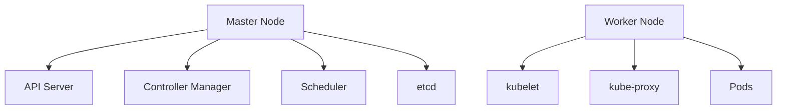

# Kubernetes 架构最佳实践

Kubernetes（简称K8s）是一个开源的容器编排平台，用于自动化部署、扩展和管理容器化应用。为了确保Kubernetes集群的高效性和可靠性，遵循一些架构最佳实践至关重要。本文将逐步介绍Kubernetes架构的最佳实践，帮助初学者更好地理解和应用这些概念。

## 1. 理解Kubernetes架构

Kubernetes架构由多个组件组成，这些组件协同工作以管理容器化应用。以下是Kubernetes的主要组件：

- **Master节点**：负责管理整个集群，包括调度、API服务、控制器管理等。
- **Worker节点**：运行容器化应用的实际工作负载。
- **etcd**：分布式键值存储，用于保存集群的所有配置数据。
- **kubelet**：运行在每个Worker节点上，负责与Master节点通信并管理容器。
- **kube-proxy**：负责网络代理和负载均衡。



## 2. 最佳实践

### 2.1 使用命名空间（Namespaces）进行资源隔离

命名空间是Kubernetes中用于隔离资源的一种机制。通过使用命名空间，您可以将不同的项目、团队或环境（如开发、测试、生产）隔离开来，从而避免资源冲突。

```yaml
apiVersion: v1
kind: Namespace
metadata:
  name: development
```

:::tip
在生产环境中，建议为每个团队或项目创建独立的命名空间，以便更好地管理资源。
:::

### 2.2 使用资源限制（Resource Limits）和请求（Requests）

为了确保应用的稳定性和性能，建议为每个容器设置资源限制和请求。资源请求（Requests）是Kubernetes调度器分配资源的依据，而资源限制（Limits）则是容器可以使用的最大资源量。

```yaml
apiVersion: v1
kind: Pod
metadata:
  name: my-pod
spec:
  containers:
  - name: my-container
    image: nginx
    resources:
      requests:
        memory: "64Mi"
        cpu: "250m"
      limits:
        memory: "128Mi"
        cpu: "500m"
```

:::caution
如果不设置资源限制，容器可能会消耗过多的资源，导致其他应用性能下降。
:::

### 2.3 使用健康检查（Liveness and Readiness Probes）

健康检查是确保应用正常运行的重要手段。Kubernetes提供了两种健康检查机制：

- **Liveness Probe**：用于检测应用是否处于运行状态。如果检测失败，Kubernetes会重启容器。
- **Readiness Probe**：用于检测应用是否准备好接收流量。如果检测失败，Kubernetes会将该容器从服务负载均衡中移除。

```yaml
apiVersion: v1
kind: Pod
metadata:
  name: my-pod
spec:
  containers:
  - name: my-container
    image: nginx
    livenessProbe:
      httpGet:
        path: /healthz
        port: 8080
      initialDelaySeconds: 3
      periodSeconds: 3
    readinessProbe:
      httpGet:
        path: /ready
        port: 8080
      initialDelaySeconds: 5
      periodSeconds: 5
```

:::note
健康检查可以帮助您及时发现和修复应用中的问题，从而提高应用的可靠性。
:::

### 2.4 使用ConfigMaps和Secrets管理配置

ConfigMaps和Secrets是Kubernetes中用于管理配置和敏感信息的资源对象。ConfigMaps用于存储非敏感配置数据，而Secrets用于存储敏感信息（如密码、API密钥等）。

```yaml
apiVersion: v1
kind: ConfigMap
metadata:
  name: my-config
data:
  app.properties: |
    color=blue
    size=large
```

```yaml
apiVersion: v1
kind: Secret
metadata:
  name: my-secret
type: Opaque
data:
  username: YWRtaW4=
  password: MWYyZDFlMmU2N2Rm
```

:::warning
Secrets中的数据是Base64编码的，但并不是加密的。建议使用加密工具或Kubernetes的加密功能来保护敏感数据。
:::

### 2.5 使用Horizontal Pod Autoscaler（HPA）进行自动扩展

Horizontal Pod Autoscaler（HPA）可以根据CPU或内存使用率自动扩展或缩减Pod的数量。这有助于应对流量波动，确保应用始终具有足够的资源。

```yaml
apiVersion: autoscaling/v2beta2
kind: HorizontalPodAutoscaler
metadata:
  name: my-hpa
spec:
  scaleTargetRef:
    apiVersion: apps/v1
    kind: Deployment
    name: my-deployment
  minReplicas: 1
  maxReplicas: 10
  metrics:
  - type: Resource
    resource:
      name: cpu
      target:
        type: Utilization
        averageUtilization: 50
```

:::tip
HPA可以帮助您节省资源成本，同时确保应用在高负载时仍能正常运行。
:::

## 3. 实际案例

假设您正在运行一个电子商务网站，该网站需要处理大量的用户请求。为了确保网站在高峰时段仍能正常运行，您可以采取以下措施：

1. **使用命名空间**：为不同的服务（如前端、后端、数据库）创建独立的命名空间。
2. **设置资源限制**：为每个服务设置合理的资源请求和限制，避免资源争用。
3. **配置健康检查**：为每个服务配置Liveness和Readiness Probes，确保服务在出现问题时能够自动恢复。
4. **使用HPA**：为前端服务配置HPA，根据CPU使用率自动扩展Pod数量，以应对流量高峰。

## 4. 总结

通过遵循Kubernetes架构的最佳实践，您可以构建高效、可靠的容器化应用。本文介绍了使用命名空间、资源限制、健康检查、ConfigMaps、Secrets和HPA等最佳实践，帮助您更好地管理和优化Kubernetes集群。

## 5. 附加资源与练习

- **Kubernetes官方文档**：https://kubernetes.io/docs/home/
- **练习**：尝试在本地或云环境中部署一个简单的Kubernetes集群，并应用本文介绍的最佳实践。

:::note
如果您有任何问题或需要进一步的帮助，请参考Kubernetes社区或相关文档。
:::