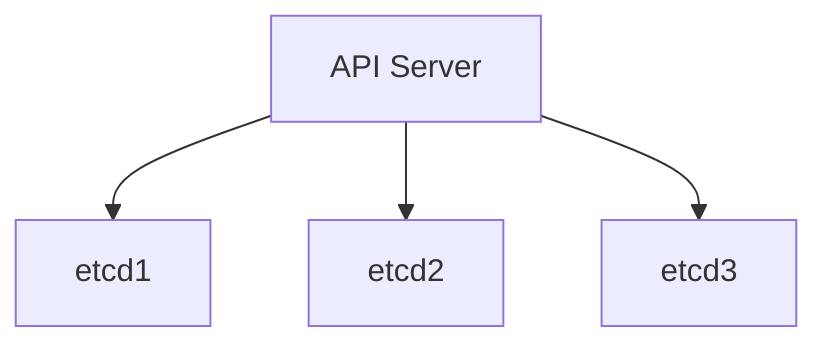

# Kubernetes 高可用最佳实践

Kubernetes 是一个强大的容器编排工具，能够管理大规模的容器化应用程序。然而，为了确保生产环境中的应用程序能够持续稳定运行，高可用性（High Availability, HA）是至关重要的。本文将介绍 Kubernetes 高可用的最佳实践，帮助初学者理解如何构建和管理高可用的 Kubernetes 集群。

## 什么是高可用性？

高可用性是指系统能够在规定的时间内持续提供服务的能力。对于 Kubernetes 集群来说，高可用性意味着即使某些节点或组件发生故障，集群仍然能够正常运行，应用程序不会中断。

## Kubernetes 高可用的关键组件

要实现 Kubernetes 的高可用性，以下几个关键组件需要特别注意：

1. **控制平面（Control Plane）**：包括 API Server、Controller Manager、Scheduler 和 etcd。
2. **工作节点（Worker Nodes）**：运行应用程序的节点。
3. **网络和存储**：确保网络和存储的高可用性。

### 1. 控制平面的高可用性

控制平面是 Kubernetes 集群的大脑，负责管理集群的状态和调度任务。为了实现控制平面的高可用性，通常需要部署多个控制平面节点。

#### 1.1 多节点部署

部署多个控制平面节点可以防止单点故障。通常，建议至少部署三个控制平面节点。

```yaml
apiVersion: kubeadm.k8s.io/v1beta3
kind: ClusterConfiguration
controlPlaneEndpoint: "k8s-api.example.com:6443"
etcd:
  external:
    endpoints:
      - "https://etcd1.example.com:2379"
      - "https://etcd2.example.com:2379"
      - "https://etcd3.example.com:2379"
```

#### 1.2 etcd 的高可用性

etcd 是 Kubernetes 的分布式键值存储，存储了集群的所有状态信息。为了确保 etcd 的高可用性，建议部署多个 etcd 节点，并使用负载均衡器来分发请求。



### 2. 工作节点的高可用性

工作节点是运行应用程序的地方。为了确保工作节点的高可用性，可以采取以下措施：

#### 2.1 多区域部署

将工作节点部署在多个区域（Availability Zones）可以防止区域级别的故障。Kubernetes 支持跨区域部署，可以通过配置 `topologySpreadConstraints` 来实现。

```yaml
apiVersion: apps/v1
kind: Deployment
metadata:
  name: my-app
spec:
  replicas: 3
  template:
    spec:
      topologySpreadConstraints:
        - maxSkew: 1
          topologyKey: topology.kubernetes.io/zone
          whenUnsatisfiable: DoNotSchedule
          labelSelector:
            matchLabels:
              app: my-app
```

#### 2.2 自动扩展

使用 Kubernetes 的 Horizontal Pod Autoscaler (HPA) 可以根据负载自动扩展应用程序的副本数，确保在高负载时仍然能够提供服务。

```yaml
apiVersion: autoscaling/v2beta2
kind: HorizontalPodAutoscaler
metadata:
  name: my-app-hpa
spec:
  scaleTargetRef:
    apiVersion: apps/v1
    kind: Deployment
    name: my-app
  minReplicas: 3
  maxReplicas: 10
  metrics:
    - type: Resource
      resource:
        name: cpu
        target:
          type: Utilization
          averageUtilization: 80
```

### 3. 网络和存储的高可用性

#### 3.1 网络高可用性

使用负载均衡器和多网络接口可以提高网络的可用性。Kubernetes 支持多种网络插件，如 Calico、Flannel 等，可以根据需求选择合适的插件。

#### 3.2 存储高可用性

使用分布式存储系统（如 Ceph、GlusterFS）或云提供商的存储服务（如 AWS EBS、GCP Persistent Disk）可以确保存储的高可用性。

```yaml
apiVersion: v1
kind: PersistentVolume
metadata:
  name: my-pv
spec:
  capacity:
    storage: 100Gi
  accessModes:
    - ReadWriteMany
  persistentVolumeReclaimPolicy: Retain
  storageClassName: my-storage-class
  cephfs:
    monitors:
      - "ceph-mon1.example.com:6789"
      - "ceph-mon2.example.com:6789"
    path: /my-path
    user: admin
    secretRef:
      name: ceph-secret
```

## 实际案例

假设你正在运行一个电商网站，该网站需要处理大量的用户请求。为了确保网站的高可用性，你可以采取以下措施：

1. **多区域部署**：将 Kubernetes 集群部署在多个区域，确保即使一个区域发生故障，其他区域仍然可以提供服务。
2. **自动扩展**：使用 HPA 自动扩展应用程序的副本数，确保在高负载时仍然能够处理用户请求。
3. **分布式存储**：使用分布式存储系统存储用户数据，确保数据的高可用性。

## 总结

通过实施上述最佳实践，你可以显著提高 Kubernetes 集群的高可用性，确保应用程序的稳定性和可靠性。高可用性不仅仅是技术上的挑战，更是对系统设计和运维的全面考验。

:::tip
建议在生产环境中定期进行故障演练，确保高可用性策略的有效性。
:::

## 附加资源

- [Kubernetes 官方文档](https://kubernetes.io/docs/home/)
- [etcd 高可用性指南](https://etcd.io/docs/v3.5/op-guide/high-availability/)
- [Kubernetes 网络插件比较](https://kubernetes.io/docs/concepts/cluster-administration/networking/)

## 练习

1. 尝试在一个多节点的 Kubernetes 集群中部署一个高可用的应用程序。
2. 使用 HPA 自动扩展应用程序的副本数，观察在高负载时的表现。
3. 配置一个分布式存储系统，并测试其高可用性。

通过实践这些练习，你将更深入地理解 Kubernetes 高可用的最佳实践。