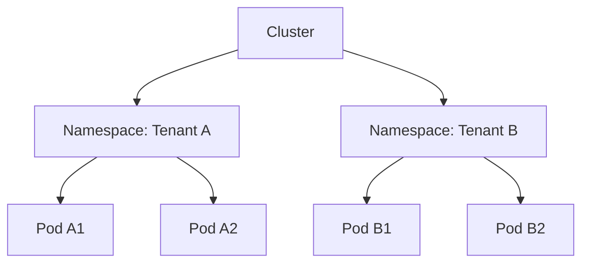
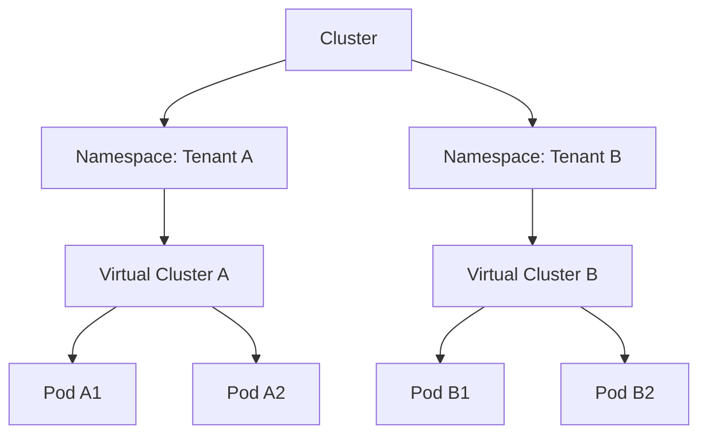

# Kubernetes 多租户最佳实践

Kubernetes 是一个强大的容器编排工具，广泛应用于现代云原生应用的管理和部署。随着越来越多的团队和组织使用 Kubernetes，如何在同一个集群中支持多个租户（即多租户架构）成为了一个重要的话题。多租户架构允许多个用户或团队共享同一个 Kubernetes 集群，同时确保资源隔离、安全性和高效管理。

本文将介绍 Kubernetes 多租户的最佳实践，帮助初学者理解如何设计和实现多租户架构。

## 什么是多租户架构？

多租户架构是指在一个共享的基础设施中，多个用户或团队（租户）可以独立地使用资源，而不会相互干扰。在 Kubernetes 中，多租户通常通过命名空间（Namespace）、资源配额（Resource Quota）和网络策略（Network Policy）等机制来实现。

:::note
**租户**：在 Kubernetes 中，租户可以是一个团队、一个项目或一个应用程序。每个租户通常有自己的命名空间和资源配额。
:::

## Kubernetes 多租户的核心概念

### 1. 命名空间（Namespace）

命名空间是 Kubernetes 中用于隔离资源的基本单位。每个租户可以拥有一个或多个命名空间，用于部署和管理自己的应用程序。

```yaml
apiVersion: v1
kind: Namespace
metadata:
  name: tenant-a
```

### 2. 资源配额（Resource Quota）

资源配额用于限制命名空间中的资源使用量，确保一个租户不会占用过多的集群资源。

```yaml
apiVersion: v1
kind: ResourceQuota
metadata:
  name: tenant-a-quota
  namespace: tenant-a
spec:
  hard:
    requests.cpu: "2"
    requests.memory: "4Gi"
    limits.cpu: "4"
    limits.memory: "8Gi"
```

### 3. 网络策略（Network Policy）

网络策略用于控制命名空间之间的网络流量，确保租户之间的网络隔离。

```yaml
apiVersion: networking.k8s.io/v1
kind: NetworkPolicy
metadata:
  name: tenant-a-network-policy
  namespace: tenant-a
spec:
  podSelector: {}
  policyTypes:
    - Ingress
    - Egress
  ingress:
    - from:
        - podSelector: {}
  egress:
    - to:
        - podSelector: {}
```

### 4. 角色和权限（RBAC）

Kubernetes 使用基于角色的访问控制（RBAC）来管理用户和服务的权限。通过 RBAC，可以为每个租户分配特定的权限，确保他们只能访问和管理自己的资源。

```yaml
apiVersion: rbac.authorization.k8s.io/v1
kind: Role
metadata:
  namespace: tenant-a
  name: tenant-a-role
rules:
  - apiGroups: [""]
    resources: ["pods"]
    verbs: ["get", "list", "watch"]
```

## 多租户架构的设计模式

### 1. 命名空间隔离模式

在这种模式下，每个租户拥有一个独立的命名空间，所有资源都在该命名空间中创建和管理。这种模式简单易用，适合小型团队或项目。



### 2. 虚拟集群模式

虚拟集群模式通过在每个命名空间中部署一个完整的 Kubernetes 控制平面来实现更高级的隔离。这种模式适合需要更高隔离级别的大型企业。



## 实际案例：多租户电商平台

假设你正在为一个电商平台设计 Kubernetes 集群，该平台有多个租户（如不同的商家）。每个商家需要独立管理自己的商品、订单和用户数据。

### 步骤 1：创建命名空间

为每个商家创建一个独立的命名空间。

```yaml
apiVersion: v1
kind: Namespace
metadata:
  name: merchant-a
```

### 步骤 2：设置资源配额

为每个商家的命名空间设置资源配额，确保他们不会占用过多的资源。

```yaml
apiVersion: v1
kind: ResourceQuota
metadata:
  name: merchant-a-quota
  namespace: merchant-a
spec:
  hard:
    requests.cpu: "1"
    requests.memory: "2Gi"
    limits.cpu: "2"
    limits.memory: "4Gi"
```

### 步骤 3：配置网络策略

配置网络策略，确保商家之间的网络流量是隔离的。

```yaml
apiVersion: networking.k8s.io/v1
kind: NetworkPolicy
metadata:
  name: merchant-a-network-policy
  namespace: merchant-a
spec:
  podSelector: {}
  policyTypes:
    - Ingress
    - Egress
  ingress:
    - from:
        - podSelector: {}
  egress:
    - to:
        - podSelector: {}
```

### 步骤 4：分配角色和权限

为每个商家的团队分配角色和权限，确保他们只能访问和管理自己的资源。

```yaml
apiVersion: rbac.authorization.k8s.io/v1
kind: Role
metadata:
  namespace: merchant-a
  name: merchant-a-role
rules:
  - apiGroups: [""]
    resources: ["pods"]
    verbs: ["get", "list", "watch"]
```

## 总结

Kubernetes 多租户架构通过命名空间、资源配额、网络策略和 RBAC 等机制，实现了资源隔离、安全性和高效管理。对于初学者来说，理解这些核心概念和设计模式是掌握 Kubernetes 多租户架构的关键。

:::tip
**附加资源**：
- [Kubernetes 官方文档](https://kubernetes.io/docs/home/)
- [Kubernetes 多租户架构设计指南](https://kubernetes.io/docs/concepts/security/multi-tenancy/)
:::

:::caution
**练习**：
1. 创建一个 Kubernetes 集群，并为其添加两个命名空间。
2. 为每个命名空间设置资源配额和网络策略。
3. 使用 RBAC 为每个命名空间分配角色和权限。
:::