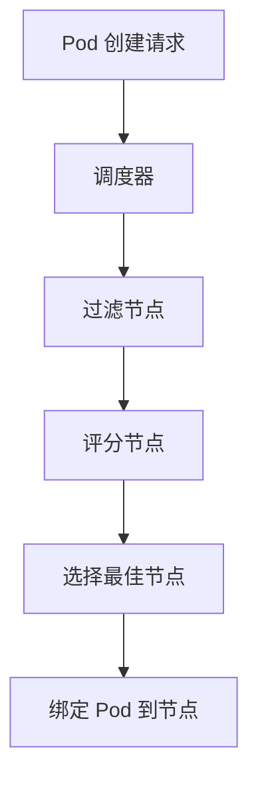

# Kubernetes Pod 调度

在 Kubernetes 中，Pod 是最小的可部署单元，而 Pod 调度则是将 Pod 分配到集群中合适节点的过程。调度器（Scheduler）是 Kubernetes 的核心组件之一，负责根据资源需求、节点状态和调度策略，将 Pod 分配到最佳节点上运行。本文将详细介绍 Kubernetes Pod 调度的基本概念、工作原理以及实际应用场景。

## 什么是 Pod 调度？

Pod 调度是 Kubernetes 中决定 Pod 在哪个节点上运行的过程。调度器会根据 Pod 的资源需求（如 CPU、内存）、节点状态（如可用资源、污点和容忍度）以及用户定义的调度策略（如亲和性和反亲和性）来做出决策。

:::note
调度器不会直接与节点通信，而是通过 API Server 获取节点信息并更新 Pod 的状态。
:::

## 调度器的工作原理

Kubernetes 调度器的工作流程可以分为以下几个步骤：

1. **过滤（Filtering）**：调度器首先会过滤掉不符合 Pod 需求的节点。例如，如果 Pod 需要 4GB 内存，而某个节点只有 2GB 可用内存，则该节点会被过滤掉。
2. **评分（Scoring）**：在过滤后的节点列表中，调度器会为每个节点打分。分数越高，节点越适合运行该 Pod。评分标准包括资源利用率、亲和性规则等。
3. **绑定（Binding）**：调度器选择分数最高的节点，并将 Pod 绑定到该节点上。



## 调度策略

Kubernetes 提供了多种调度策略，帮助用户更精细地控制 Pod 的调度行为。以下是一些常见的调度策略：

### 1. 节点亲和性（Node Affinity）

节点亲和性允许用户指定 Pod 应该调度到哪些节点上。例如，可以要求 Pod 只在具有特定标签的节点上运行。

```yaml
apiVersion: v1
kind: Pod
metadata:
  name: affinity-pod
spec:
  affinity:
    nodeAffinity:
      requiredDuringSchedulingIgnoredDuringExecution:
        nodeSelectorTerms:
        - matchExpressions:
          - key: disktype
            operator: In
            values:
            - ssd
  containers:
  - name: nginx
    image: nginx
```

:::tip
`requiredDuringSchedulingIgnoredDuringExecution` 表示在调度时必须满足的条件，但在 Pod 运行期间即使条件不再满足，也不会重新调度。
:::

### 2. Pod 亲和性与反亲和性（Pod Affinity/Anti-Affinity）

Pod 亲和性允许用户指定 Pod 应该与哪些其他 Pod 运行在同一个节点上，而反亲和性则要求 Pod 不应该与某些 Pod 运行在同一个节点上。

```yaml
apiVersion: v1
kind: Pod
metadata:
  name: pod-affinity
spec:
  affinity:
    podAffinity:
      requiredDuringSchedulingIgnoredDuringExecution:
      - labelSelector:
          matchExpressions:
          - key: app
            operator: In
            values:
            - web
        topologyKey: kubernetes.io/hostname
  containers:
  - name: nginx
    image: nginx
```

### 3. 污点和容忍度（Taints and Tolerations）

污点是节点上的一个属性，用于排斥某些 Pod。只有具有相应容忍度的 Pod 才能调度到该节点上。

```yaml
apiVersion: v1
kind: Pod
metadata:
  name: toleration-pod
spec:
  tolerations:
  - key: "key1"
    operator: "Equal"
    value: "value1"
    effect: "NoSchedule"
  containers:
  - name: nginx
    image: nginx
```

:::caution
污点的 `effect` 可以是 `NoSchedule`（不调度）、`PreferNoSchedule`（尽量不调度）或 `NoExecute`（驱逐已运行的 Pod）。
:::

## 实际案例

### 案例 1：将 Pod 调度到特定区域的节点

假设你有一个跨多个区域的 Kubernetes 集群，并且希望将某个 Pod 调度到特定区域的节点上。你可以使用节点亲和性来实现：

```yaml
apiVersion: v1
kind: Pod
metadata:
  name: regional-pod
spec:
  affinity:
    nodeAffinity:
      requiredDuringSchedulingIgnoredDuringExecution:
        nodeSelectorTerms:
        - matchExpressions:
          - key: topology.kubernetes.io/zone
            operator: In
            values:
            - us-west-2a
  containers:
  - name: nginx
    image: nginx
```

### 案例 2：避免将 Pod 调度到同一节点

如果你希望确保两个 Pod 不会运行在同一个节点上，可以使用 Pod 反亲和性：

```yaml
apiVersion: v1
kind: Pod
metadata:
  name: anti-affinity-pod
spec:
  affinity:
    podAntiAffinity:
      requiredDuringSchedulingIgnoredDuringExecution:
      - labelSelector:
          matchExpressions:
          - key: app
            operator: In
            values:
            - web
        topologyKey: kubernetes.io/hostname
  containers:
  - name: nginx
    image: nginx
```

## 总结

Kubernetes Pod 调度是一个复杂但强大的功能，它允许用户通过多种策略来控制 Pod 的部署位置。通过理解调度器的工作原理以及如何使用节点亲和性、Pod 亲和性、污点和容忍度等策略，你可以更好地优化集群的资源利用率，并确保应用程序的高可用性。

## 附加资源与练习

- **官方文档**：[Kubernetes 调度器](https://kubernetes.io/docs/concepts/scheduling-eviction/kube-scheduler/)
- **练习**：尝试在一个多节点的 Kubernetes 集群中，使用节点亲和性和 Pod 反亲和性来部署一组 Pod，并观察它们的调度行为。

:::warning
在实际生产环境中，请谨慎使用调度策略，避免因过度限制而导致 Pod 无法调度。
:::