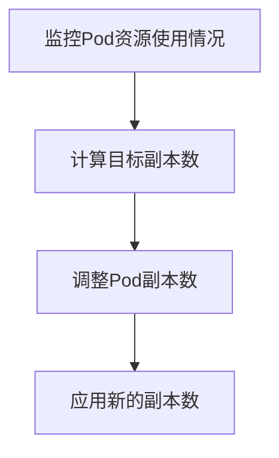

# Kubernetes 水平扩展

Kubernetes水平扩展（Horizontal Pod Autoscaler, HPA）是Kubernetes中一种自动调整Pod副本数量的机制。它通过监控Pod的资源使用情况（如CPU或内存），动态地增加或减少Pod的数量，以确保应用程序能够应对流量变化并保持稳定的性能。

## 什么是水平扩展？

水平扩展是指通过增加或减少Pod的副本数量来调整应用程序的容量。与垂直扩展（增加单个Pod的资源）不同，水平扩展更适用于应对突发的流量增长或减少。Kubernetes通过HPA实现这一功能，HPA会根据设定的指标（如CPU利用率）自动调整Pod的数量。

## 如何配置水平扩展？

要启用水平扩展，首先需要定义一个HPA资源。以下是一个简单的HPA配置示例：

```yaml
apiVersion: autoscaling/v2beta2
kind: HorizontalPodAutoscaler
metadata:
  name: my-app-hpa
spec:
  scaleTargetRef:
    apiVersion: apps/v1
    kind: Deployment
    name: my-app
  minReplicas: 1
  maxReplicas: 10
  metrics:
  - type: Resource
    resource:
      name: cpu
      target:
        type: Utilization
        averageUtilization: 50
```

在这个示例中，HPA会监控名为`my-app`的Deployment，并根据CPU利用率自动调整Pod的数量。`minReplicas`和`maxReplicas`分别定义了Pod的最小和最大副本数，`averageUtilization`则设定了目标CPU利用率。

## 水平扩展的工作原理

HPA通过以下步骤实现水平扩展：

1. **监控指标**：HPA会定期从Metrics Server或其他监控工具中获取Pod的资源使用情况。
2. **计算目标副本数**：根据设定的目标利用率（如CPU利用率），HPA计算出所需的Pod副本数。
3. **调整副本数**：HPA会更新Deployment或ReplicaSet的副本数，以匹配计算出的目标值。

以下是一个简单的流程图，展示了HPA的工作流程：



## 实际应用场景

### 场景1：应对流量高峰

假设你运行了一个电商网站，在促销活动期间，流量会突然增加。通过配置HPA，Kubernetes可以自动增加Pod的数量，以应对流量高峰，确保网站不会因为负载过高而崩溃。

### 场景2：节省资源成本

在流量较低的时段，HPA可以减少Pod的数量，从而节省资源成本。例如，夜间流量较低时，HPA可以将Pod数量减少到最小值，以降低云服务费用。

## 总结

Kubernetes水平扩展是一种强大的机制，能够帮助应用程序动态应对流量变化。通过配置HPA，你可以确保应用程序在高负载时保持稳定，并在低负载时节省资源。对于初学者来说，理解并掌握HPA的使用是迈向Kubernetes高级应用的重要一步。

## 附加资源与练习

- **官方文档**：阅读Kubernetes官方文档中关于[HPA](https://kubernetes.io/docs/tasks/run-application/horizontal-pod-autoscale/)的详细说明。
- **练习**：尝试在自己的Kubernetes集群中配置一个HPA，并观察Pod数量的变化。你可以使用一个简单的Web应用作为测试对象，模拟流量变化。

:::tip
在配置HPA时，建议从简单的CPU利用率指标开始，逐步尝试其他指标（如内存或自定义指标）。
:::