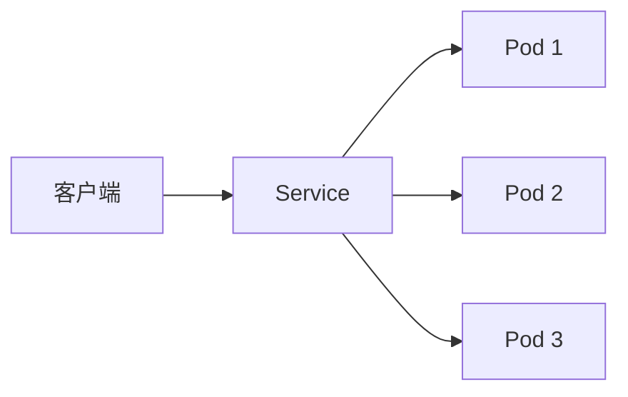

# Kubernetes 负载均衡

在现代分布式系统中，负载均衡是一个关键概念，它确保流量能够均匀地分发到多个后端实例，从而提高应用的可用性和性能。Kubernetes 提供了强大的负载均衡机制，帮助开发者轻松管理流量分发。本文将详细介绍 Kubernetes 中的负载均衡机制，并通过实际案例展示其应用。

## 什么是负载均衡？

负载均衡是一种将网络流量分发到多个服务器的技术，目的是优化资源使用、最大化吞吐量、最小化响应时间，并避免任何单个服务器过载。在 Kubernetes 中，负载均衡通常通过 **Service** 资源实现。

Kubernetes 的 Service 资源为 Pod 提供了一个稳定的网络端点，并将流量分发到后端的多个 Pod 实例。通过这种方式，Kubernetes 实现了负载均衡。

## Kubernetes 中的负载均衡机制

Kubernetes 中的负载均衡主要通过以下两种方式实现：

1. **ClusterIP**：这是默认的 Service 类型，它为 Pod 提供一个集群内部的虚拟 IP 地址。流量通过该 IP 地址分发到后端的 Pod。
2. **LoadBalancer**：这是云服务提供商（如 AWS、GCP、Azure）支持的 Service 类型。它会自动创建一个外部负载均衡器，并将流量分发到集群中的 Pod。

### ClusterIP 示例

以下是一个简单的 ClusterIP Service 配置示例：

```yaml
apiVersion: v1
kind: Service
metadata:
  name: my-service
spec:
  selector:
    app: my-app
  ports:
    - protocol: TCP
      port: 80
      targetPort: 8080
```

在这个示例中，`my-service` 会将流量分发到所有带有 `app: my-app` 标签的 Pod，并将流量从端口 `80` 转发到 Pod 的端口 `8080`。

### LoadBalancer 示例

以下是一个 LoadBalancer Service 配置示例：

```yaml
apiVersion: v1
kind: Service
metadata:
  name: my-loadbalancer-service
spec:
  type: LoadBalancer
  selector:
    app: my-app
  ports:
    - protocol: TCP
      port: 80
      targetPort: 8080
```

在这个示例中，Kubernetes 会与云服务提供商交互，创建一个外部负载均衡器，并将流量分发到后端的 Pod。

## 负载均衡的工作原理

Kubernetes 的负载均衡机制依赖于 **kube-proxy** 组件。kube-proxy 运行在每个节点上，负责将流量转发到正确的 Pod。它通过以下两种模式之一工作：

1. **iptables 模式**：kube-proxy 使用 iptables 规则将流量转发到后端的 Pod。
2. **IPVS 模式**：kube-proxy 使用 IPVS（IP Virtual Server）实现更高效的负载均衡。

以下是一个简单的流量分发示意图：



在这个示意图中，客户端请求首先到达 Service，然后 Service 将流量分发到后端的多个 Pod。

## 实际应用场景

### 场景 1：Web 应用的负载均衡

假设你有一个 Web 应用，部署在 Kubernetes 集群中，并且有多个 Pod 实例运行。为了确保高可用性和性能，你可以创建一个 LoadBalancer Service，将外部流量均匀分发到这些 Pod。

```yaml
apiVersion: v1
kind: Service
metadata:
  name: web-app-service
spec:
  type: LoadBalancer
  selector:
    app: web-app
  ports:
    - protocol: TCP
      port: 80
      targetPort: 8080
```

在这个场景中，外部用户访问 Web 应用时，流量会通过负载均衡器分发到后端的多个 Pod，从而确保应用的高可用性。

### 场景 2：微服务架构中的内部负载均衡

在微服务架构中，服务之间通常需要相互通信。你可以使用 ClusterIP Service 来实现服务之间的负载均衡。

```yaml
apiVersion: v1
kind: Service
metadata:
  name: backend-service
spec:
  selector:
    app: backend
  ports:
    - protocol: TCP
      port: 80
      targetPort: 8080
```

在这个场景中，前端服务可以通过 `backend-service` 访问后端服务，流量会自动分发到后端的多个 Pod。

## 总结

Kubernetes 提供了强大的负载均衡机制，帮助开发者轻松管理流量分发。通过 Service 资源，你可以实现集群内部和外部的负载均衡，确保应用的高可用性和可扩展性。

:::tip
在实际使用中，建议根据应用的需求选择合适的 Service 类型。对于内部服务，可以使用 ClusterIP；对于需要外部访问的服务，可以使用 LoadBalancer。
:::

## 附加资源

- [Kubernetes 官方文档 - Service](https://kubernetes.io/docs/concepts/services-networking/service/)
- [Kubernetes 负载均衡深入解析](https://kubernetes.io/blog/2018/07/09/kubernetes-load-balancing-deep-dive/)

## 练习

1. 创建一个 ClusterIP Service，将流量分发到你的应用 Pod。
2. 在云环境中创建一个 LoadBalancer Service，并观察外部负载均衡器的创建过程。
3. 使用 `kubectl describe service` 命令查看 Service 的详细信息，理解流量分发的机制。