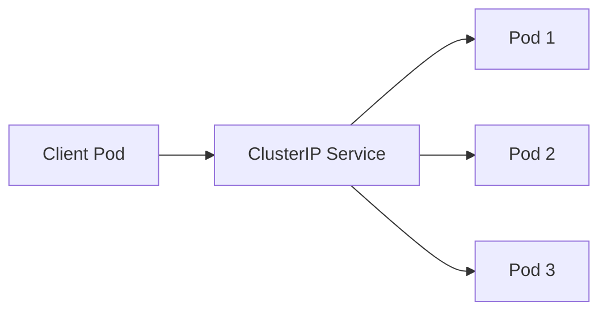

# Kubernetes ClusterIP

Kubernetes 是一个强大的容器编排平台，它提供了多种服务类型来管理容器之间的通信。其中，**ClusterIP** 是最常用的服务类型之一。本文将详细介绍 ClusterIP 的概念、工作原理、配置方法以及实际应用场景。

## 什么是 ClusterIP？

ClusterIP 是 Kubernetes 中的一种服务类型，它为集群内部的 Pod 提供一个稳定的 IP 地址和 DNS 名称。通过 ClusterIP，集群内的其他 Pod 可以访问该服务，而无需关心 Pod 的具体 IP 地址或位置。

:::note
ClusterIP 是 Kubernetes 默认的服务类型。如果你没有显式指定服务类型，Kubernetes 会默认创建一个 ClusterIP 服务。
:::

## ClusterIP 的工作原理

ClusterIP 服务通过 Kubernetes 的 kube-proxy 组件实现。kube-proxy 会为每个 ClusterIP 服务创建一个虚拟 IP 地址（即 ClusterIP），并将该 IP 地址映射到后端 Pod 的 IP 地址。当集群内的其他 Pod 访问 ClusterIP 时，kube-proxy 会将请求转发到后端的某个 Pod。



在上图中，Client Pod 通过 ClusterIP 服务访问后端的多个 Pod。ClusterIP 服务会根据负载均衡策略将请求转发到其中一个 Pod。

## 如何配置 ClusterIP 服务？

下面是一个简单的 ClusterIP 服务配置示例：

```yaml
apiVersion: v1
kind: Service
metadata:
  name: my-service
spec:
  selector:
    app: my-app
  ports:
    - protocol: TCP
      port: 80
      targetPort: 9376
```

在这个示例中，我们定义了一个名为 `my-service` 的 ClusterIP 服务。该服务会将所有带有 `app: my-app` 标签的 Pod 暴露在端口 80 上，并将流量转发到 Pod 的 9376 端口。

:::tip
`selector` 字段用于指定哪些 Pod 属于该服务。`ports` 字段定义了服务的端口映射关系。
:::

## 实际应用场景

### 场景 1：微服务架构中的内部通信

在微服务架构中，通常会有多个服务相互通信。例如，一个前端服务可能需要调用后端服务来获取数据。在这种情况下，可以使用 ClusterIP 服务来暴露后端服务，前端服务通过 ClusterIP 访问后端服务。

```yaml
apiVersion: v1
kind: Service
metadata:
  name: backend-service
spec:
  selector:
    app: backend
  ports:
    - protocol: TCP
      port: 80
      targetPort: 8080
```

在这个示例中，`backend-service` 是一个 ClusterIP 服务，它将所有带有 `app: backend` 标签的 Pod 暴露在端口 80 上。前端服务可以通过 `backend-service:80` 访问后端服务。

### 场景 2：数据库服务的内部访问

在 Kubernetes 集群中，数据库服务通常只允许集群内部访问。通过 ClusterIP 服务，可以确保数据库服务只能在集群内部访问，而不会暴露给外部网络。

```yaml
apiVersion: v1
kind: Service
metadata:
  name: database-service
spec:
  selector:
    app: database
  ports:
    - protocol: TCP
      port: 5432
      targetPort: 5432
```

在这个示例中，`database-service` 是一个 ClusterIP 服务，它将所有带有 `app: database` 标签的 Pod 暴露在端口 5432 上。其他服务可以通过 `database-service:5432` 访问数据库。

## 总结

ClusterIP 是 Kubernetes 中最常用的服务类型之一，它为集群内部的 Pod 提供了一个稳定的 IP 地址和 DNS 名称。通过 ClusterIP，集群内的其他 Pod 可以方便地访问该服务，而无需关心 Pod 的具体 IP 地址或位置。

在实际应用中，ClusterIP 服务广泛用于微服务架构中的内部通信、数据库服务的内部访问等场景。

## 附加资源与练习

- **练习 1**：创建一个 ClusterIP 服务，将你的应用暴露在集群内部，并通过另一个 Pod 访问该服务。
- **练习 2**：尝试修改 ClusterIP 服务的 `selector` 字段，观察服务如何动态地映射到不同的 Pod。

:::caution
在修改服务配置时，请确保 `selector` 字段与 Pod 的标签匹配，否则服务将无法正确映射到 Pod。
:::

希望本文能帮助你更好地理解 Kubernetes 中的 ClusterIP 服务类型。如果你有任何问题或需要进一步的帮助，请参考 Kubernetes 官方文档或社区资源。