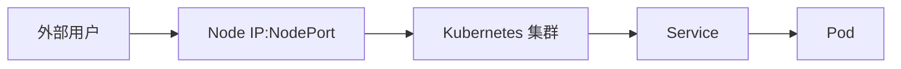

## 什么是 Kubernetes NodePort？

在 Kubernetes 中，`NodePort` 是一种服务类型，用于将集群内部的服务暴露到集群外部。通过 `NodePort`，您可以在集群的每个节点上打开一个特定的端口，外部用户可以通过该端口访问您的服务。`NodePort` 是 Kubernetes 中最基础的服务暴露方式之一，适合在开发或测试环境中使用。

:::note
`NodePort` 是 Kubernetes 服务类型之一，其他常见的服务类型包括 `ClusterIP` 和 `LoadBalancer`。
:::

## NodePort 的工作原理

当您创建一个 `NodePort` 服务时，Kubernetes 会执行以下操作：

1. 在集群的每个节点上分配一个静态端口（默认范围为 30000-32767）。
2. 将流量从该端口转发到服务的后端 Pod。
3. 外部用户可以通过访问任意节点的 IP 地址和该端口来访问服务。



## 如何配置 NodePort 服务

以下是一个简单的 `NodePort` 服务配置示例：

```yaml
apiVersion: v1
kind: Service
metadata:
  name: my-nodeport-service
spec:
  type: NodePort
  ports:
    - port: 80
      targetPort: 8080
      nodePort: 30007
  selector:
    app: my-app
```

### 配置说明

- `type: NodePort`：指定服务类型为 `NodePort`。
- `port: 80`：服务在集群内部暴露的端口。
- `targetPort: 8080`：后端 Pod 的端口。
- `nodePort: 30007`：在节点上暴露的端口（可选，如果不指定，Kubernetes 会自动分配一个端口）。

:::tip
如果您不指定 `nodePort`，Kubernetes 会自动在 30000-32767 范围内分配一个端口。
:::

### 创建服务

使用以下命令创建服务：

```bash
kubectl apply -f my-nodeport-service.yaml
```

### 验证服务

创建服务后，您可以通过以下命令查看服务详情：

```bash
kubectl get svc my-nodeport-service
```

输出示例：

```
NAME                 TYPE       CLUSTER-IP      EXTERNAL-IP   PORT(S)        AGE
my-nodeport-service   NodePort   10.96.123.45    <none>        80:30007/TCP   1m
```

## 实际应用场景

### 场景 1：开发环境中的快速服务暴露

在开发环境中，您可能需要快速将服务暴露给外部用户进行测试。使用 `NodePort` 可以避免复杂的负载均衡器配置，只需在节点上打开一个端口即可。

### 场景 2：本地集群测试

如果您在本地运行 Kubernetes 集群（如 Minikube 或 Kind），`NodePort` 是一种简单的方式将服务暴露到本地网络，方便调试和测试。

## 总结

`NodePort` 是 Kubernetes 中一种简单且直接的服务暴露方式，适合在开发、测试或本地环境中使用。通过在每个节点上打开一个静态端口，外部用户可以直接访问集群内部的服务。然而，在生产环境中，建议使用 `LoadBalancer` 或 `Ingress` 来提供更稳定和安全的服务暴露方式。

## 附加资源

- [Kubernetes 官方文档 - 服务](https://kubernetes.io/docs/concepts/services-networking/service/)
- [Kubernetes NodePort 服务类型详解](https://kubernetes.io/docs/concepts/services-networking/service/#nodeport)

## 练习

1. 创建一个 `NodePort` 服务，将您的应用程序暴露到集群外部。
2. 尝试不指定 `nodePort`，观察 Kubernetes 如何自动分配端口。
3. 使用 `kubectl port-forward` 命令将服务端口转发到本地，测试服务是否正常工作。