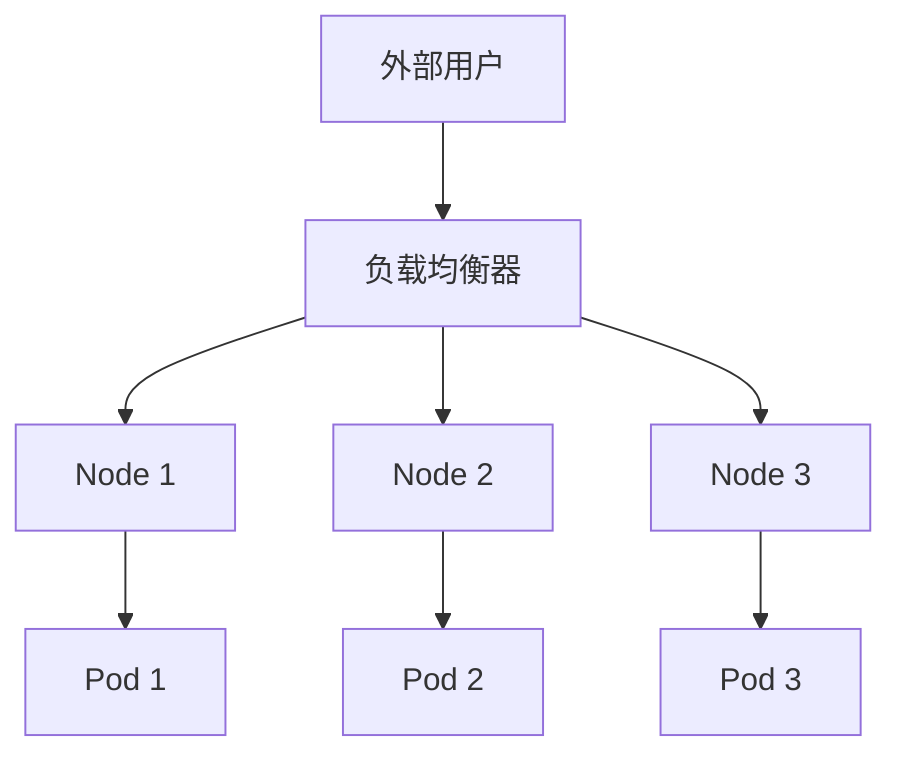

# Kubernetes LoadBalancer

在 Kubernetes 中，`LoadBalancer` 是一种服务类型，用于将外部流量直接路由到集群中的 Pod。它是 `NodePort` 服务的扩展，能够自动配置云提供商的负载均衡器，从而将流量分发到集群中的多个节点。对于初学者来说，理解 `LoadBalancer` 的工作原理和配置方法非常重要，因为它是将应用程序暴露给外部用户的关键方式之一。

## 什么是 LoadBalancer？

`LoadBalancer` 是 Kubernetes 中的一种服务类型，专门用于在云环境中自动配置负载均衡器。它的主要功能是将外部流量分发到集群中的多个节点，确保应用程序的高可用性和可扩展性。与 `NodePort` 不同，`LoadBalancer` 不需要手动配置端口映射，而是依赖于云提供商的负载均衡器服务。

:::note
`LoadBalancer` 服务类型通常与云提供商（如 AWS、GCP、Azure 等）集成，因此在使用时需要确保集群运行在支持负载均衡器的云环境中。
:::

## LoadBalancer 的工作原理

当你在 Kubernetes 中创建一个 `LoadBalancer` 服务时，Kubernetes 会执行以下步骤：

1. **创建服务对象**：Kubernetes 会根据你定义的 YAML 文件创建一个服务对象。
2. **分配外部 IP**：Kubernetes 会请求云提供商分配一个外部 IP 地址。
3. **配置负载均衡器**：云提供商会自动配置一个负载均衡器，并将流量路由到集群中的节点。
4. **流量分发**：负载均衡器将外部流量分发到集群中的多个节点，确保应用程序的高可用性。



## 配置 LoadBalancer 服务

以下是一个简单的 `LoadBalancer` 服务配置示例：

```yaml
apiVersion: v1
kind: Service
metadata:
  name: my-loadbalancer-service
spec:
  type: LoadBalancer
  ports:
    - port: 80
      targetPort: 8080
  selector:
    app: my-app
```

在这个示例中：

- `type: LoadBalancer` 指定了服务类型为 `LoadBalancer`。
- `port: 80` 是服务对外暴露的端口。
- `targetPort: 8080` 是 Pod 中应用程序监听的端口。
- `selector` 用于选择哪些 Pod 属于该服务。

应用此配置后，Kubernetes 会自动创建一个负载均衡器，并将外部流量路由到 `my-app` 标签的 Pod。

## 实际应用场景

### 场景 1：Web 应用程序

假设你有一个 Web 应用程序，部署在 Kubernetes 集群中。你希望用户能够通过互联网访问该应用程序。使用 `LoadBalancer` 服务类型，你可以轻松地将流量路由到集群中的多个 Pod，确保应用程序的高可用性。

### 场景 2：微服务架构

在微服务架构中，每个服务可能需要独立暴露给外部用户。通过为每个微服务创建 `LoadBalancer` 服务，你可以确保每个服务都有独立的入口点，并且流量能够被正确分发。

## 总结

`LoadBalancer` 是 Kubernetes 中用于将外部流量路由到集群中的 Pod 的重要服务类型。它通过与云提供商的负载均衡器集成，自动配置外部 IP 和流量分发规则，确保应用程序的高可用性和可扩展性。对于初学者来说，掌握 `LoadBalancer` 的配置和使用方法是非常重要的。

## 附加资源与练习

- **Kubernetes 官方文档**：[Services](https://kubernetes.io/docs/concepts/services-networking/service/)
- **练习**：尝试在本地 Kubernetes 集群（如 Minikube）中创建一个 `LoadBalancer` 服务，并观察其行为。
- **进一步学习**：了解 `Ingress` 和 `ClusterIP` 服务类型，比较它们与 `LoadBalancer` 的异同。

:::tip
如果你在本地环境中使用 Minikube，`LoadBalancer` 服务可能无法直接分配外部 IP。你可以使用 `minikube tunnel` 命令来模拟云环境中的负载均衡器行为。
:::