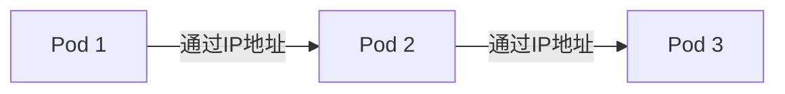

# Kubernetes 网络模型

Kubernetes是一个强大的容器编排平台，它通过一系列网络模型来管理容器之间的通信。理解Kubernetes的网络模型对于构建可靠、高效的分布式应用至关重要。本文将详细介绍Kubernetes的网络模型，帮助初学者掌握其核心概念。

## 什么是Kubernetes网络模型？

Kubernetes网络模型定义了容器之间如何通信，以及如何与外部世界进行交互。Kubernetes的网络模型基于以下几个核心原则：

1. **每个Pod拥有唯一的IP地址**：在Kubernetes中，每个Pod都被分配一个唯一的IP地址，Pod中的所有容器共享这个IP地址。
2. **Pod之间可以直接通信**：无论Pod运行在哪个节点上，它们都可以直接通过IP地址进行通信，无需额外的网络地址转换（NAT）。
3. **Service提供稳定的网络端点**：Service是Kubernetes中的一种抽象，它为Pod提供稳定的网络端点，即使Pod的IP地址发生变化，Service的IP地址仍然保持不变。

## Kubernetes 网络模型的核心组件

### Pod网络

Pod是Kubernetes中最小的部署单元，每个Pod都有一个唯一的IP地址。Pod中的所有容器共享这个IP地址，并且可以通过`localhost`相互通信。Pod之间的通信通过Pod的IP地址直接进行。



### Service网络

Service是Kubernetes中的一种抽象，它为Pod提供稳定的网络端点。Service通过标签选择器（Label Selector）与一组Pod关联，并为这些Pod提供一个虚拟IP地址（ClusterIP）。外部流量可以通过Service的IP地址访问Pod。

```yaml
apiVersion: v1
kind: Service
metadata:
  name: my-service
spec:
  selector:
    app: my-app
  ports:
    - protocol: TCP
      port: 80
      targetPort: 9376
```

在上面的示例中，`my-service` Service将流量转发到所有带有`app=my-app`标签的Pod的9376端口。

### Ingress

Ingress是Kubernetes中用于管理外部访问的API对象。它允许你定义HTTP和HTTPS路由规则，将外部流量路由到集群内的Service。Ingress通常与Ingress控制器一起使用，后者负责实现Ingress规则。

```yaml
apiVersion: networking.k8s.io/v1
kind: Ingress
metadata:
  name: example-ingress
spec:
  rules:
  - host: example.com
    http:
      paths:
      - path: /app
        pathType: Prefix
        backend:
          service:
            name: my-service
            port:
              number: 80
```

在上面的示例中，所有访问`example.com/app`的流量将被路由到`my-service` Service。

## 实际应用场景

### 场景1：微服务架构中的服务发现

在微服务架构中，服务之间的通信至关重要。Kubernetes的Service抽象使得服务发现变得非常简单。每个微服务都可以通过Service的名称进行访问，而无需关心底层Pod的IP地址。

```yaml
apiVersion: v1
kind: Service
metadata:
  name: user-service
spec:
  selector:
    app: user
  ports:
    - protocol: TCP
      port: 80
      targetPort: 8080
```

在这个示例中，`user-service` Service将流量转发到所有带有`app=user`标签的Pod的8080端口。

### 场景2：外部流量路由

假设你有一个Web应用，需要将外部流量路由到不同的后端服务。你可以使用Ingress来实现这一点。

```yaml
apiVersion: networking.k8s.io/v1
kind: Ingress
metadata:
  name: web-ingress
spec:
  rules:
  - host: web.example.com
    http:
      paths:
      - path: /api
        pathType: Prefix
        backend:
          service:
            name: api-service
            port:
              number: 80
      - path: /static
        pathType: Prefix
        backend:
          service:
            name: static-service
            port:
              number: 80
```

在这个示例中，所有访问`web.example.com/api`的流量将被路由到`api-service`，而访问`web.example.com/static`的流量将被路由到`static-service`。

## 总结

Kubernetes网络模型是构建分布式应用的基础。通过理解Pod网络、Service和Ingress的工作原理，你可以更好地设计和管理Kubernetes集群中的网络通信。希望本文能帮助你掌握Kubernetes网络模型的核心概念，并为你的Kubernetes之旅打下坚实的基础。

## 附加资源与练习

- **官方文档**：阅读Kubernetes官方文档中关于[网络模型](https://kubernetes.io/docs/concepts/cluster-administration/networking/)的部分，深入了解Kubernetes网络的高级特性。
- **练习**：尝试在你的Kubernetes集群中创建一个Service和一个Ingress，并观察它们如何将流量路由到Pod。

:::tip
如果你在练习中遇到问题，可以参考Kubernetes社区的[讨论论坛](https://discuss.kubernetes.io/)或查阅相关教程。
:::