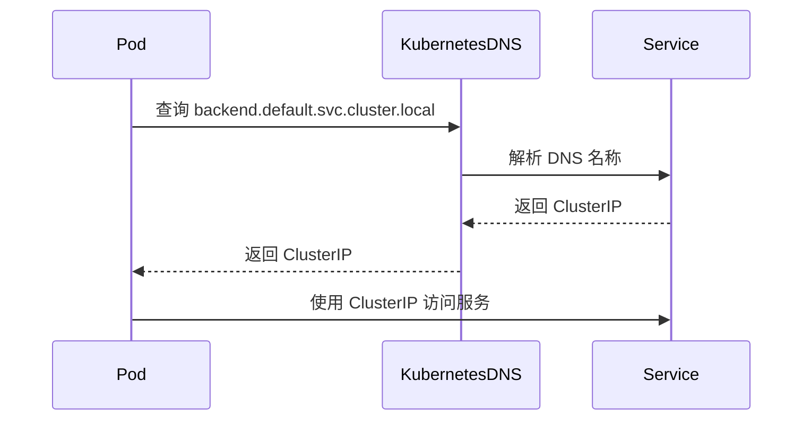

# Kubernetes DNS

在 Kubernetes 集群中，服务发现是一个关键功能。Kubernetes DNS 是集群中用于解析服务名称的核心组件之一。它允许 Pod 通过服务名称而不是 IP 地址来访问其他服务，从而简化了服务之间的通信。

## 什么是 Kubernetes DNS？

Kubernetes DNS 是一个内置的 DNS 服务器，它为集群中的服务提供域名解析功能。每个服务在创建时都会自动分配一个 DNS 名称，其他 Pod 可以通过这个名称访问该服务。Kubernetes DNS 的核心组件是 CoreDNS（或早期的 kube-dns），它负责处理集群内的 DNS 请求。

:::note
Kubernetes DNS 是集群内部的服务发现机制，不适用于外部访问。
:::

## Kubernetes DNS 的工作原理

Kubernetes DNS 的工作流程如下：

1. **服务创建**：当你在 Kubernetes 中创建一个服务时，Kubernetes 会为该服务分配一个 DNS 名称。
2. **DNS 解析**：当 Pod 尝试访问某个服务时，它会向 Kubernetes DNS 发送 DNS 查询请求。
3. **DNS 响应**：Kubernetes DNS 返回服务的 ClusterIP 或 Pod IP，Pod 可以使用该 IP 与服务通信。

### DNS 名称格式

Kubernetes 中的 DNS 名称遵循以下格式：

- **服务名称**：`<service-name>.<namespace>.svc.cluster.local`
- **Pod 名称**：`<pod-ip>.<namespace>.pod.cluster.local`

例如，如果你在 `default` 命名空间中创建了一个名为 `my-service` 的服务，它的 DNS 名称将是 `my-service.default.svc.cluster.local`。

## 实际案例

假设我们有一个简单的 Kubernetes 集群，其中包含以下服务：

- 一个名为 `frontend` 的前端服务。
- 一个名为 `backend` 的后端服务。

### 创建服务

首先，我们创建 `frontend` 和 `backend` 服务：

```yaml
apiVersion: v1
kind: Service
metadata:
  name: frontend
  namespace: default
spec:
  selector:
    app: frontend
  ports:
    - protocol: TCP
      port: 80
      targetPort: 8080
```

```yaml
apiVersion: v1
kind: Service
metadata:
  name: backend
  namespace: default
spec:
  selector:
    app: backend
  ports:
    - protocol: TCP
      port: 80
      targetPort: 8080
```

### 在 Pod 中访问服务

假设我们有一个 Pod 需要访问 `backend` 服务。在 Pod 中，我们可以通过以下方式访问：

```bash
curl http://backend.default.svc.cluster.local
```

Kubernetes DNS 会将 `backend.default.svc.cluster.local` 解析为 `backend` 服务的 ClusterIP，从而允许 Pod 与 `backend` 服务通信。

## 使用 Mermaid 绘制 DNS 解析流程



## 总结

Kubernetes DNS 是 Kubernetes 集群中服务发现的核心组件。它通过为服务分配 DNS 名称，使得 Pod 可以通过服务名称而不是 IP 地址来访问其他服务。这种机制简化了服务之间的通信，并提高了集群的可维护性。

## 附加资源

- [Kubernetes 官方文档 - DNS for Services and Pods](https://kubernetes.io/docs/concepts/services-networking/dns-pod-service/)
- [CoreDNS 官方文档](https://coredns.io/)

## 练习

1. 在你的 Kubernetes 集群中创建一个服务，并尝试从另一个 Pod 中通过 DNS 名称访问它。
2. 修改服务的命名空间，观察 DNS 名称的变化。
3. 使用 `nslookup` 或 `dig` 命令在 Pod 中查询服务的 DNS 记录。

通过这些练习，你将更好地理解 Kubernetes DNS 的工作原理及其在实际中的应用。