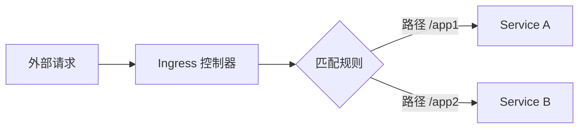

# Kubernetes Ingress

Kubernetes Ingress 是一种用于管理外部访问 Kubernetes 集群中服务的 API 对象。它允许你定义如何将外部 HTTP/HTTPS 流量路由到集群内的服务。与传统的 NodePort 或 LoadBalancer 服务不同，Ingress 提供了更灵活的路由规则和基于主机名或路径的流量管理。

## 什么是 Ingress？

Ingress 是 Kubernetes 中的一种资源类型，用于配置外部访问集群内服务的规则。它通常与 Ingress 控制器（Ingress Controller）一起使用，后者是一个负责实现 Ingress 规则的实际组件。Ingress 控制器可以是 Nginx、Traefik、HAProxy 等。

:::note
Ingress 本身并不直接处理流量，而是通过 Ingress 控制器来实现流量路由。
:::

## Ingress 的工作原理

当外部请求到达 Kubernetes 集群时，Ingress 控制器会根据 Ingress 资源中定义的规则将请求路由到相应的服务。这些规则可以基于主机名、路径或其他条件。



## 创建 Ingress 资源

以下是一个简单的 Ingress 资源示例，它将流量路由到两个不同的服务：

```yaml
apiVersion: networking.k8s.io/v1
kind: Ingress
metadata:
  name: example-ingress
  annotations:
    nginx.ingress.kubernetes.io/rewrite-target: /
spec:
  rules:
  - host: example.com
    http:
      paths:
      - path: /app1
        pathType: Prefix
        backend:
          service:
            name: service-a
            port:
              number: 80
      - path: /app2
        pathType: Prefix
        backend:
          service:
            name: service-b
            port:
              number: 80
```

在这个示例中，所有访问 `example.com/app1` 的请求将被路由到 `service-a`，而访问 `example.com/app2` 的请求将被路由到 `service-b`。

## 实际应用场景

### 场景 1：基于路径的路由

假设你有一个 Kubernetes 集群，其中运行着多个微服务。你可以使用 Ingress 来根据路径将流量路由到不同的服务。例如：

- `/api` 路由到 API 服务
- `/web` 路由到 Web 前端服务

### 场景 2：基于主机名的路由

如果你有多个子域名，你可以使用 Ingress 来根据主机名将流量路由到不同的服务。例如：

- `api.example.com` 路由到 API 服务
- `web.example.com` 路由到 Web 前端服务

## 总结

Kubernetes Ingress 提供了一种灵活的方式来管理外部访问集群内服务的流量。通过定义 Ingress 资源，你可以轻松地实现基于路径或主机名的路由规则。Ingress 控制器是实现这些规则的关键组件，常见的控制器包括 Nginx、Traefik 和 HAProxy。

## 附加资源

- [Kubernetes 官方文档 - Ingress](https://kubernetes.io/docs/concepts/services-networking/ingress/)
- [Nginx Ingress 控制器文档](https://kubernetes.github.io/ingress-nginx/)
- [Traefik Ingress 控制器文档](https://doc.traefik.io/traefik/providers/kubernetes-ingress/)

## 练习

1. 创建一个简单的 Ingress 资源，将流量路由到两个不同的服务。
2. 部署一个 Ingress 控制器（如 Nginx Ingress 控制器）并测试你的 Ingress 配置。
3. 尝试使用基于主机名的路由规则，将不同的子域名路由到不同的服务。

通过以上练习，你将更好地理解 Kubernetes Ingress 的工作原理和实际应用。