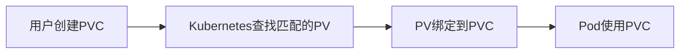

# Kubernetes 持久卷声明

在Kubernetes中，持久卷声明（Persistent Volume Claim, PVC）是一种用于请求存储资源的机制。它允许用户在不关心底层存储细节的情况下，动态地请求和使用存储资源。本文将详细介绍PVC的概念、工作原理以及如何在实际场景中使用它。

## 什么是持久卷声明（PVC）？

持久卷声明（PVC）是Kubernetes中用于请求存储资源的对象。它类似于Pod请求计算资源（如CPU和内存）的方式。PVC允许用户定义所需的存储大小和访问模式，而不需要关心底层存储的具体实现。

### PVC与持久卷（PV）的关系

持久卷（Persistent Volume, PV）是集群中的一块存储资源，通常由管理员预先配置。PVC则是用户对PV的请求。当用户创建一个PVC时，Kubernetes会尝试找到一个满足PVC要求的PV，并将其绑定到PVC上。



## 创建持久卷声明

下面是一个简单的PVC示例，它请求1Gi的存储空间，并指定访问模式为`ReadWriteOnce`（即只能被单个节点以读写模式挂载）。

```yaml
apiVersion: v1
kind: PersistentVolumeClaim
metadata:
  name: my-pvc
spec:
  accessModes:
    - ReadWriteOnce
  resources:
    requests:
      storage: 1Gi
```

### 解释

- `accessModes`: 定义了PVC的访问模式。常见的访问模式包括：
  - `ReadWriteOnce` (RWO): 只能被单个节点以读写模式挂载。
  - `ReadOnlyMany` (ROX): 可以被多个节点以只读模式挂载。
  - `ReadWriteMany` (RWX): 可以被多个节点以读写模式挂载。
- `resources.requests.storage`: 定义了请求的存储大小。

## 使用PVC的Pod示例

一旦PVC被创建并绑定到PV，Pod就可以通过挂载PVC来使用存储资源。以下是一个使用PVC的Pod示例：

```yaml
apiVersion: v1
kind: Pod
metadata:
  name: my-pod
spec:
  containers:
    - name: my-container
      image: nginx
      volumeMounts:
        - mountPath: "/usr/share/nginx/html"
          name: my-storage
  volumes:
    - name: my-storage
      persistentVolumeClaim:
        claimName: my-pvc
```

### 解释

- `volumeMounts`: 指定了容器内挂载存储的路径。
- `volumes`: 定义了Pod使用的存储卷，这里引用了之前创建的PVC `my-pvc`。

## 实际应用场景

### 场景1：数据库存储

假设你正在运行一个需要持久化存储的数据库应用（如MySQL）。你可以创建一个PVC来请求存储资源，并将其挂载到数据库Pod中，以确保数据在Pod重启或迁移时不会丢失。

```yaml
apiVersion: v1
kind: PersistentVolumeClaim
metadata:
  name: mysql-pvc
spec:
  accessModes:
    - ReadWriteOnce
  resources:
    requests:
      storage: 10Gi
```

### 场景2：共享文件存储

如果你有一个需要多个Pod共享的文件存储系统（如NFS），你可以创建一个`ReadWriteMany`的PVC，并将其挂载到多个Pod中。

```yaml
apiVersion: v1
kind: PersistentVolumeClaim
metadata:
  name: shared-pvc
spec:
  accessModes:
    - ReadWriteMany
  resources:
    requests:
      storage: 5Gi
```

## 总结

持久卷声明（PVC）是Kubernetes中管理存储资源的重要机制。它允许用户在不关心底层存储细节的情况下，动态地请求和使用存储资源。通过PVC，用户可以轻松地为Pod提供持久化存储，确保数据在Pod重启或迁移时不会丢失。

### 附加资源

- [Kubernetes官方文档 - Persistent Volumes](https://kubernetes.io/docs/concepts/storage/persistent-volumes/)
- [Kubernetes官方文档 - Persistent Volume Claims](https://kubernetes.io/docs/concepts/storage/persistent-volumes/#persistentvolumeclaims)

### 练习

1. 创建一个PVC，请求2Gi的存储空间，并将其挂载到一个Nginx Pod中。
2. 修改PVC的访问模式为`ReadWriteMany`，并尝试将其挂载到多个Pod中。

通过完成这些练习，你将更好地理解PVC的工作原理及其在实际应用中的使用。