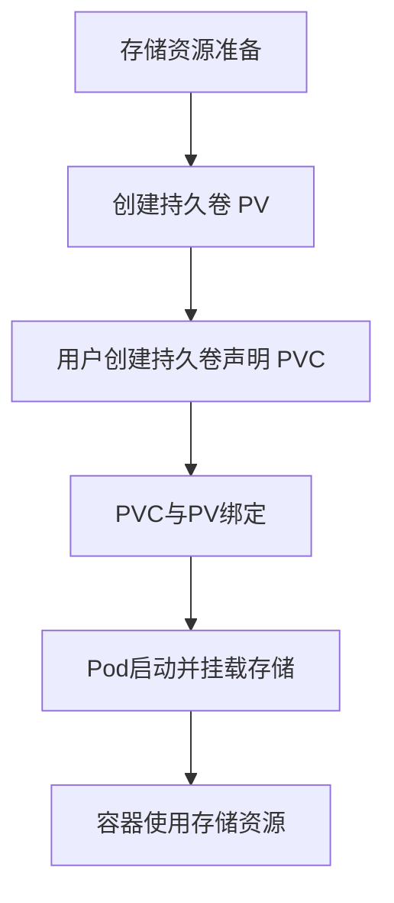

# Kubernetes 存储驱动

Kubernetes存储驱动是Kubernetes中用于管理存储资源的组件。它们负责将存储资源（如持久卷）与容器化应用程序连接起来，确保数据在容器重启或迁移时不会丢失。本文将详细介绍Kubernetes存储驱动的工作原理、常见类型以及如何在实际场景中使用它们。

## 什么是Kubernetes存储驱动？

Kubernetes存储驱动是Kubernetes与底层存储系统之间的桥梁。它们允许Kubernetes集群中的Pod访问持久化存储资源，如本地磁盘、网络存储（如NFS、iSCSI）或云存储（如AWS EBS、GCP Persistent Disk）。存储驱动的核心任务是将存储资源抽象化，使其对Pod透明，同时确保数据的高可用性和持久性。

:::note
存储驱动通常与Kubernetes的**持久卷（Persistent Volume, PV）**和**持久卷声明（Persistent Volume Claim, PVC）**机制配合使用。
:::

## Kubernetes 存储驱动的工作原理

Kubernetes存储驱动的工作流程可以分为以下几个步骤：

1. **存储资源准备**：管理员或自动化工具在Kubernetes集群中创建持久卷（PV），这些PV可以是本地存储、网络存储或云存储。
2. **存储资源声明**：用户通过创建持久卷声明（PVC）来请求存储资源。PVC会与PV绑定。
3. **存储资源挂载**：当Pod启动时，Kubernetes会根据PVC找到对应的PV，并通过存储驱动将存储资源挂载到Pod中。
4. **存储资源使用**：Pod中的容器可以像使用本地文件系统一样使用挂载的存储资源。



## 常见的Kubernetes存储驱动

Kubernetes支持多种存储驱动，以下是一些常见的类型：

1. **本地存储驱动**：使用节点上的本地磁盘作为存储资源。适用于单节点或对性能要求较高的场景。
2. **网络存储驱动**：如NFS、iSCSI等，适用于多节点共享存储的场景。
3. **云存储驱动**：如AWS EBS、GCP Persistent Disk、Azure Disk等，适用于云环境中的持久化存储。
4. **分布式存储驱动**：如Ceph、GlusterFS等，适用于需要高可用性和扩展性的场景。

:::tip
选择合适的存储驱动时，需要考虑存储的性能、可用性、扩展性以及成本等因素。
:::

## 实际案例：使用AWS EBS作为Kubernetes存储驱动

以下是一个使用AWS EBS作为Kubernetes存储驱动的实际案例。我们将创建一个持久卷（PV）和一个持久卷声明（PVC），并将其挂载到一个Pod中。

### 1. 创建持久卷（PV）

```yaml
apiVersion: v1
kind: PersistentVolume
metadata:
  name: aws-ebs-pv
spec:
  capacity:
    storage: 10Gi
  accessModes:
    - ReadWriteOnce
  awsElasticBlockStore:
    volumeID: vol-0abcdef1234567890
    fsType: ext4
```

### 2. 创建持久卷声明（PVC）

```yaml
apiVersion: v1
kind: PersistentVolumeClaim
metadata:
  name: aws-ebs-pvc
spec:
  accessModes:
    - ReadWriteOnce
  resources:
    requests:
      storage: 10Gi
```

### 3. 创建Pod并挂载存储

```yaml
apiVersion: v1
kind: Pod
metadata:
  name: my-pod
spec:
  containers:
    - name: my-container
      image: nginx
      volumeMounts:
        - mountPath: "/mnt/data"
          name: my-storage
  volumes:
    - name: my-storage
      persistentVolumeClaim:
        claimName: aws-ebs-pvc
```

### 4. 验证存储挂载

Pod启动后，可以通过以下命令验证存储是否成功挂载：

```bash
kubectl exec -it my-pod -- df -h
```

输出应显示挂载的存储设备：

```plaintext
Filesystem      Size  Used Avail Use% Mounted on
/dev/xvdf        10G   0G   10G   0% /mnt/data
```

## 总结

Kubernetes存储驱动是Kubernetes中管理存储资源的关键组件。它们通过抽象化存储资源，使得Pod可以方便地使用持久化存储。本文介绍了Kubernetes存储驱动的基本概念、工作原理以及常见类型，并通过一个实际案例展示了如何使用AWS EBS作为存储驱动。

:::caution
在实际生产环境中，选择合适的存储驱动并正确配置存储资源非常重要。错误的配置可能导致数据丢失或性能问题。
:::

## 附加资源与练习

- **官方文档**：[Kubernetes Storage](https://kubernetes.io/docs/concepts/storage/)
- **练习**：尝试在本地Kubernetes集群中使用NFS作为存储驱动，创建一个PV、PVC并将其挂载到Pod中。
- **深入学习**：了解Kubernetes中的动态存储供应（Dynamic Provisioning）机制，并尝试在云环境中使用它。

通过本文的学习，你应该对Kubernetes存储驱动有了初步的了解。接下来，可以通过实践进一步巩固这些知识。