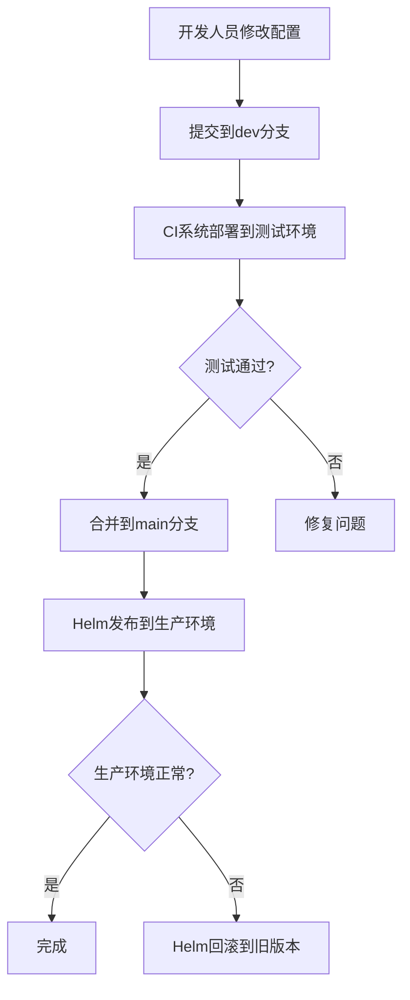

# Kubernetes 配置版本控制

在Kubernetes中，配置管理是确保应用程序稳定运行的关键部分。随着应用程序的不断演进，配置也会随之变化。为了确保这些变化是可追踪、可回滚的，配置版本控制变得至关重要。本文将详细介绍Kubernetes中的配置版本控制，帮助初学者理解其重要性及实现方法。

## 什么是Kubernetes配置版本控制？

Kubernetes配置版本控制是指对Kubernetes资源（如Deployment、Service、ConfigMap等）的配置进行版本化管理的过程。通过版本控制，您可以追踪配置的变更历史，轻松回滚到之前的版本，并在团队协作中避免配置冲突。

### 为什么需要配置版本控制？

1. **可追溯性**：记录每次配置变更的详细信息，便于排查问题。
2. **回滚能力**：当新配置导致问题时，可以快速回滚到稳定版本。
3. **团队协作**：避免多人同时修改配置导致的冲突。
4. **环境一致性**：确保开发、测试和生产环境的配置一致。

---

## 如何实现Kubernetes配置版本控制

在Kubernetes中，配置版本控制通常通过以下方式实现：

1. **使用Git进行版本控制**：将Kubernetes配置文件存储在Git仓库中，利用Git的分支、标签和提交历史来管理版本。
2. **使用Helm进行包管理**：Helm是Kubernetes的包管理工具，支持版本化发布和回滚。
3. **使用Kustomize进行配置定制**：Kustomize允许您基于基础配置生成不同环境的配置，并支持版本控制。

### 方法1：使用Git进行版本控制

Git是最常用的版本控制工具，适用于管理Kubernetes配置文件。以下是实现步骤：

1. **创建Git仓库**：将Kubernetes配置文件（如`deployment.yaml`、`service.yaml`等）存储在Git仓库中。
2. **提交变更**：每次修改配置文件后，提交变更并添加有意义的提交信息。
3. **使用分支和标签**：为不同的环境（如开发、测试、生产）创建分支，并使用标签标记重要版本。

```bash
# 示例：提交配置变更
git add deployment.yaml
git commit -m "Update deployment to version 2.0"
git tag v2.0
```

4. **回滚到旧版本**：如果需要回滚，可以使用Git的`checkout`命令切换到之前的版本。

```bash
# 示例：回滚到v1.0
git checkout v1.0
```

:::tip
建议为每个环境（如开发、测试、生产）创建独立的分支，并在合并到主分支前进行充分的测试。
:::

### 方法2：使用Helm进行版本控制

Helm是Kubernetes的包管理工具，支持版本化发布和回滚。以下是使用Helm实现版本控制的步骤：

1. **创建Helm Chart**：将Kubernetes配置文件打包到Helm Chart中。
2. **发布版本**：使用`helm install`或`helm upgrade`发布新版本。
3. **回滚版本**：使用`helm rollback`回滚到之前的版本。

```bash
# 示例：发布新版本
helm install my-app ./my-chart --version 1.0.0

# 示例：升级到新版本
helm upgrade my-app ./my-chart --version 2.0.0

# 示例：回滚到旧版本
helm rollback my-app 1
```

:::note
Helm会自动记录每次发布的版本历史，您可以使用`helm history`命令查看。
:::

### 方法3：使用Kustomize进行配置定制

Kustomize是Kubernetes的原生配置管理工具，支持基于基础配置生成不同环境的配置。以下是使用Kustomize实现版本控制的步骤：

1. **创建基础配置**：定义通用的Kubernetes资源配置。
2. **创建环境覆盖**：为不同环境（如开发、测试、生产）创建覆盖配置。
3. **生成配置**：使用`kustomize build`生成最终的配置文件。

```bash
# 示例：生成开发环境配置
kustomize build ./overlays/dev > dev-config.yaml

# 示例：生成生产环境配置
kustomize build ./overlays/prod > prod-config.yaml
```

:::caution
Kustomize本身不提供版本历史记录功能，建议将其与Git结合使用以实现版本控制。
:::

---

## 实际案例：配置版本控制在CI/CD中的应用

假设您正在为一个Web应用程序构建CI/CD流水线。以下是配置版本控制在其中的应用场景：

1. **开发阶段**：开发人员在Git的`dev`分支上修改Kubernetes配置文件，并提交变更。
2. **测试阶段**：CI系统自动将`dev`分支的配置部署到测试环境，并进行自动化测试。
3. **生产阶段**：测试通过后，将配置合并到`main`分支，并使用Helm发布新版本到生产环境。
4. **回滚操作**：如果生产环境出现问题，使用Helm快速回滚到稳定版本。



---

## 总结

Kubernetes配置版本控制是确保应用程序稳定性和可维护性的关键实践。通过使用Git、Helm或Kustomize，您可以轻松管理配置的版本，实现可追溯性和快速回滚。在实际应用中，结合CI/CD流水线可以进一步提高效率和可靠性。

### 附加资源

- [Git官方文档](https://git-scm.com/doc)
- [Helm官方文档](https://helm.sh/docs/)
- [Kustomize官方文档](https://kustomize.io/)

### 练习

1. 创建一个Git仓库，并将Kubernetes配置文件存储在其中。尝试提交、分支和回滚操作。
2. 使用Helm创建一个简单的Chart，并尝试发布和回滚版本。
3. 使用Kustomize为开发和生产环境生成不同的配置文件。

通过以上练习，您将更好地掌握Kubernetes配置版本控制的实践方法。