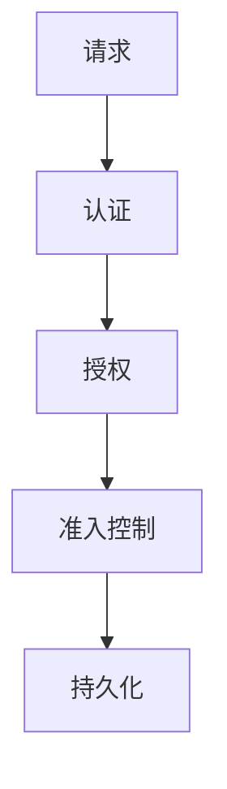

## 介绍

Kubernetes准入控制（Admission Control）是Kubernetes API服务器中的一个重要机制，用于在请求被持久化到存储之前对其进行验证或修改。准入控制插件可以在资源创建、更新或删除时介入，确保集群的安全性和一致性。

准入控制通常用于以下场景：
- 验证资源是否符合特定的策略。
- 修改资源以添加默认值或进行标准化。
- 拒绝不符合要求的请求。

## 准入控制的类型

Kubernetes中的准入控制分为两类：
1. **验证准入控制（Validating Admission Control）**：用于验证请求是否符合特定规则，如果不符合，则拒绝请求。
2. **修改准入控制（Mutating Admission Control）**：用于修改请求内容，例如添加默认值或标准化字段。

## 准入控制的工作原理

当用户或控制器向Kubernetes API服务器发送请求时，请求会经过以下步骤：
1. **认证（Authentication）**：验证请求者的身份。
2. **授权（Authorization）**：检查请求者是否有权限执行该操作。
3. **准入控制（Admission Control）**：在请求被持久化之前，对其进行验证或修改。

准入控制插件按照顺序执行，每个插件都可以决定是否允许请求继续，或者是否需要对请求进行修改。



## 实际案例

### 案例1：使用PodSecurityPolicy进行验证

PodSecurityPolicy（PSP）是一个常见的准入控制插件，用于限制Pod的安全设置。例如，可以配置PSP来禁止以root用户运行容器。

```yaml
apiVersion: policy/v1beta1
kind: PodSecurityPolicy
metadata:
  name: restricted
spec:
  privileged: false
  runAsUser:
    rule: MustRunAsNonRoot
  seLinux:
    rule: RunAsAny
  supplementalGroups:
    rule: RunAsAny
  fsGroup:
    rule: RunAsAny
  volumes:
  - '*'
```

当用户尝试创建一个以root用户运行的Pod时，准入控制器会拒绝该请求。

```yaml
apiVersion: v1
kind: Pod
metadata:
  name: root-pod
spec:
  containers:
  - name: root-container
    image: busybox
    command: ["sleep", "3600"]
    securityContext:
      runAsUser: 0
```

**输出：**
```
Error from server (Forbidden): error when creating "root-pod.yaml": pods "root-pod" is forbidden: unable to validate against any pod security policy: [spec.containers[0].securityContext.runAsUser: Invalid value: 0: running with the root UID is forbidden]
```

### 案例2：使用MutatingAdmissionWebhook添加默认值

假设我们希望所有Pod都自动添加一个特定的标签。可以通过MutatingAdmissionWebhook来实现。

```yaml
apiVersion: admissionregistration.k8s.io/v1
kind: MutatingWebhookConfiguration
metadata:
  name: add-label-webhook
webhooks:
- name: add-label.example.com
  rules:
  - apiGroups: [""]
    apiVersions: ["v1"]
    operations: ["CREATE"]
    resources: ["pods"]
  clientConfig:
    service:
      name: webhook-service
      namespace: default
      path: "/mutate"
```

当用户创建一个Pod时，准入控制器会自动添加标签 `env: production`。

```yaml
apiVersion: v1
kind: Pod
metadata:
  name: example-pod
spec:
  containers:
  - name: example-container
    image: nginx
```

**输出：**
```yaml
apiVersion: v1
kind: Pod
metadata:
  name: example-pod
  labels:
    env: production
spec:
  containers:
  - name: example-container
    image: nginx
```

## 总结

Kubernetes准入控制是确保集群安全性和一致性的重要机制。通过验证和修改准入控制插件，管理员可以强制执行安全策略、标准化资源定义，并防止不符合要求的请求被持久化。

## 附加资源

- [Kubernetes官方文档 - 准入控制](https://kubernetes.io/docs/reference/access-authn-authz/admission-controllers/)
- [Kubernetes PodSecurityPolicy文档](https://kubernetes.io/docs/concepts/policy/pod-security-policy/)
- [Kubernetes Webhook准入控制](https://kubernetes.io/docs/reference/access-authn-authz/extensible-admission-controllers/)

## 练习

1. 创建一个PodSecurityPolicy，要求所有Pod必须使用非特权容器。
2. 配置一个MutatingAdmissionWebhook，自动为所有Pod添加一个注释 `created-by: webhook`。
3. 尝试创建一个不符合PodSecurityPolicy要求的Pod，并观察API服务器的响应。

:::tip
在测试准入控制插件时，建议在开发环境中进行，以避免影响生产集群。
:::