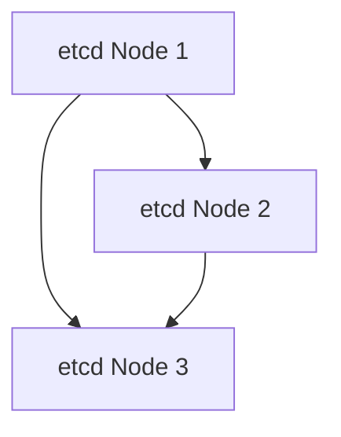

# Kubernetes 高可用架构

Kubernetes 是一个开源的容器编排平台，用于自动化部署、扩展和管理容器化应用。在生产环境中，Kubernetes 集群的高可用性（High Availability, HA）至关重要。高可用性意味着系统能够在部分组件发生故障时继续正常运行，从而确保服务的连续性和可靠性。

## 什么是Kubernetes高可用架构？

Kubernetes 高可用架构是指通过冗余和故障转移机制，确保 Kubernetes 集群中的关键组件（如 API Server、etcd、Controller Manager 和 Scheduler）在发生故障时仍能正常运行。高可用架构的目标是最大限度地减少停机时间，并确保应用程序的持续可用性。

### 关键组件的高可用性

在 Kubernetes 中，以下几个关键组件需要实现高可用性：

1. **API Server**：Kubernetes 的控制平面入口，负责处理所有 API 请求。
2. **etcd**：分布式键值存储，用于保存 Kubernetes 集群的所有配置数据。
3. **Controller Manager**：负责管理各种控制器，如节点控制器、副本控制器等。
4. **Scheduler**：负责将 Pod 调度到合适的节点上。

## 如何实现Kubernetes高可用架构

### 1. 多节点部署

为了实现高可用性，Kubernetes 的控制平面组件（API Server、Controller Manager 和 Scheduler）通常会在多个节点上部署。这样，即使其中一个节点发生故障，其他节点仍然可以继续提供服务。

```bash
# 示例：部署多个 API Server 实例
kubectl get pods -n kube-system -l component=kube-apiserver
```

### 2. etcd 集群

etcd 是 Kubernetes 的核心数据存储，因此其高可用性至关重要。通常，etcd 会以集群形式部署，使用 Raft 协议来确保数据的一致性和高可用性。



### 3. 负载均衡

为了确保 API Server 的高可用性，通常会在多个 API Server 实例前部署负载均衡器。负载均衡器可以将请求分发到不同的 API Server 实例，从而避免单点故障。

```bash
# 示例：配置负载均衡器
apiVersion: v1
kind: Service
metadata:
  name: kube-apiserver
spec:
  type: LoadBalancer
  ports:
    - port: 6443
      targetPort: 6443
  selector:
    component: kube-apiserver
```

### 4. 自动故障转移

Kubernetes 的高可用性还依赖于自动故障转移机制。例如，当某个节点发生故障时，Kubernetes 会自动将 Pod 重新调度到其他健康的节点上。

```bash
# 示例：查看节点状态
kubectl get nodes
```

## 实际案例

假设你正在运行一个电商平台，该平台依赖于 Kubernetes 来管理其微服务架构。为了确保平台的高可用性，你部署了一个包含多个 API Server 实例和 etcd 集群的 Kubernetes 集群。当某个 API Server 实例发生故障时，负载均衡器会自动将流量路由到其他健康的实例，从而确保平台的持续运行。

## 总结

Kubernetes 高可用架构通过多节点部署、etcd 集群、负载均衡和自动故障转移等机制，确保了集群的稳定性和可靠性。对于生产环境来说，实现高可用性是至关重要的，它可以最大限度地减少停机时间，并确保应用程序的持续可用性。

## 附加资源

- [Kubernetes 官方文档](https://kubernetes.io/docs/home/)
- [etcd 官方文档](https://etcd.io/docs/)
- [Kubernetes 高可用性最佳实践](https://kubernetes.io/docs/setup/best-practices/ha/)

:::tip
建议初学者在本地环境中使用 Minikube 或 Kind 进行 Kubernetes 高可用架构的实验，以更好地理解其工作原理。
:::