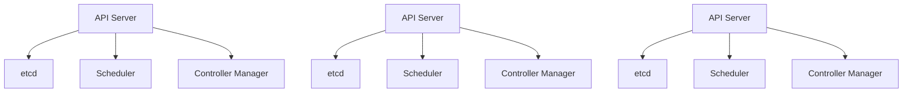

# Kubernetes 多主节点

## 介绍

Kubernetes是一个开源的容器编排平台，用于自动化部署、扩展和管理容器化应用程序。在生产环境中，Kubernetes集群的高可用性（High Availability, HA）至关重要。为了实现高可用性，Kubernetes支持多主节点（Multi-Master）架构。

多主节点架构意味着集群中有多个控制平面节点（Master Node），这些节点共同管理集群的状态和调度。如果其中一个主节点发生故障，其他主节点可以继续提供服务，从而确保集群的稳定性和可用性。

## 多主节点架构

在Kubernetes中，控制平面由多个组件组成，包括API Server、Scheduler、Controller Manager和etcd。在多主节点架构中，这些组件通常会在多个节点上运行，以确保冗余和故障转移。

### 架构图



在上面的架构图中，我们可以看到多个API Server、Scheduler、Controller Manager和etcd实例分布在不同的节点上。这种分布确保了即使一个节点发生故障，其他节点仍然可以继续工作。

## 配置多主节点集群

要配置一个多主节点的Kubernetes集群，通常需要以下步骤：

1. **安装etcd集群**：etcd是Kubernetes的分布式键值存储，用于存储集群的状态。在多主节点架构中，etcd也需要以集群模式运行。

2. **配置API Server**：每个主节点上都需要运行一个API Server实例，并且这些实例需要能够相互通信。

3. **配置负载均衡器**：为了将客户端请求分发到不同的API Server，通常需要一个负载均衡器。

4. **配置Scheduler和Controller Manager**：这些组件也需要在每个主节点上运行，并且需要配置为高可用模式。

### 示例：配置etcd集群

以下是一个简单的etcd集群配置示例：

```bash
# 在第一个节点上启动etcd
etcd --name infra0 --initial-advertise-peer-urls http://10.0.0.1:2380 \
  --listen-peer-urls http://10.0.0.1:2380 \
  --listen-client-urls http://10.0.0.1:2379,http://127.0.0.1:2379 \
  --advertise-client-urls http://10.0.0.1:2379 \
  --initial-cluster-token etcd-cluster-1 \
  --initial-cluster infra0=http://10.0.0.1:2380,infra1=http://10.0.0.2:2380,infra2=http://10.0.0.3:2380 \
  --initial-cluster-state new

# 在第二个节点上启动etcd
etcd --name infra1 --initial-advertise-peer-urls http://10.0.0.2:2380 \
  --listen-peer-urls http://10.0.0.2:2380 \
  --listen-client-urls http://10.0.0.2:2379,http://127.0.0.1:2379 \
  --advertise-client-urls http://10.0.0.2:2379 \
  --initial-cluster-token etcd-cluster-1 \
  --initial-cluster infra0=http://10.0.0.1:2380,infra1=http://10.0.0.2:2380,infra2=http://10.0.0.3:2380 \
  --initial-cluster-state new

# 在第三个节点上启动etcd
etcd --name infra2 --initial-advertise-peer-urls http://10.0.0.3:2380 \
  --listen-peer-urls http://10.0.0.3:2380 \
  --listen-client-urls http://10.0.0.3:2379,http://127.0.0.1:2379 \
  --advertise-client-urls http://10.0.0.3:2379 \
  --initial-cluster-token etcd-cluster-1 \
  --initial-cluster infra0=http://10.0.0.1:2380,infra1=http://10.0.0.2:2380,infra2=http://10.0.0.3:2380 \
  --initial-cluster-state new
```

:::note
在实际生产环境中，建议使用自动化工具（如kubeadm）来配置多主节点集群，以减少手动配置的复杂性。
:::

## 实际应用场景

### 场景：金融系统的高可用性

在金融系统中，系统的稳定性和可用性至关重要。假设我们有一个基于Kubernetes的支付处理系统，该系统需要处理大量的交易请求。为了确保系统的高可用性，我们采用了多主节点架构。

- **API Server**：多个API Server实例分布在不同的数据中心，确保即使一个数据中心发生故障，其他数据中心仍然可以处理请求。
- **etcd**：etcd集群分布在不同的区域，确保数据的持久性和一致性。
- **负载均衡器**：负载均衡器将客户端请求分发到不同的API Server，确保请求的均匀分布。

通过这种架构，即使一个主节点或数据中心发生故障，系统仍然可以继续运行，从而确保支付处理系统的高可用性。

## 总结

Kubernetes多主节点架构是实现高可用性的关键。通过配置多个控制平面节点，可以确保即使一个节点发生故障，集群仍然可以继续运行。本文介绍了多主节点的概念、架构、配置步骤以及实际应用场景。

## 附加资源

- [Kubernetes官方文档](https://kubernetes.io/docs/home/)
- [etcd官方文档](https://etcd.io/docs/)
- [kubeadm官方文档](https://kubernetes.io/docs/reference/setup-tools/kubeadm/)

## 练习

1. 使用kubeadm工具配置一个三节点的Kubernetes多主节点集群。
2. 模拟一个主节点故障，观察集群的行为。
3. 研究如何在多主节点架构中实现etcd的高可用性。

:::tip
在练习过程中，建议使用虚拟机或云服务提供商提供的实例来模拟多节点环境。
:::