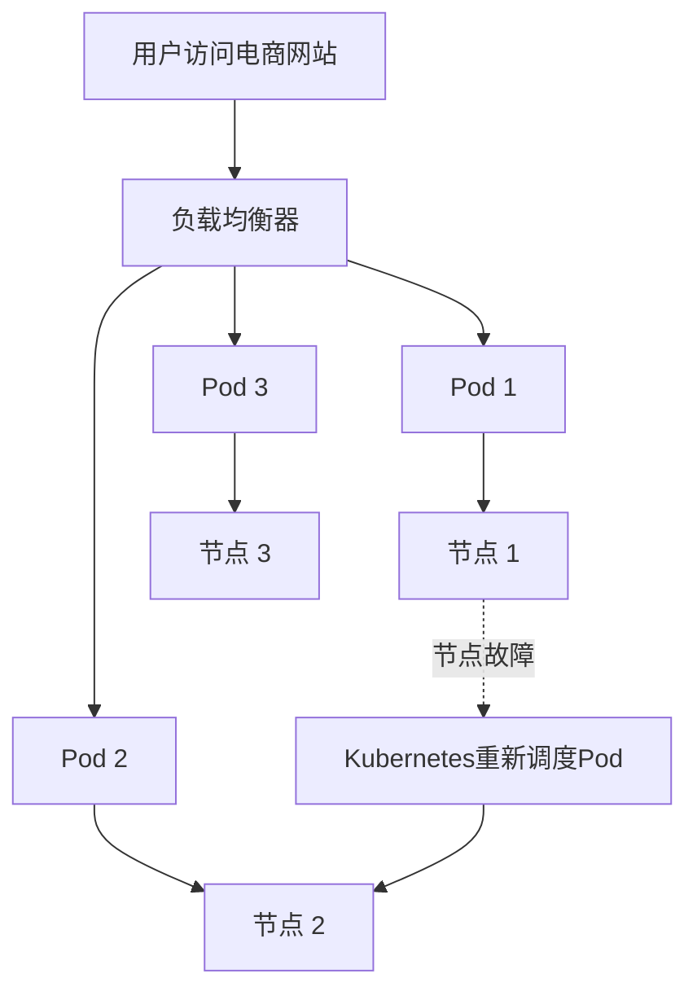

# Kubernetes 容错机制

在现代分布式系统中，容错机制是确保系统高可用性和稳定性的关键。Kubernetes作为一个强大的容器编排平台，提供了多种容错机制来应对节点故障、网络问题以及应用程序崩溃等场景。本文将详细介绍Kubernetes中的容错机制，并通过实际案例帮助初学者理解其工作原理。

## 什么是容错机制？

容错机制是指系统在部分组件发生故障时，仍能继续正常运行的能力。在Kubernetes中，容错机制主要通过以下几个方面实现：

1. **节点故障恢复**：当某个节点发生故障时，Kubernetes会自动将运行在该节点上的Pod重新调度到其他健康的节点上。
2. **Pod健康检查**：通过Liveness和Readiness探针，Kubernetes可以检测Pod的健康状态，并在必要时重启或替换Pod。
3. **副本集（ReplicaSet）**：通过副本集，Kubernetes确保指定数量的Pod副本始终处于运行状态，即使某些Pod发生故障。
4. **自动扩展**：通过Horizontal Pod Autoscaler（HPA），Kubernetes可以根据负载自动调整Pod的数量，确保应用程序的高可用性。

## Kubernetes 容错机制的核心组件

### 1. 节点故障恢复

Kubernetes通过节点控制器（Node Controller）监控集群中的节点状态。当某个节点不可用时，节点控制器会将该节点标记为“不可调度”，并将运行在该节点上的Pod重新调度到其他健康的节点上。

```yaml
apiVersion: v1
kind: Node
metadata:
  name: node-1
status:
  conditions:
  - type: Ready
    status: "False"
    lastHeartbeatTime: "2023-10-01T12:00:00Z"
```

在上面的示例中，节点`node-1`的状态被标记为`Ready: False`，Kubernetes会将该节点上的Pod重新调度到其他节点。

### 2. Pod健康检查

Kubernetes通过Liveness和Readiness探针来监控Pod的健康状态。

- **Liveness探针**：用于检测Pod是否仍在运行。如果Liveness探针失败，Kubernetes会重启该Pod。
- **Readiness探针**：用于检测Pod是否准备好接收流量。如果Readiness探针失败，Kubernetes会将该Pod从服务端点中移除。

```yaml
apiVersion: v1
kind: Pod
metadata:
  name: my-app
spec:
  containers:
  - name: my-app-container
    image: my-app-image
    livenessProbe:
      httpGet:
        path: /healthz
        port: 8080
      initialDelaySeconds: 3
      periodSeconds: 3
    readinessProbe:
      httpGet:
        path: /ready
        port: 8080
      initialDelaySeconds: 5
      periodSeconds: 5
```

在上面的示例中，Liveness探针每3秒检查一次`/healthz`路径，Readiness探针每5秒检查一次`/ready`路径。

### 3. 副本集（ReplicaSet）

副本集确保指定数量的Pod副本始终处于运行状态。如果某个Pod发生故障或被删除，副本集会自动创建新的Pod来替代。

```yaml
apiVersion: apps/v1
kind: ReplicaSet
metadata:
  name: my-app-replicaset
spec:
  replicas: 3
  selector:
    matchLabels:
      app: my-app
  template:
    metadata:
      labels:
        app: my-app
    spec:
      containers:
      - name: my-app-container
        image: my-app-image
```

在上面的示例中，副本集确保始终有3个`my-app` Pod在运行。

### 4. 自动扩展（Horizontal Pod Autoscaler）

Horizontal Pod Autoscaler（HPA）根据CPU利用率或其他自定义指标自动调整Pod的数量。

```yaml
apiVersion: autoscaling/v2beta2
kind: HorizontalPodAutoscaler
metadata:
  name: my-app-hpa
spec:
  scaleTargetRef:
    apiVersion: apps/v1
    kind: Deployment
    name: my-app-deployment
  minReplicas: 2
  maxReplicas: 10
  metrics:
  - type: Resource
    resource:
      name: cpu
      target:
        type: Utilization
        averageUtilization: 50
```

在上面的示例中，HPA会根据CPU利用率自动调整`my-app-deployment`的Pod数量，确保CPU利用率保持在50%左右。

## 实际案例：电商网站的高可用性

假设我们有一个电商网站，使用Kubernetes部署。为了确保网站在高流量和节点故障时仍能正常运行，我们可以采取以下措施：

1. **使用副本集**：确保有多个Pod副本运行，即使某个Pod发生故障，其他Pod仍能继续处理请求。
2. **配置健康检查**：通过Liveness和Readiness探针监控Pod的健康状态，确保只有健康的Pod才会接收流量。
3. **自动扩展**：在促销活动期间，通过HPA自动扩展Pod数量，以应对突发的流量增长。
4. **节点故障恢复**：当某个节点发生故障时，Kubernetes会自动将Pod重新调度到其他节点，确保服务不中断。



在上面的图表中，当节点1发生故障时，Kubernetes会将Pod 1重新调度到节点2或节点3，确保服务不中断。

## 总结

Kubernetes的容错机制通过节点故障恢复、Pod健康检查、副本集和自动扩展等功能，确保了应用程序的高可用性和稳定性。对于初学者来说，理解这些机制是掌握Kubernetes的关键。通过实际案例，我们可以看到这些机制在真实场景中的应用。

## 附加资源

- [Kubernetes官方文档](https://kubernetes.io/docs/home/)
- [Kubernetes健康检查指南](https://kubernetes.io/docs/tasks/configure-pod-container/configure-liveness-readiness-startup-probes/)
- [Horizontal Pod Autoscaler详解](https://kubernetes.io/docs/tasks/run-application/horizontal-pod-autoscale/)

## 练习

1. 创建一个包含Liveness和Readiness探针的Pod，并模拟探针失败，观察Kubernetes的行为。
2. 部署一个副本集，并手动删除一个Pod，观察Kubernetes如何自动创建新的Pod。
3. 配置一个Horizontal Pod Autoscaler，并模拟高负载，观察Pod数量的变化。

通过以上练习，你将更深入地理解Kubernetes的容错机制。