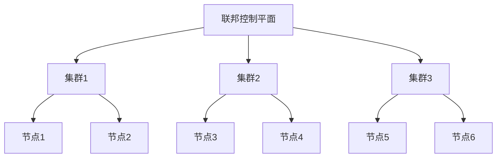

## 什么是Kubernetes集群联邦？

Kubernetes集群联邦（Kubernetes Cluster Federation）是一种将多个Kubernetes集群统一管理的机制。它允许你在多个集群之间共享资源、配置和服务，从而实现跨集群的高可用性和负载均衡。通过集群联邦，你可以将多个独立的Kubernetes集群视为一个逻辑上的“超级集群”，从而简化管理和运维工作。

:::tip
集群联邦特别适用于需要在多个区域或云提供商之间部署应用的场景，例如全球分布式应用或多云环境。
:::

## 集群联邦的核心概念

### 1. 联邦控制平面（Federation Control Plane）
联邦控制平面是集群联邦的核心组件，负责管理多个Kubernetes集群。它通过API服务器与各个集群通信，并将资源分发到这些集群中。

### 2. 联邦资源（Federated Resources）
联邦资源是指在多个集群之间共享的资源，例如Deployment、Service、ConfigMap等。这些资源由联邦控制平面统一管理，并分发到各个集群中。

### 3. 集群注册（Cluster Registration）
在使用集群联邦之前，需要将各个Kubernetes集群注册到联邦控制平面中。注册后，联邦控制平面可以识别并管理这些集群。

### 4. 跨集群调度（Cross-Cluster Scheduling）
集群联邦支持跨集群调度，允许你将工作负载分发到多个集群中。这可以通过配置策略来实现，例如基于地理位置、资源利用率等条件进行调度。

## 集群联邦的工作原理

以下是一个简化的集群联邦架构图：



1. **联邦控制平面**：负责管理多个Kubernetes集群。
2. **集群注册**：将各个集群注册到联邦控制平面中。
3. **资源分发**：联邦控制平面将资源分发到各个集群中。
4. **跨集群调度**：根据配置策略，将工作负载分发到合适的集群中。

## 实际案例：全球分布式应用

假设你正在开发一个全球分布式应用，需要在多个区域（例如北美、欧洲和亚洲）部署服务。通过Kubernetes集群联邦，你可以轻松实现以下目标：

1. **高可用性**：在多个区域部署相同的服务，确保即使某个区域发生故障，其他区域的服务仍然可用。
2. **负载均衡**：根据用户的地理位置，将流量路由到最近的区域，从而减少延迟。
3. **统一管理**：通过联邦控制平面，统一管理多个区域的Kubernetes集群，简化运维工作。

### 代码示例：创建联邦Deployment

以下是一个简单的联邦Deployment示例，用于在多个集群中部署Nginx服务：

```yaml
apiVersion: types.kubefed.io/v1beta1
kind: FederatedDeployment
metadata:
  name: nginx
  namespace: default
spec:
  template:
    metadata:
      labels:
        app: nginx
    spec:
      replicas: 3
      selector:
        matchLabels:
          app: nginx
      template:
        metadata:
          labels:
            app: nginx
        spec:
          containers:
          - name: nginx
            image: nginx:1.14.2
            ports:
            - containerPort: 80
  placement:
    clusters:
    - name: cluster1
    - name: cluster2
    - name: cluster3
```

:::note
在这个示例中，`FederatedDeployment`资源将被分发到`cluster1`、`cluster2`和`cluster3`三个集群中。
:::

## 总结

Kubernetes集群联邦是一种强大的工具，可以帮助你在多个Kubernetes集群之间实现高可用性、负载均衡和统一管理。通过联邦控制平面，你可以轻松管理多个集群，并将资源分发到这些集群中。集群联邦特别适用于全球分布式应用或多云环境。

## 附加资源

- [Kubernetes官方文档：集群联邦](https://kubernetes.io/docs/concepts/cluster-administration/federation/)
- [Kubefed：Kubernetes集群联邦的实现](https://github.com/kubernetes-sigs/kubefed)

## 练习

1. 尝试在你的本地环境中部署一个简单的联邦Deployment，并将其分发到多个集群中。
2. 研究如何配置跨集群调度策略，例如基于地理位置的调度。
