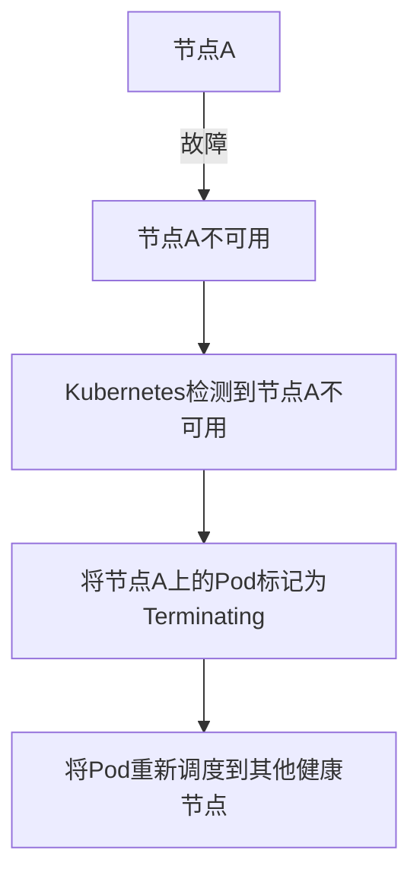

# Kubernetes 故障转移

在现代分布式系统中，高可用性是一个关键目标。Kubernetes作为容器编排工具，提供了强大的故障转移机制，确保应用程序在节点或组件发生故障时能够继续运行。本文将详细介绍Kubernetes中的故障转移概念、实现方式以及实际应用场景。

## 什么是故障转移？

故障转移（Failover）是指在系统或组件发生故障时，自动将工作负载转移到其他健康的节点或组件上，以确保服务的连续性和高可用性。在Kubernetes中，故障转移通常通过以下机制实现：

1. **Pod的重启策略**：当Pod中的容器崩溃时，Kubernetes会根据配置的重启策略自动重启容器。
2. **ReplicaSet和Deployment**：通过ReplicaSet和Deployment控制器，Kubernetes可以确保指定数量的Pod副本始终处于运行状态。
3. **节点故障检测**：Kubernetes会监控节点的健康状态，并在节点故障时将Pod重新调度到其他健康的节点上。

## Kubernetes 中的故障转移机制

### 1. Pod的重启策略

Kubernetes支持三种Pod的重启策略：

- **Always**：无论容器退出状态如何，总是重启容器。
- **OnFailure**：仅在容器非正常退出时重启容器。
- **Never**：从不重启容器。

以下是一个Pod的YAML示例，展示了如何配置重启策略：

```yaml
apiVersion: v1
kind: Pod
metadata:
  name: my-pod
spec:
  containers:
  - name: my-container
    image: nginx
  restartPolicy: OnFailure
```

### 2. ReplicaSet和Deployment

ReplicaSet和Deployment是Kubernetes中用于管理Pod副本的控制器。它们确保指定数量的Pod副本始终处于运行状态。当某个Pod发生故障时，控制器会自动创建新的Pod来替换它。

以下是一个Deployment的YAML示例：

```yaml
apiVersion: apps/v1
kind: Deployment
metadata:
  name: my-deployment
spec:
  replicas: 3
  selector:
    matchLabels:
      app: my-app
  template:
    metadata:
      labels:
        app: my-app
    spec:
      containers:
      - name: my-container
        image: nginx
```

在这个示例中，Kubernetes会确保始终有3个`my-app`的Pod在运行。如果其中一个Pod发生故障，Kubernetes会自动创建一个新的Pod来替换它。

### 3. 节点故障检测

Kubernetes会定期检查节点的健康状态。如果某个节点不可用，Kubernetes会将该节点上的Pod标记为`Terminating`，并将它们重新调度到其他健康的节点上。

以下是一个节点故障的示例流程：



## 实际应用场景

### 场景1：Web应用的高可用性

假设你有一个Web应用，部署在Kubernetes集群中。你希望确保即使某个节点发生故障，Web应用仍然可以继续提供服务。通过使用Deployment控制器，你可以确保有多个Pod副本运行在不同的节点上。当某个节点发生故障时，Kubernetes会自动将Pod重新调度到其他节点上，从而保证Web应用的高可用性。

### 场景2：数据库的故障转移

对于有状态的应用程序，如数据库，Kubernetes提供了StatefulSet控制器。StatefulSet确保每个Pod都有唯一的标识，并且在Pod重新调度时保持其状态。当某个节点发生故障时，Kubernetes会自动将数据库Pod重新调度到其他节点，并确保数据的一致性。

## 总结

Kubernetes的故障转移机制是确保应用程序高可用性的关键。通过Pod的重启策略、ReplicaSet和Deployment控制器以及节点故障检测，Kubernetes能够在组件或节点发生故障时自动恢复服务。理解这些机制并合理配置，可以帮助你构建更加健壮和可靠的分布式系统。

## 附加资源与练习

- **Kubernetes官方文档**：[Pod生命周期](https://kubernetes.io/docs/concepts/workloads/pods/pod-lifecycle/)
- **练习**：尝试在本地Kubernetes集群中部署一个Deployment，并模拟节点故障，观察Kubernetes如何自动进行故障转移。

:::tip
在实际生产环境中，建议结合监控和告警系统，及时发现和处理节点或组件的故障，以确保系统的高可用性。
:::