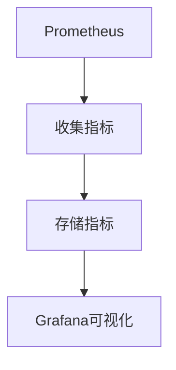

# Kubernetes 可观测性

在现代分布式系统中，**可观测性**是一个至关重要的概念。它指的是通过监控、日志和追踪等手段，了解系统的内部状态和行为。对于Kubernetes这样的复杂系统，可观测性尤为重要，因为它可以帮助我们快速定位问题、优化性能，并确保系统的稳定性。

## 什么是Kubernetes可观测性？

Kubernetes可观测性是指通过收集、分析和可视化Kubernetes集群中的各种数据，来了解集群的健康状况、性能和行为。这些数据通常包括：

- **监控数据**：如CPU、内存、网络等资源的使用情况。
- **日志数据**：如应用程序和系统组件的日志输出。
- **追踪数据**：如请求在系统中的流转路径和耗时。

通过这些数据，我们可以更好地理解系统的运行状态，及时发现和解决问题。

## Kubernetes 可观测性的三大支柱

Kubernetes可观测性主要依赖于以下三大支柱：

1. **监控（Monitoring）**
2. **日志（Logging）**
3. **追踪（Tracing）**

### 1. 监控（Monitoring）

监控是指持续收集和分析系统的性能指标，以便了解系统的健康状况。在Kubernetes中，常用的监控工具包括Prometheus、Grafana等。

#### 示例：使用Prometheus监控Kubernetes集群

首先，我们需要在Kubernetes集群中部署Prometheus。可以通过Helm来快速安装：

```bash
helm repo add prometheus-community https://prometheus-community.github.io/helm-charts
helm install prometheus prometheus-community/prometheus
```

安装完成后，Prometheus会自动开始收集集群中的各种指标。我们可以通过Grafana来可视化这些数据。



### 2. 日志（Logging）

日志是指记录系统或应用程序运行时的详细信息。在Kubernetes中，日志通常由容器生成，并通过标准输出（stdout）和标准错误（stderr）输出。

#### 示例：使用Fluentd收集Kubernetes日志

Fluentd是一个常用的日志收集工具，可以将Kubernetes集群中的日志收集并发送到Elasticsearch等存储系统中。

首先，部署Fluentd DaemonSet：

```yaml
apiVersion: apps/v1
kind: DaemonSet
metadata:
  name: fluentd
  namespace: kube-system
spec:
  template:
    spec:
      containers:
      - name: fluentd
        image: fluent/fluentd-kubernetes-daemonset:v1.14.6-debian-elasticsearch7-1
        env:
        - name: FLUENT_ELASTICSEARCH_HOST
          value: "elasticsearch"
        - name: FLUENT_ELASTICSEARCH_PORT
          value: "9200"
```

部署完成后，Fluentd会自动收集每个节点的日志，并将其发送到Elasticsearch。

### 3. 追踪（Tracing）

追踪是指记录请求在系统中的流转路径和耗时。这对于理解系统的性能瓶颈和调试分布式系统中的问题非常有帮助。

#### 示例：使用Jaeger进行分布式追踪

Jaeger是一个开源的分布式追踪系统，可以帮助我们追踪请求在Kubernetes集群中的流转路径。

首先，部署Jaeger：

```bash
kubectl create namespace observability
kubectl apply -f https://raw.githubusercontent.com/jaegertracing/jaeger-operator/master/deploy/crds/jaegertracing.io_jaegers_crd.yaml
kubectl apply -f https://raw.githubusercontent.com/jaegertracing/jaeger-operator/master/deploy/operator.yaml
```

部署完成后，Jaeger会自动开始收集追踪数据，并提供一个Web界面来查看这些数据。

## 实际应用场景

### 场景1：性能优化

假设我们有一个Kubernetes集群，运行着一个微服务架构的应用程序。通过监控工具，我们发现某个服务的CPU使用率异常高。通过日志和追踪工具，我们进一步发现该服务在处理某个特定请求时耗时过长。最终，我们通过优化代码解决了这个问题。

### 场景2：故障排查

在一次系统升级后，我们发现某个服务频繁崩溃。通过日志工具，我们发现了崩溃时的错误信息，并通过追踪工具找到了导致崩溃的请求路径。最终，我们通过回滚升级解决了这个问题。

## 总结

Kubernetes可观测性是确保系统稳定性和性能的关键。通过监控、日志和追踪这三大支柱，我们可以更好地理解系统的运行状态，及时发现和解决问题。

## 附加资源

- [Prometheus官方文档](https://prometheus.io/docs/)
- [Fluentd官方文档](https://docs.fluentd.org/)
- [Jaeger官方文档](https://www.jaegertracing.io/docs/)

## 练习

1. 在Kubernetes集群中部署Prometheus，并使用Grafana可视化监控数据。
2. 使用Fluentd收集Kubernetes集群中的日志，并将其发送到Elasticsearch。
3. 部署Jaeger，并追踪一个简单的微服务应用程序的请求路径。

通过完成这些练习，你将更深入地理解Kubernetes可观测性的各个方面。