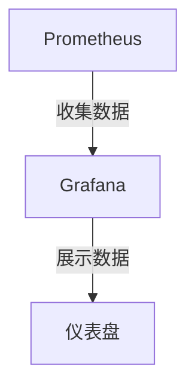

# Kubernetes 性能监控

Kubernetes是一个强大的容器编排平台，但随着应用程序和集群规模的扩大，性能问题可能会变得复杂。为了确保集群的高效运行，性能监控是必不可少的。本文将介绍Kubernetes性能监控的基本概念、常用工具以及如何在实际场景中应用这些工具。

## 什么是Kubernetes性能监控？

Kubernetes性能监控是指通过收集和分析集群中各个组件的性能数据，来确保集群的健康和高效运行。这些组件包括节点、Pod、容器、网络和存储等。通过监控，您可以及时发现性能瓶颈、资源不足或其他潜在问题，从而采取相应的措施。

## 为什么需要性能监控？

1. **资源优化**：通过监控，您可以了解资源的使用情况，从而优化资源配置，避免资源浪费。
2. **故障排查**：当应用程序出现性能问题时，监控数据可以帮助您快速定位问题根源。
3. **自动扩展**：监控数据可以用于触发自动扩展策略，确保应用程序在高负载下仍能正常运行。

## 常用监控工具

在Kubernetes中，有多种工具可以用于性能监控。以下是一些常用的工具：

1. **Prometheus**：一个开源的监控和告警工具，广泛用于Kubernetes集群的监控。
2. **Grafana**：一个开源的可视化工具，通常与Prometheus结合使用，用于展示监控数据。
3. **cAdvisor**：一个开源的容器监控工具，集成在Kubelet中，用于收集容器的资源使用情况。
4. **Metrics Server**：一个集群范围的资源使用数据聚合器，用于提供资源使用情况的API。

## 实际案例：使用Prometheus和Grafana监控Kubernetes集群

### 步骤1：安装Prometheus

首先，您需要在Kubernetes集群中安装Prometheus。可以使用Helm来简化安装过程：

```bash
helm repo add prometheus-community https://prometheus-community.github.io/helm-charts
helm repo update
helm install prometheus prometheus-community/prometheus
```

### 步骤2：安装Grafana

接下来，安装Grafana来可视化Prometheus收集的数据：

```bash
helm repo add grafana https://grafana.github.io/helm-charts
helm repo update
helm install grafana grafana/grafana
```

### 步骤3：配置Grafana数据源

在Grafana中，您需要配置Prometheus作为数据源。登录Grafana后，进入“Configuration” -> “Data Sources”，然后添加一个新的数据源，选择Prometheus，并输入Prometheus的URL。

### 步骤4：创建仪表盘

在Grafana中，您可以创建自定义仪表盘来展示Kubernetes集群的性能数据。例如，您可以创建一个仪表盘来展示CPU和内存的使用情况。



### 步骤5：监控集群性能

现在，您可以通过Grafana仪表盘实时监控Kubernetes集群的性能。您可以查看各个节点的CPU、内存、网络和存储的使用情况，并根据需要调整资源配置。

## 总结

Kubernetes性能监控是确保集群高效运行的关键。通过使用Prometheus和Grafana等工具，您可以轻松收集和可视化集群的性能数据，从而及时发现和解决问题。希望本文能帮助您理解Kubernetes性能监控的基本概念，并在实际应用中发挥作用。

## 附加资源

- [Prometheus官方文档](https://prometheus.io/docs/)
- [Grafana官方文档](https://grafana.com/docs/)
- [Kubernetes官方文档](https://kubernetes.io/docs/)

## 练习

1. 在您的Kubernetes集群中安装Prometheus和Grafana，并配置一个基本的监控仪表盘。
2. 尝试创建一个自定义的Grafana仪表盘，展示您感兴趣的Kubernetes性能指标。
3. 使用Prometheus的告警功能，设置一个当CPU使用率超过80%时触发的告警。

:::tip
提示：在配置Prometheus和Grafana时，确保您有足够的权限来访问Kubernetes集群的资源。
:::