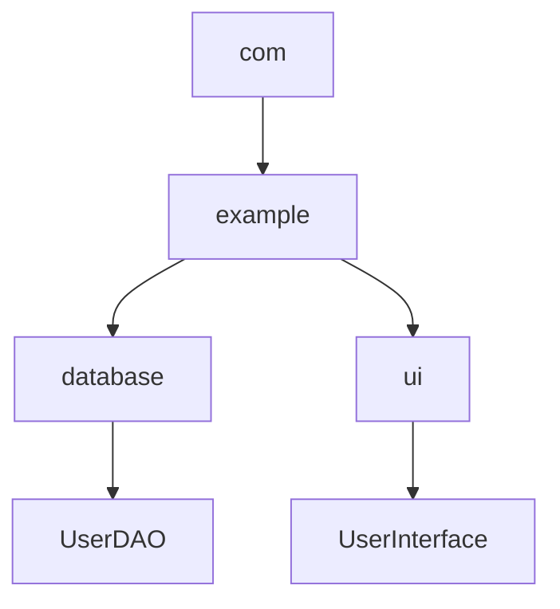

## 介绍

在Java中，**包（Package）**是一种用于组织和管理类和接口的机制。包的主要作用是避免命名冲突，并提供更好的代码组织和可维护性。通过将相关的类和接口放在同一个包中，可以更轻松地管理和重用代码。

### 什么是包？

包是Java中用于组织类和接口的命名空间。它类似于文件系统中的文件夹，用于将相关的文件（类和接口）组织在一起。每个包都有一个唯一的名称，通常采用反向域名的方式命名，例如 `com.example.mypackage`。

## 包的基本用法

### 创建包

要创建一个包，只需在Java源文件的开头使用 `package` 关键字声明包名。例如：

```java
package com.example.mypackage;

public class MyClass {
    public static void main(String[] args) {
        System.out.println("Hello from MyClass!");
    }
}
```

在这个例子中，`MyClass` 类属于 `com.example.mypackage` 包。

### 导入包

要在另一个类中使用某个包中的类，需要使用 `import` 语句。例如：

```java
import com.example.mypackage.MyClass;

public class AnotherClass {
    public static void main(String[] args) {
        MyClass myClass = new MyClass();
        myClass.main(args);
    }
}
```

在这个例子中，`AnotherClass` 类通过 `import` 语句导入了 `com.example.mypackage.MyClass` 类。

:::tip
如果两个类在同一个包中，则不需要使用 `import` 语句。
:::

### 包的命名规范

包的命名通常采用反向域名的方式，例如 `com.example.mypackage`。这样可以确保包名的唯一性，避免命名冲突。

:::caution
包名应该全部小写，并且不能包含任何特殊字符（除了点 `.`）。
:::

## 包的实际应用

### 避免命名冲突

假设你有两个类都叫 `User`，但它们属于不同的包：

```java
package com.example.firstpackage;

public class User {
    public void greet() {
        System.out.println("Hello from first package!");
    }
}
```

```java
package com.example.secondpackage;

public class User {
    public void greet() {
        System.out.println("Hello from second package!");
    }
}
```

在这种情况下，你可以通过包名来区分这两个类：

```java
import com.example.firstpackage.User;
import com.example.secondpackage.User;

public class Main {
    public static void main(String[] args) {
        User user1 = new com.example.firstpackage.User();
        User user2 = new com.example.secondpackage.User();

        user1.greet(); // 输出: Hello from first package!
        user2.greet(); // 输出: Hello from second package!
    }
}
```

### 提高代码的可维护性

通过将相关的类和接口放在同一个包中，可以更轻松地管理和维护代码。例如，你可以将所有的数据库操作类放在 `com.example.database` 包中，将所有的用户界面类放在 `com.example.ui` 包中。

## 包的层次结构

包可以嵌套，形成层次结构。例如：



在这个例子中，`com.example.database` 和 `com.example.ui` 是 `com.example` 包的子包。

## 总结

Java的包机制是组织和管理代码的重要工具。通过使用包，你可以避免命名冲突，提高代码的可维护性，并更好地组织你的项目。

### 附加资源

- [Java官方文档 - 包](https://docs.oracle.com/javase/tutorial/java/package/index.html)
- [Java编程思想](https://www.amazon.com/Thinking-Java-4th-Bruce-Eckel/dp/0131872486)

### 练习

1. 创建一个名为 `com.example.utils` 的包，并在其中定义一个 `StringUtil` 类，该类包含一个静态方法 `reverse(String str)`，用于反转字符串。
2. 在另一个类中导入并使用 `StringUtil` 类，测试 `reverse` 方法。

:::note
完成练习后，尝试将 `StringUtil` 类移动到另一个包中，并观察需要如何修改导入语句。
:::