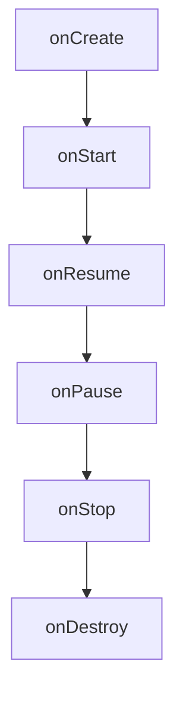

# Android Activity深入

Activity 是 Android 应用中最基本的组件之一，它代表了一个用户可以与之交互的屏幕界面。每个 Activity 都负责管理一个窗口，用户可以在其中执行操作。理解 Activity 的工作原理对于开发 Android 应用至关重要。

## 什么是 Activity？

Activity 是 Android 应用中的一个核心组件，它负责管理用户界面（UI）和用户交互。每个 Activity 都代表一个屏幕，用户可以在屏幕上执行操作。例如，一个电子邮件应用可能有一个 Activity 用于显示邮件列表，另一个 Activity 用于撰写新邮件。

### Activity 的生命周期

Activity 的生命周期是指 Activity 从创建到销毁的整个过程。Android 系统通过回调方法来管理 Activity 的生命周期。以下是 Activity 的主要生命周期方法：

1. **onCreate()**: 当 Activity 第一次创建时调用。通常在这里进行初始化操作，如设置布局。
2. **onStart()**: 当 Activity 对用户可见时调用。
3. **onResume()**: 当 Activity 开始与用户交互时调用。
4. **onPause()**: 当 Activity 失去焦点但仍可见时调用。
5. **onStop()**: 当 Activity 不再可见时调用。
6. **onDestroy()**: 当 Activity 被销毁时调用。



:::note
**注意**: 理解 Activity 的生命周期对于避免内存泄漏和确保应用性能至关重要。
:::

### 代码示例：创建一个简单的 Activity

以下是一个简单的 Activity 示例，展示了如何在 `onCreate()` 方法中设置布局：

```java
public class MainActivity extends AppCompatActivity {
    @Override
    protected void onCreate(Bundle savedInstanceState) {
        super.onCreate(savedInstanceState);
        setContentView(R.layout.activity_main); // 设置布局文件
    }
}
```

在这个示例中，`MainActivity` 继承自 `AppCompatActivity`，并在 `onCreate()` 方法中设置了布局文件 `activity_main.xml`。

### Activity 的实际应用场景

Activity 在 Android 应用中有广泛的应用场景。以下是一些常见的例子：

1. **登录界面**: 用户输入用户名和密码的界面通常是一个 Activity。
2. **主界面**: 应用的主界面通常是一个 Activity，用户可以在其中浏览内容或执行操作。
3. **设置界面**: 应用的设置界面通常是一个 Activity，用户可以在其中更改应用设置。

### 总结

Activity 是 Android 应用的核心组件之一，负责管理用户界面和用户交互。理解 Activity 的生命周期和如何通过代码实现 Activity 的功能对于开发 Android 应用至关重要。

### 附加资源与练习

- **官方文档**: [Android Activity 文档](https://developer.android.com/guide/components/activities)
- **练习**: 创建一个新的 Android 项目，并尝试实现一个包含多个 Activity 的应用。例如，创建一个登录界面和一个主界面，并在用户登录成功后跳转到主界面。

:::tip
**提示**: 在开发过程中，使用 `Logcat` 来调试 Activity 的生命周期方法，以确保它们按预期执行。
:::