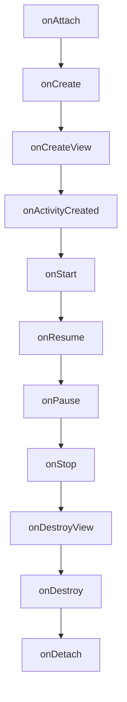

# Android Fragment详解

## 介绍

在Android开发中，Fragment（片段）是一个非常重要的组件。它代表了一个Activity中的一部分用户界面或行为。Fragment可以被看作是Activity的模块化部分，它有自己的生命周期，可以接收输入事件，并且可以在Activity运行时被添加或移除。Fragment的主要目的是支持更灵活的用户界面设计，尤其是在大屏幕设备（如平板电脑）上。

## Fragment的生命周期

Fragment的生命周期与Activity的生命周期类似，但也有一些独特的回调方法。以下是Fragment的主要生命周期方法：

1. **onAttach()**: Fragment与Activity关联时调用。
2. **onCreate()**: Fragment创建时调用。
3. **onCreateView()**: 创建Fragment的视图时调用。
4. **onActivityCreated()**: Activity的`onCreate()`方法完成后调用。
5. **onStart()**: Fragment可见时调用。
6. **onResume()**: Fragment可交互时调用。
7. **onPause()**: Fragment不再可交互时调用。
8. **onStop()**: Fragment不可见时调用。
9. **onDestroyView()**: Fragment的视图被销毁时调用。
10. **onDestroy()**: Fragment被销毁时调用。
11. **onDetach()**: Fragment与Activity解除关联时调用。



## 创建和使用Fragment

### 创建Fragment

要创建一个Fragment，你需要继承`Fragment`类并重写`onCreateView()`方法来定义Fragment的布局。

```java
public class MyFragment extends Fragment {
    @Override
    public View onCreateView(LayoutInflater inflater, ViewGroup container,
                             Bundle savedInstanceState) {
        // Inflate the layout for this fragment
        return inflater.inflate(R.layout.fragment_my, container, false);
    }
}
```

### 在Activity中添加Fragment

你可以通过两种方式将Fragment添加到Activity中：静态添加和动态添加。

#### 静态添加

在Activity的布局文件中直接添加Fragment：

```xml
<fragment
    android:id="@+id/myFragment"
    android:name="com.example.MyFragment"
    android:layout_width="match_parent"
    android:layout_height="match_parent" />
```

#### 动态添加

在Activity中使用`FragmentManager`动态添加Fragment：

```java
FragmentManager fragmentManager = getSupportFragmentManager();
FragmentTransaction fragmentTransaction = fragmentManager.beginTransaction();

MyFragment fragment = new MyFragment();
fragmentTransaction.add(R.id.fragment_container, fragment);
fragmentTransaction.commit();
```

## Fragment的实际应用场景

### 1. 多面板布局

在大屏幕设备上，Fragment可以用于创建多面板布局。例如，左侧面板显示列表，右侧面板显示详细信息。

```java
FragmentManager fragmentManager = getSupportFragmentManager();
FragmentTransaction fragmentTransaction = fragmentManager.beginTransaction();

ListFragment listFragment = new ListFragment();
DetailFragment detailFragment = new DetailFragment();

fragmentTransaction.add(R.id.list_container, listFragment);
fragmentTransaction.add(R.id.detail_container, detailFragment);
fragmentTransaction.commit();
```

### 2. 导航抽屉

Fragment可以用于实现导航抽屉（Navigation Drawer）。当用户点击抽屉中的某个选项时，可以动态替换Activity中的Fragment。

```java
FragmentManager fragmentManager = getSupportFragmentManager();
FragmentTransaction fragmentTransaction = fragmentManager.beginTransaction();

HomeFragment homeFragment = new HomeFragment();
fragmentTransaction.replace(R.id.fragment_container, homeFragment);
fragmentTransaction.commit();
```

## 总结

Fragment是Android开发中非常重要的组件，它可以帮助你创建灵活且模块化的用户界面。通过理解Fragment的生命周期和使用方法，你可以在不同的设备上提供更好的用户体验。

:::tip
**提示**: 在实际开发中，Fragment的使用非常广泛，尤其是在需要支持多种屏幕尺寸和方向的应用程序中。
:::

## 附加资源与练习

- **官方文档**: [Android Fragment](https://developer.android.com/guide/fragments)
- **练习**: 尝试创建一个包含多个Fragment的应用程序，并在不同屏幕尺寸的设备上测试其布局。

:::caution
**注意**: 在使用Fragment时，务必注意其生命周期，避免内存泄漏和其他潜在问题。
:::