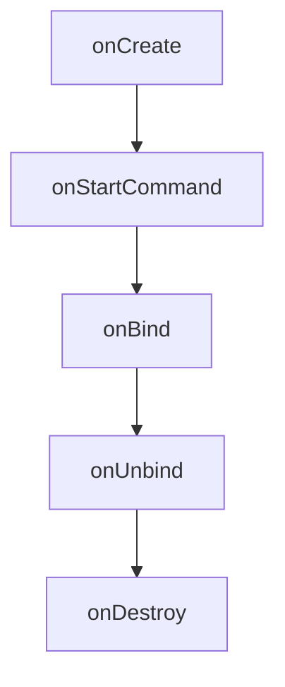

## 介绍

在 Android 开发中，**Service** 是一种可以在后台执行长时间运行操作的组件，它不需要用户界面。Service 通常用于处理不需要与用户直接交互的任务，例如播放音乐、下载文件或处理网络请求。与 Activity 不同，Service 没有用户界面，因此它可以在后台持续运行，即使应用不在前台。

:::note
Service 并不是一个独立的线程，它默认运行在主线程中。因此，如果你需要在 Service 中执行耗时操作，必须创建新的线程或使用其他并发机制。
:::

## Service 的生命周期

Service 的生命周期比 Activity 简单，主要包括以下几个方法：

- `onCreate()`: Service 被创建时调用。
- `onStartCommand()`: 每次通过 `startService()` 启动 Service 时调用。
- `onBind()`: 当其他组件通过 `bindService()` 绑定到 Service 时调用。
- `onUnbind()`: 当所有绑定的组件都解绑时调用。
- `onDestroy()`: Service 被销毁时调用。



## 创建 Service

要创建一个 Service，你需要继承 `Service` 类并重写其生命周期方法。以下是一个简单的 Service 示例：

```java
public class MyService extends Service {

    @Override
    public void onCreate() {
        super.onCreate();
        // Service 创建时执行的操作
    }

    @Override
    public int onStartCommand(Intent intent, int flags, int startId) {
        // 每次通过 startService() 启动 Service 时执行的操作
        return START_STICKY; // 表示 Service 被系统杀死后会重新创建
    }

    @Override
    public IBinder onBind(Intent intent) {
        // 当其他组件绑定到 Service 时执行的操作
        return null; // 如果不需要绑定，返回 null
    }

    @Override
    public void onDestroy() {
        super.onDestroy();
        // Service 销毁时执行的操作
    }
}
```

## 启动和停止 Service

你可以通过 `startService()` 和 `stopService()` 方法来启动和停止 Service。以下是如何在 Activity 中启动和停止 Service 的示例：

```java
Intent serviceIntent = new Intent(this, MyService.class);
startService(serviceIntent); // 启动 Service

// 停止 Service
stopService(serviceIntent);
```

:::caution
如果你通过 `startService()` 启动 Service，必须通过 `stopService()` 或 `stopSelf()` 来停止它，否则 Service 会一直运行。
:::

## 绑定 Service

除了通过 `startService()` 启动 Service，你还可以通过 `bindService()` 将 Activity 或其他组件绑定到 Service。绑定后，组件可以与 Service 进行交互。以下是一个绑定 Service 的示例：

```java
ServiceConnection serviceConnection = new ServiceConnection() {
    @Override
    public void onServiceConnected(ComponentName name, IBinder service) {
        // 当 Service 连接成功时调用
    }

    @Override
    public void onServiceDisconnected(ComponentName name) {
        // 当 Service 意外断开连接时调用
    }
};

Intent bindIntent = new Intent(this, MyService.class);
bindService(bindIntent, serviceConnection, Context.BIND_AUTO_CREATE);
```

:::tip
绑定 Service 后，你可以通过 `unbindService()` 来解绑。解绑后，Service 如果没有其他绑定，可能会被系统销毁。
:::

## 实际应用场景

### 1. 后台音乐播放

Service 非常适合用于后台音乐播放。你可以在 Service 中管理音乐播放器，并通过 `startService()` 启动 Service 来播放音乐。即使应用退到后台，音乐仍然可以继续播放。

### 2. 文件下载

如果你需要在后台下载大文件，可以使用 Service 来处理下载任务。通过 `startService()` 启动 Service，并在 Service 中创建新的线程来执行下载操作。

### 3. 网络请求

Service 也可以用于处理网络请求。你可以在 Service 中执行网络操作，并将结果返回给 Activity 或其他组件。

## 总结

Android Service 是一个强大的工具，可以帮助你在后台执行长时间运行的任务。通过 `startService()` 和 `bindService()`，你可以灵活地管理 Service 的生命周期。然而，需要注意的是，Service 默认运行在主线程中，因此如果你需要执行耗时操作，必须创建新的线程或使用其他并发机制。

## 附加资源

- [Android 官方文档 - Service](https://developer.android.com/guide/components/services)
- [Android Service 示例代码](https://github.com/android/sunflower)
- [Android 并发编程指南](https://developer.android.com/training/multiple-threads)

## 练习

1. 创建一个简单的 Service，在 `onStartCommand()` 方法中打印日志，并通过 `startService()` 启动它。
2. 修改 Service，使其在 `onBind()` 方法中返回一个自定义的 `IBinder` 对象，并通过 `bindService()` 绑定到 Activity。
3. 尝试在 Service 中执行一个耗时操作（如模拟下载），并观察主线程是否被阻塞。
