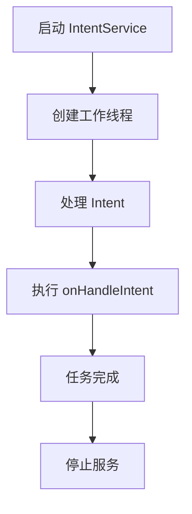

## 什么是 Android IntentService？

`IntentService` 是 Android 提供的一个用于处理异步任务的类。它继承自 `Service`，但专门设计用于处理耗时操作，例如网络请求或数据库操作。与普通的 `Service` 不同，`IntentService` 会在后台线程中执行任务，并且在任务完成后自动停止服务。

:::note
`IntentService` 在 Android 8.0（API 级别 26）及更高版本中已被弃用，推荐使用 `WorkManager` 或 `JobScheduler` 来替代。但对于学习 Android 基础组件，了解 `IntentService` 仍然很有帮助。
:::

## IntentService 的工作原理

`IntentService` 内部使用一个工作线程来处理传入的 `Intent` 请求。它会依次处理每个 `Intent`，并在所有任务完成后自动停止服务。以下是 `IntentService` 的工作流程：

1. 当 `IntentService` 启动时，它会创建一个新的工作线程。
2. 每个 `Intent` 会被传递到 `onHandleIntent()` 方法中，在该方法中执行耗时操作。
3. 当所有 `Intent` 处理完毕后，`IntentService` 会自动停止。



## 如何使用 IntentService？

### 1. 创建自定义 IntentService

要使用 `IntentService`，首先需要创建一个继承自 `IntentService` 的子类，并重写 `onHandleIntent()` 方法。

```java
public class MyIntentService extends IntentService {

    public MyIntentService() {
        super("MyIntentService");
    }

    @Override
    protected void onHandleIntent(@Nullable Intent intent) {
        // 在这里执行耗时操作
        if (intent != null) {
            String action = intent.getAction();
            if ("com.example.action.TASK1".equals(action)) {
                performTask1();
            } else if ("com.example.action.TASK2".equals(action)) {
                performTask2();
            }
        }
    }

    private void performTask1() {
        // 模拟耗时操作
        try {
            Thread.sleep(2000);
        } catch (InterruptedException e) {
            e.printStackTrace();
        }
        Log.d("MyIntentService", "Task 1 completed");
    }

    private void performTask2() {
        // 模拟耗时操作
        try {
            Thread.sleep(3000);
        } catch (InterruptedException e) {
            e.printStackTrace();
        }
        Log.d("MyIntentService", "Task 2 completed");
    }
}
```

### 2. 启动 IntentService

在 `Activity` 或其他组件中，可以通过 `Intent` 启动 `IntentService`。

```java
Intent intent = new Intent(this, MyIntentService.class);
intent.setAction("com.example.action.TASK1");
startService(intent);
```

### 3. 处理多个任务

`IntentService` 会依次处理传入的 `Intent`。例如，如果你连续启动两个任务：

```java
Intent intent1 = new Intent(this, MyIntentService.class);
intent1.setAction("com.example.action.TASK1");
startService(intent1);

Intent intent2 = new Intent(this, MyIntentService.class);
intent2.setAction("com.example.action.TASK2");
startService(intent2);
```

`IntentService` 会先处理 `TASK1`，然后再处理 `TASK2`。

## 实际应用场景

`IntentService` 适用于需要在后台执行耗时操作，但不需要与用户界面交互的场景。以下是一些常见的应用场景：

1. **下载文件**：在后台下载大文件，避免阻塞主线程。
2. **上传数据**：将用户数据上传到服务器。
3. **处理数据库操作**：执行复杂的数据库查询或更新操作。

:::caution
由于 `IntentService` 是单线程的，它不适合处理需要并行执行的任务。如果需要并行处理任务，可以考虑使用 `ThreadPoolExecutor` 或其他并发工具。
:::

## 总结

`IntentService` 是一个简单而强大的工具，适用于在后台执行耗时操作。虽然它在现代 Android 开发中已被弃用，但了解其工作原理仍然有助于理解 Android 的服务机制。

## 附加资源与练习

- **官方文档**：[IntentService](https://developer.android.com/reference/android/app/IntentService)
- **练习**：尝试创建一个 `IntentService`，用于在后台下载图片并保存到设备的存储中。
- **进阶学习**：了解 `WorkManager` 和 `JobScheduler`，它们是 `IntentService` 的现代替代方案。

:::tip
如果你对 `IntentService` 的使用有任何疑问，欢迎在评论区留言，我们会尽快为你解答！
:::