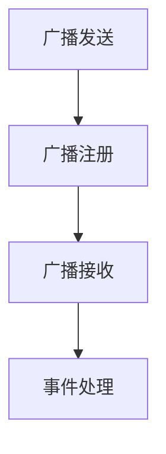

# Android BroadcastReceiver

## 介绍

在 Android 开发中，`BroadcastReceiver` 是一种用于监听系统或应用事件的组件。它允许应用程序在特定事件发生时（例如网络状态变化、电池电量低、短信接收等）执行某些操作。`BroadcastReceiver` 是 Android 四大组件之一，与 `Activity`、`Service` 和 `ContentProvider` 并列。

`BroadcastReceiver` 的核心思想是“事件驱动”。当某个事件发生时，系统会发送一个广播（Broadcast），所有注册了该广播的 `BroadcastReceiver` 都会接收到并处理该事件。

:::note
`BroadcastReceiver` 本身并不执行长时间运行的任务。如果需要执行耗时操作，通常会启动一个 `Service` 或使用 `WorkManager`。
:::

## BroadcastReceiver 的工作原理

`BroadcastReceiver` 的工作流程可以分为以下几个步骤：

1. **广播发送**：系统或应用发送一个广播。
2. **广播注册**：`BroadcastReceiver` 注册以监听特定的广播。
3. **广播接收**：当广播发送时，所有注册了该广播的 `BroadcastReceiver` 都会接收到。
4. **事件处理**：`BroadcastReceiver` 的 `onReceive()` 方法被调用，执行相应的逻辑。



## 创建 BroadcastReceiver

要创建一个 `BroadcastReceiver`，你需要继承 `BroadcastReceiver` 类并重写 `onReceive()` 方法。以下是一个简单的示例：

```java
public class MyReceiver extends BroadcastReceiver {
    @Override
    public void onReceive(Context context, Intent intent) {
        // 处理接收到的广播
        String action = intent.getAction();
        if (action != null && action.equals("com.example.MY_CUSTOM_ACTION")) {
            Toast.makeText(context, "自定义广播已接收", Toast.LENGTH_SHORT).show();
        }
    }
}
```

在这个示例中，`MyReceiver` 监听了一个自定义的广播动作 `com.example.MY_CUSTOM_ACTION`，并在接收到广播时显示一个 Toast 消息。

## 注册 BroadcastReceiver

`BroadcastReceiver` 可以通过两种方式注册：**静态注册**和**动态注册**。

### 静态注册

静态注册是在 `AndroidManifest.xml` 文件中声明 `BroadcastReceiver`。这种方式适用于需要长期监听某些系统事件的场景。

```xml
<receiver android:name=".MyReceiver">
    <intent-filter>
        <action android:name="com.example.MY_CUSTOM_ACTION" />
    </intent-filter>
</receiver>
```

### 动态注册

动态注册是在代码中通过 `registerReceiver()` 方法注册 `BroadcastReceiver`。这种方式适用于只在特定生命周期内监听广播的场景。

```java
MyReceiver receiver = new MyReceiver();
IntentFilter filter = new IntentFilter("com.example.MY_CUSTOM_ACTION");
registerReceiver(receiver, filter);
```

:::caution
动态注册的 `BroadcastReceiver` 必须在不再需要时通过 `unregisterReceiver()` 方法取消注册，否则会导致内存泄漏。
:::

## 发送广播

你可以通过 `Intent` 发送广播。以下是一个发送自定义广播的示例：

```java
Intent intent = new Intent("com.example.MY_CUSTOM_ACTION");
sendBroadcast(intent);
```

## 实际案例：监听网络状态变化

一个常见的实际应用场景是监听设备的网络状态变化。以下是一个监听网络连接状态的 `BroadcastReceiver` 示例：

```java
public class NetworkChangeReceiver extends BroadcastReceiver {
    @Override
    public void onReceive(Context context, Intent intent) {
        ConnectivityManager cm = (ConnectivityManager) context.getSystemService(Context.CONNECTIVITY_SERVICE);
        NetworkInfo activeNetwork = cm.getActiveNetworkInfo();
        boolean isConnected = activeNetwork != null && activeNetwork.isConnectedOrConnecting();

        if (isConnected) {
            Toast.makeText(context, "网络已连接", Toast.LENGTH_SHORT).show();
        } else {
            Toast.makeText(context, "网络已断开", Toast.LENGTH_SHORT).show();
        }
    }
}
```

在 `AndroidManifest.xml` 中注册该接收器：

```xml
<receiver android:name=".NetworkChangeReceiver">
    <intent-filter>
        <action android:name="android.net.conn.CONNECTIVITY_CHANGE" />
    </intent-filter>
</receiver>
```

:::warning
从 Android 7.0（API 24）开始，`CONNECTIVITY_CHANGE` 广播不再支持静态注册。你需要使用 `JobScheduler` 或 `WorkManager` 来监听网络状态变化。
:::

## 总结

`BroadcastReceiver` 是 Android 中用于监听系统或应用事件的重要组件。通过静态或动态注册，你可以让应用在特定事件发生时执行相应的操作。虽然 `BroadcastReceiver` 本身不适合执行耗时任务，但它在事件驱动的场景中非常有用。

## 附加资源与练习

- **官方文档**：[BroadcastReceiver](https://developer.android.com/reference/android/content/BroadcastReceiver)
- **练习**：尝试创建一个 `BroadcastReceiver`，监听设备的电池电量变化，并在电量低于 20% 时显示警告。
- **进一步学习**：了解 `LocalBroadcastManager` 和 `JobScheduler`，它们在某些场景下可以替代 `BroadcastReceiver`。

通过掌握 `BroadcastReceiver`，你将能够更好地处理 Android 应用中的事件驱动逻辑。