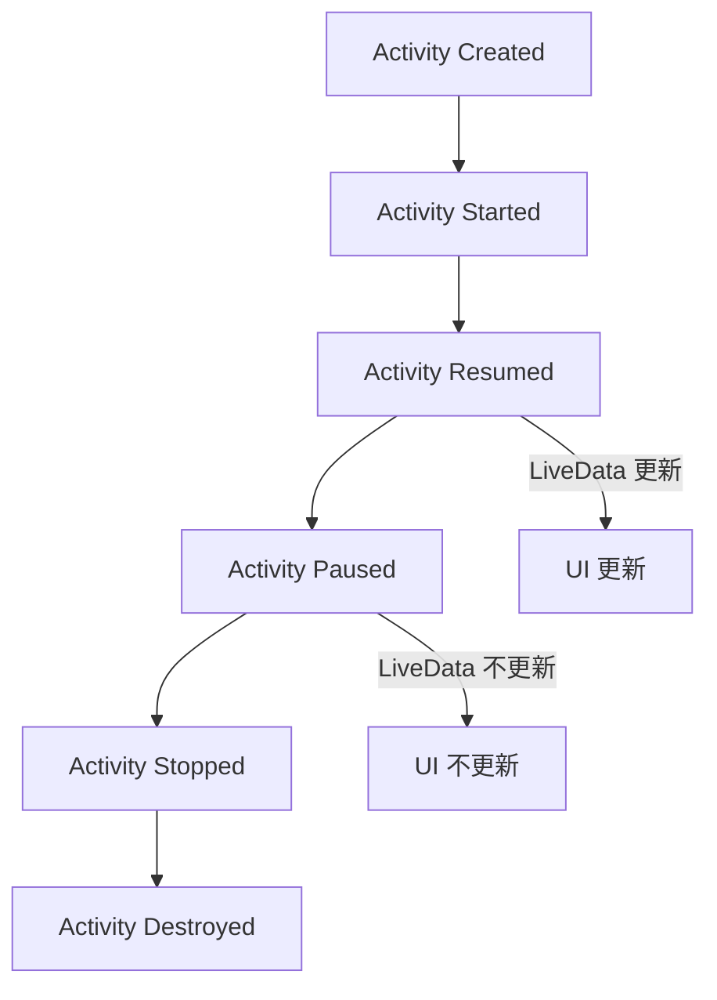

# Android LiveData

## 介绍

在 Android 开发中，LiveData 是一种可观察的数据持有者类，专门用于与 UI 组件（如 Activity 和 Fragment）进行数据交互。LiveData 具有生命周期感知能力，这意味着它只会更新处于活跃生命周期状态的观察者。这种特性使得 LiveData 成为处理异步数据更新和避免内存泄漏的理想选择。

LiveData 通常与 ViewModel 结合使用，以在配置更改（如屏幕旋转）时保持数据的一致性。

## LiveData 的基本用法

### 创建 LiveData 对象

LiveData 是一个抽象类，通常我们使用它的子类 `MutableLiveData` 来创建可变的 LiveData 对象。以下是一个简单的示例：

```kotlin
val liveData = MutableLiveData<String>()
```

### 观察 LiveData

要观察 LiveData 中的数据变化，可以使用 `observe` 方法。以下代码展示了如何在 Activity 中观察 LiveData：

```kotlin
liveData.observe(this, Observer { newValue ->
    // 更新 UI 或执行其他操作
    textView.text = newValue
})
```

### 更新 LiveData

要更新 LiveData 中的数据，可以使用 `setValue` 或 `postValue` 方法。`setValue` 必须在主线程中调用，而 `postValue` 可以在后台线程中调用。

```kotlin
liveData.value = "Hello, LiveData!" // 主线程
liveData.postValue("Hello from background thread") // 后台线程
```

## LiveData 的生命周期感知

LiveData 的一个重要特性是它的生命周期感知能力。它只会通知处于活跃生命周期状态（如 `STARTED` 或 `RESUMED`）的观察者。这意味着当 Activity 或 Fragment 处于后台时，LiveData 不会触发不必要的 UI 更新，从而避免资源浪费。

以下是一个生命周期感知的示意图：



## LiveData 的实际应用场景

### 场景 1：实时更新 UI

假设我们有一个简单的计数器应用，用户点击按钮时计数器会增加，并且 UI 会实时更新。我们可以使用 LiveData 来实现这一功能。

```kotlin
class CounterViewModel : ViewModel() {
    private val _counter = MutableLiveData<Int>()
    val counter: LiveData<Int> get() = _counter

    init {
        _counter.value = 0
    }

    fun increment() {
        _counter.value = (_counter.value ?: 0) + 1
    }
}
```

在 Activity 中观察 `counter` 并更新 UI：

```kotlin
viewModel.counter.observe(this, Observer { count ->
    textView.text = "Count: $count"
})

button.setOnClickListener {
    viewModel.increment()
}
```

### 场景 2：网络请求与数据更新

LiveData 也可以用于处理网络请求的结果。例如，我们可以使用 Retrofit 进行网络请求，并将结果存储在 LiveData 中。

```kotlin
class UserViewModel : ViewModel() {
    private val _user = MutableLiveData<User>()
    val user: LiveData<User> get() = _user

    fun fetchUser(userId: String) {
        viewModelScope.launch {
            val response = userRepository.getUser(userId)
            if (response.isSuccessful) {
                _user.value = response.body()
            }
        }
    }
}
```

在 Activity 中观察 `user` 并更新 UI：

```kotlin
viewModel.user.observe(this, Observer { user ->
    textView.text = user?.name ?: "User not found"
})

viewModel.fetchUser("123")
```

## 总结

LiveData 是 Android 开发中一个强大的工具，它简化了数据与 UI 之间的交互，并提供了生命周期感知能力，避免了内存泄漏和不必要的 UI 更新。通过结合 ViewModel 和 LiveData，开发者可以轻松构建响应式、健壮的应用程序。

## 附加资源与练习

- **官方文档**: [LiveData Overview](https://developer.android.com/topic/libraries/architecture/livedata)
- **练习**: 尝试创建一个简单的天气应用，使用 LiveData 来显示实时天气数据。
- **进阶阅读**: 了解 `Transformations` 和 `MediatorLiveData`，它们可以帮助你更灵活地操作 LiveData。

:::tip
在实际开发中，尽量将 LiveData 与 ViewModel 结合使用，以确保数据在配置更改时保持一致。
:::