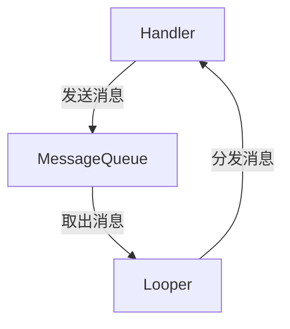

## 介绍

在 Android 开发中，Handler 是一个非常重要的机制，用于在不同线程之间进行通信。Android 的主线程（也称为 UI 线程）负责处理用户界面的更新和事件响应，而耗时操作（如网络请求、数据库操作等）通常需要在子线程中执行。为了避免阻塞主线程，Android 提供了 Handler 机制，允许开发者将任务从子线程发送到主线程执行。

Handler 机制的核心是 **消息队列（MessageQueue）** 和 **Looper**。Handler 通过发送消息（Message）到消息队列中，Looper 则负责从消息队列中取出消息并分发给对应的 Handler 处理。

## Handler 的基本用法

### 1. 创建 Handler

在 Android 中，Handler 通常与主线程的 Looper 关联。以下是一个简单的 Handler 创建示例：

```java
Handler handler = new Handler(Looper.getMainLooper()) {
    @Override
    public void handleMessage(Message msg) {
        // 在这里处理消息
        switch (msg.what) {
            case 1:
                // 处理消息类型 1
                break;
            case 2:
                // 处理消息类型 2
                break;
            default:
                super.handleMessage(msg);
        }
    }
};
```

### 2. 发送消息

你可以通过 `sendMessage()` 方法向 Handler 发送消息。消息可以携带数据，并通过 `what` 字段来区分不同的消息类型。

```java
Message message = handler.obtainMessage();
message.what = 1; // 设置消息类型
message.obj = "Hello, Handler!"; // 携带数据
handler.sendMessage(message);
```

### 3. 处理消息

当消息被发送到 Handler 后，Looper 会从消息队列中取出消息，并调用 `handleMessage()` 方法来处理消息。

```java
@Override
public void handleMessage(Message msg) {
    switch (msg.what) {
        case 1:
            String data = (String) msg.obj;
            Log.d("HandlerExample", "Received message: " + data);
            break;
        default:
            super.handleMessage(msg);
    }
}
```

## Handler 的实际应用场景

### 1. 更新 UI

在 Android 中，UI 更新必须在主线程中进行。如果你在子线程中执行耗时操作，可以使用 Handler 将结果发送到主线程并更新 UI。

```java
new Thread(() -> {
    // 模拟耗时操作
    try {
        Thread.sleep(2000);
    } catch (InterruptedException e) {
        e.printStackTrace();
    }

    // 使用 Handler 发送消息到主线程
    Message message = handler.obtainMessage();
    message.what = 1;
    message.obj = "Data loaded!";
    handler.sendMessage(message);
}).start();
```

### 2. 定时任务

Handler 还可以用于执行定时任务。通过 `postDelayed()` 方法，你可以延迟执行某个任务。

```java
handler.postDelayed(() -> {
    Log.d("HandlerExample", "This message is delayed by 2 seconds");
}, 2000);
```

## Handler 的工作原理

为了更好地理解 Handler 的工作原理，我们可以通过以下流程图来展示 Handler、Looper 和 MessageQueue 之间的关系：



1. **Handler**：负责发送和处理消息。
2. **MessageQueue**：存储消息的队列，遵循先进先出（FIFO）原则。
3. **Looper**：不断从 MessageQueue 中取出消息，并分发给对应的 Handler 处理。

## 总结

Handler 是 Android 中用于线程间通信的重要机制。通过 Handler，开发者可以轻松地将任务从子线程发送到主线程执行，从而避免阻塞 UI 线程。Handler 的核心是消息队列和 Looper，它们共同协作，确保消息能够被正确地发送和处理。

在实际开发中，Handler 常用于更新 UI、执行定时任务等场景。掌握 Handler 的使用方法，对于编写高效、流畅的 Android 应用至关重要。

## 附加资源与练习

- **练习**：尝试在子线程中执行一个耗时操作，并使用 Handler 将结果发送到主线程更新 UI。
- **进一步学习**：了解 Android 中的 `AsyncTask` 和 `HandlerThread`，它们是如何简化异步任务处理的。

:::tip
提示：在使用 Handler 时，务必注意内存泄漏问题。如果 Handler 持有 Activity 的引用，可能会导致 Activity 无法被回收。可以通过使用静态内部类或弱引用来避免这个问题。
:::