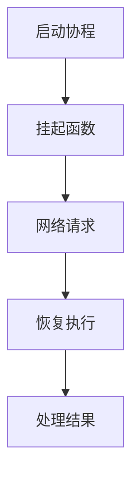

# Android协程

在现代Android开发中，异步编程是一个不可避免的话题。传统的异步编程方式（如`AsyncTask`、`Handler`）虽然有效，但往往会导致代码复杂、难以维护。为了解决这些问题，Kotlin引入了**协程（Coroutines）**，它提供了一种更简洁、更直观的方式来处理异步任务。

## 什么是协程？

协程是一种轻量级的线程管理工具，它允许你以同步的方式编写异步代码。与线程不同，协程的挂起和恢复是由开发者控制的，而不是由操作系统调度。这使得协程更加高效，尤其是在处理大量并发任务时。

:::note
协程并不是线程的替代品，而是一种更高级的抽象，用于简化异步编程。
:::

## 为什么使用协程？

1. **简化代码**：协程允许你以同步的方式编写异步代码，避免了回调地狱（Callback Hell）。
2. **高效**：协程的挂起和恢复开销远低于线程切换。
3. **可读性**：协程代码更易于理解和维护。

## 协程的基本概念

### 1. 挂起函数（Suspend Function）

挂起函数是协程的核心概念之一。它允许函数在执行过程中暂停（挂起），并在稍后恢复执行。挂起函数必须由协程或其他挂起函数调用。

```kotlin
suspend fun fetchData(): String {
    delay(1000) // 模拟网络请求
    return "Data fetched"
}
```

### 2. 协程构建器（Coroutine Builders）

协程构建器用于启动一个新的协程。常见的构建器包括：

- `launch`：启动一个不会返回结果的协程。
- `async`：启动一个会返回结果的协程。

```kotlin
fun main() = runBlocking {
    val job = launch {
        val data = fetchData()
        println(data)
    }
    job.join() // 等待协程完成
}
```

### 3. 协程作用域（Coroutine Scope）

协程作用域定义了协程的生命周期。常见的协程作用域包括：

- `GlobalScope`：全局作用域，协程的生命周期与应用程序一致。
- `lifecycleScope`：与Activity或Fragment的生命周期绑定。
- `viewModelScope`：与ViewModel的生命周期绑定。

```kotlin
class MyViewModel : ViewModel() {
    fun fetchData() {
        viewModelScope.launch {
            val data = fetchData()
            println(data)
        }
    }
}
```

## 实际应用场景

### 1. 网络请求

协程非常适合用于处理网络请求，因为它可以轻松地处理异步操作，而不会阻塞主线程。

```kotlin
suspend fun fetchUserData(): User {
    return withContext(Dispatchers.IO) {
        // 模拟网络请求
        delay(1000)
        User("John Doe")
    }
}
```

### 2. 数据库操作

协程也可以用于数据库操作，特别是在使用Room库时。

```kotlin
@Dao
interface UserDao {
    @Query("SELECT * FROM user")
    suspend fun getAllUsers(): List<User>
}
```

### 3. 并发任务

协程可以轻松地处理多个并发任务。

```kotlin
fun main() = runBlocking {
    val result1 = async { fetchData1() }
    val result2 = async { fetchData2() }
    println("Result: ${result1.await()} and ${result2.await()}")
}
```

## 总结

协程是Android开发中处理异步任务的强大工具。它简化了代码，提高了效率，并且易于理解和维护。通过使用挂起函数、协程构建器和协程作用域，你可以轻松地处理网络请求、数据库操作和并发任务。

## 附加资源

- [Kotlin协程官方文档](https://kotlinlang.org/docs/coroutines-guide.html)
- [Android开发者指南：协程](https://developer.android.com/kotlin/coroutines)

## 练习

1. 编写一个挂起函数，模拟一个耗时操作，并在协程中调用它。
2. 使用`async`和`await`实现两个并发任务，并打印它们的结果。
3. 在`ViewModel`中使用`viewModelScope`启动一个协程，并在其中调用网络请求函数。



通过以上内容，你应该对Android协程有了一个全面的了解。继续练习和探索，你将能够更熟练地使用协程来简化你的异步编程任务。