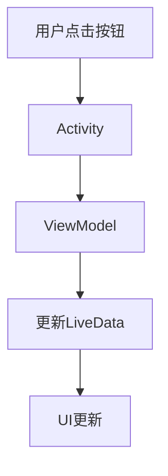

# Android架构概述

Android架构设计是开发高质量Android应用的关键。它不仅仅是代码的组织方式，还涉及如何管理应用的复杂性、提高可维护性以及确保应用的性能。本文将带你了解Android架构的基本概念，并通过实际案例帮助你更好地理解。

## 什么是Android架构？

Android架构是指Android应用程序的整体结构和设计模式。它定义了应用的不同组件如何协同工作，以及如何管理数据流、用户界面和业务逻辑。一个好的架构能够使应用更易于扩展、测试和维护。

### 核心组件

Android架构通常由以下几个核心组件组成：

1. **Activity**：负责管理用户界面和用户交互。
2. **Fragment**：用于构建灵活的用户界面，通常嵌入在Activity中。
3. **ViewModel**：用于管理与UI相关的数据，并在配置更改（如屏幕旋转）时保持数据。
4. **LiveData**：一种可观察的数据持有者，用于在数据变化时通知UI。
5. **Repository**：负责管理数据源（如网络、数据库）并提供统一的数据访问接口。
6. **Room**：一个SQLite对象映射库，用于简化数据库操作。

### 常见的Android架构模式

在Android开发中，常见的架构模式包括：

- **MVC（Model-View-Controller）**：将应用分为模型、视图和控制器三层。
- **MVP（Model-View-Presenter）**：在MVC的基础上引入Presenter，进一步解耦视图和业务逻辑。
- **MVVM（Model-View-ViewModel）**：通过ViewModel将视图与模型分离，支持数据绑定。

:::tip
MVVM是Android官方推荐的架构模式，尤其是在使用Jetpack组件时。
:::

## Android架构的实际应用

### 示例：使用MVVM架构构建一个简单的计数器应用

以下是一个使用MVVM架构的简单计数器应用的代码示例：

```kotlin
// ViewModel
class CounterViewModel : ViewModel() {
    private val _count = MutableLiveData<Int>()
    val count: LiveData<Int> get() = _count

    init {
        _count.value = 0
    }

    fun increment() {
        _count.value = (_count.value ?: 0) + 1
    }
}

// Activity
class CounterActivity : AppCompatActivity() {
    private lateinit var viewModel: CounterViewModel

    override fun onCreate(savedInstanceState: Bundle?) {
        super.onCreate(savedInstanceState)
        setContentView(R.layout.activity_counter)

        viewModel = ViewModelProvider(this).get(CounterViewModel::class.java)

        val countTextView = findViewById<TextView>(R.id.countTextView)
        val incrementButton = findViewById<Button>(R.id.incrementButton)

        viewModel.count.observe(this, Observer { count ->
            countTextView.text = count.toString()
        })

        incrementButton.setOnClickListener {
            viewModel.increment()
        }
    }
}
```

在这个示例中，`CounterViewModel`负责管理计数器的状态，而`CounterActivity`则负责显示计数器的值并处理用户的点击事件。通过这种方式，视图逻辑与业务逻辑被清晰地分离。

### 数据流图

为了更好地理解MVVM架构中的数据流，我们可以使用Mermaid绘制一个简单的数据流图：



:::note
在这个流程中，用户的操作通过Activity传递给ViewModel，ViewModel更新数据后，LiveData会自动通知UI进行更新。
:::

## 总结

Android架构设计是开发高质量应用的基础。通过合理的架构设计，你可以使应用更易于维护、测试和扩展。本文介绍了Android架构的核心组件和常见的架构模式，并通过一个简单的计数器应用展示了MVVM架构的实际应用。

### 附加资源

- [Android官方文档：应用架构指南](https://developer.android.com/jetpack/guide)
- [Jetpack组件库](https://developer.android.com/jetpack)
- [Kotlin编程语言](https://kotlinlang.org/)

### 练习

1. 尝试将上述计数器应用扩展为一个支持减法的应用。
2. 研究并实现一个使用Room数据库的简单记事本应用。

通过不断实践，你将更好地掌握Android架构设计的精髓。祝你学习愉快！