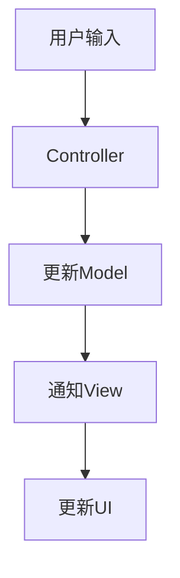

# Android MVC模式

MVC（Model-View-Controller）是一种经典的软件设计模式，广泛应用于Android开发中。它的核心思想是将应用程序的逻辑、界面和数据分离，从而提高代码的可维护性和可扩展性。本文将详细介绍MVC模式的概念、组成部分以及如何在Android开发中应用它。

## 什么是MVC模式？

MVC模式将应用程序分为三个主要部分：

1. **Model（模型）**：负责管理应用程序的核心数据和业务逻辑。它不直接与用户交互，而是通过Controller与View进行通信。
2. **View（视图）**：负责展示数据和用户界面。它是用户与应用程序交互的窗口。
3. **Controller（控制器）**：作为Model和View之间的桥梁，负责处理用户输入并更新Model和View。

通过这种分离，MVC模式使得代码更易于维护和扩展，尤其是在大型项目中。

## MVC模式的组成部分

### 1. Model（模型）

Model是应用程序的核心部分，负责管理数据和业务逻辑。它通常包括数据存储、数据检索和数据处理等功能。在Android中，Model可以是一个数据库、网络请求的结果或任何其他形式的数据源。

```java
public class UserModel {
    private String name;
    private int age;

    public UserModel(String name, int age) {
        this.name = name;
        this.age = age;
    }

    public String getName() {
        return name;
    }

    public int getAge() {
        return age;
    }
}
```

### 2. View（视图）

View是用户界面的展示部分。它负责将Model中的数据呈现给用户，并接收用户的输入。在Android中，View通常是Activity或Fragment中的布局文件。

```xml
<!-- res/layout/activity_main.xml -->
<LinearLayout xmlns:android="http://schemas.android.com/apk/res/android"
    android:layout_width="match_parent"
    android:layout_height="match_parent"
    android:orientation="vertical">

    <TextView
        android:id="@+id/nameTextView"
        android:layout_width="wrap_content"
        android:layout_height="wrap_content"
        android:text="Name" />

    <TextView
        android:id="@+id/ageTextView"
        android:layout_width="wrap_content"
        android:layout_height="wrap_content"
        android:text="Age" />
</LinearLayout>
```

### 3. Controller（控制器）

Controller负责处理用户输入并更新Model和View。在Android中，Controller通常是Activity或Fragment中的逻辑代码。

```java
public class MainActivity extends AppCompatActivity {
    private TextView nameTextView;
    private TextView ageTextView;

    @Override
    protected void onCreate(Bundle savedInstanceState) {
        super.onCreate(savedInstanceState);
        setContentView(R.layout.activity_main);

        nameTextView = findViewById(R.id.nameTextView);
        ageTextView = findViewById(R.id.ageTextView);

        UserModel user = new UserModel("John Doe", 25);
        updateUI(user);
    }

    private void updateUI(UserModel user) {
        nameTextView.setText(user.getName());
        ageTextView.setText(String.valueOf(user.getAge()));
    }
}
```

## MVC模式的工作流程



1. 用户通过View与应用程序交互，触发事件。
2. Controller接收用户输入，并根据需要更新Model。
3. Model更新后，Controller通知View更新UI。
4. View根据Model中的数据更新用户界面。

## 实际案例：简单的用户信息展示应用

假设我们要开发一个简单的Android应用，展示用户的基本信息。我们可以使用MVC模式来实现这个功能。

### 1. 创建Model

```java
public class UserModel {
    private String name;
    private int age;

    public UserModel(String name, int age) {
        this.name = name;
        this.age = age;
    }

    public String getName() {
        return name;
    }

    public int getAge() {
        return age;
    }
}
```

### 2. 创建View

```xml
<!-- res/layout/activity_main.xml -->
<LinearLayout xmlns:android="http://schemas.android.com/apk/res/android"
    android:layout_width="match_parent"
    android:layout_height="match_parent"
    android:orientation="vertical">

    <TextView
        android:id="@+id/nameTextView"
        android:layout_width="wrap_content"
        android:layout_height="wrap_content"
        android:text="Name" />

    <TextView
        android:id="@+id/ageTextView"
        android:layout_width="wrap_content"
        android:layout_height="wrap_content"
        android:text="Age" />
</LinearLayout>
```

### 3. 创建Controller

```java
public class MainActivity extends AppCompatActivity {
    private TextView nameTextView;
    private TextView ageTextView;

    @Override
    protected void onCreate(Bundle savedInstanceState) {
        super.onCreate(savedInstanceState);
        setContentView(R.layout.activity_main);

        nameTextView = findViewById(R.id.nameTextView);
        ageTextView = findViewById(R.id.ageTextView);

        UserModel user = new UserModel("John Doe", 25);
        updateUI(user);
    }

    private void updateUI(UserModel user) {
        nameTextView.setText(user.getName());
        ageTextView.setText(String.valueOf(user.getAge()));
    }
}
```

## 总结

MVC模式通过将应用程序的逻辑、界面和数据分离，使得代码更易于维护和扩展。在Android开发中，MVC模式可以帮助我们更好地组织代码，尤其是在处理复杂的用户界面和业务逻辑时。

:::tip
**提示**：虽然MVC模式在Android开发中非常有用，但在某些情况下，其他设计模式（如MVP或MVVM）可能更适合你的项目。建议根据项目需求选择合适的设计模式。
:::

## 附加资源

- [Android官方文档](https://developer.android.com/docs)
- [MVC模式详解](https://en.wikipedia.org/wiki/Model%E2%80%93view%E2%80%93controller)
- [Android架构设计指南](https://developer.android.com/jetpack/guide)

## 练习

1. 尝试将上述用户信息展示应用扩展为可以编辑用户信息的功能。
2. 思考如何在MVC模式中处理网络请求，并将结果显示在UI上。
3. 研究MVP和MVVM模式，并与MVC模式进行比较。

通过以上练习，你将更深入地理解MVC模式及其在Android开发中的应用。