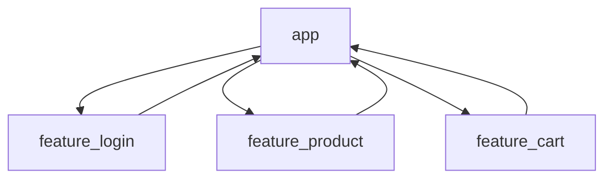

# Android模块化

## 介绍

在Android开发中，随着项目规模的增大，代码库往往会变得复杂且难以维护。模块化是一种将应用程序拆分为多个独立模块的架构设计方法，每个模块负责特定的功能或业务逻辑。通过模块化，开发者可以更好地组织代码、提高代码复用性、简化测试流程，并支持团队协作开发。

模块化的核心思想是将应用程序的功能分解为多个独立的模块，每个模块可以独立开发、测试和部署。这种设计方式不仅提高了代码的可维护性，还为应用程序的扩展和重构提供了更大的灵活性。

## 模块化的优势

1. **代码复用**：模块化允许开发者将通用的功能封装到独立的模块中，从而可以在多个项目中复用这些模块。
2. **简化测试**：每个模块可以独立进行单元测试和集成测试，减少了测试的复杂性。
3. **团队协作**：不同的团队可以并行开发不同的模块，提高了开发效率。
4. **动态加载**：模块化支持动态加载模块，可以根据需要加载或卸载模块，从而减少应用程序的初始加载时间。
5. **易于维护**：模块化使得代码结构更加清晰，便于理解和维护。

## 模块化的实现

### 1. 创建模块

在Android Studio中，可以通过以下步骤创建一个新的模块：

1. 右键点击项目根目录，选择 `New > Module`。
2. 选择 `Android Library` 或 `Java/Kotlin Library`，然后点击 `Next`。
3. 输入模块名称，例如 `feature_login`，然后点击 `Finish`。

### 2. 模块间的依赖

模块之间可以通过 `build.gradle` 文件来定义依赖关系。例如，如果 `app` 模块依赖于 `feature_login` 模块，可以在 `app` 模块的 `build.gradle` 文件中添加以下依赖：

```groovy
dependencies {
    implementation project(':feature_login')
}
```

### 3. 模块间的通信

模块化设计中的一个关键问题是模块之间的通信。Android提供了多种方式来实现模块间的通信，例如：

- **接口**：通过定义接口来实现模块间的解耦。
- **事件总线**：使用事件总线（如 `EventBus` 或 `LiveData`）来实现模块间的事件传递。
- **依赖注入**：使用依赖注入框架（如 `Dagger` 或 `Hilt`）来管理模块间的依赖关系。

### 4. 动态加载模块

Android支持通过 `Dynamic Feature Modules` 实现模块的动态加载。动态模块可以在应用程序运行时按需下载和安装，从而减少应用程序的初始安装包大小。

```groovy
dependencies {
    implementation 'com.google.android.play:core:1.10.3'
}
```

在代码中，可以通过以下方式请求动态模块的安装：

```kotlin
val splitInstallManager = SplitInstallManagerFactory.create(context)
val request = SplitInstallRequest.newBuilder()
    .addModule("dynamic_feature_module")
    .build()

splitInstallManager.startInstall(request)
```

## 实际案例

假设我们正在开发一个电商应用程序，该应用程序包含以下模块：

- `app`：主应用程序模块。
- `feature_login`：登录功能模块。
- `feature_product`：商品展示功能模块。
- `feature_cart`：购物车功能模块。

通过模块化设计，我们可以将每个功能模块独立开发，并通过接口或事件总线实现模块间的通信。例如，`feature_login` 模块可以通过接口通知 `app` 模块用户已登录，然后 `app` 模块可以加载 `feature_product` 模块。



## 总结

Android模块化是一种强大的架构设计方法，能够显著提高代码的可维护性、复用性和扩展性。通过将应用程序拆分为多个独立的模块，开发者可以更高效地组织代码、简化测试流程，并支持团队协作开发。在实际项目中，模块化设计可以帮助开发者更好地应对复杂的业务需求，并为应用程序的长期维护和扩展奠定坚实的基础。

## 附加资源

- [Android官方文档：模块化](https://developer.android.com/guide/app-bundle/configure)
- [Dagger官方文档](https://dagger.dev/)
- [Hilt官方文档](https://dagger.dev/hilt/)

## 练习

1. 在Android Studio中创建一个新的模块，并将其添加到主应用程序模块的依赖中。
2. 使用接口或事件总线实现两个模块之间的通信。
3. 尝试使用动态模块功能，实现一个模块的动态加载。
