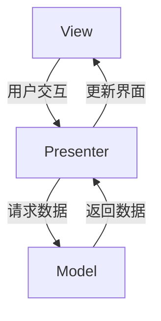

## 什么是 MVP 模式？

MVP（Model-View-Presenter）是一种用于构建 Android 应用程序的架构模式。它通过将应用程序的逻辑分为三个主要部分来帮助开发者更好地组织代码：

1. **Model**：负责管理数据，例如从网络或数据库中获取数据。
2. **View**：负责显示数据和与用户交互。
3. **Presenter**：作为 Model 和 View 之间的桥梁，处理业务逻辑并更新 View。

MVP 模式的主要目标是分离关注点，使代码更易于维护和测试。

:::note
MVP 是 MVC（Model-View-Controller）模式的改进版本，特别适合 Android 开发。
:::

## MVP 模式的核心组件

### 1. Model
Model 是应用程序的数据层。它负责从数据库、网络或其他数据源获取数据，并将数据提供给 Presenter。

```java
public class UserModel {
    public String getUserName() {
        // 模拟从数据库或网络获取数据
        return "John Doe";
    }
}
```

### 2. View
View 是用户界面层。它负责显示数据并接收用户输入。在 Android 中，View 通常是 Activity 或 Fragment。

```java
public interface UserView {
    void showUserName(String name);
}

public class UserActivity extends AppCompatActivity implements UserView {
    private UserPresenter presenter;

    @Override
    protected void onCreate(Bundle savedInstanceState) {
        super.onCreate(savedInstanceState);
        setContentView(R.layout.activity_user);

        presenter = new UserPresenter(this);
        presenter.loadUserData();
    }

    @Override
    public void showUserName(String name) {
        TextView userNameTextView = findViewById(R.id.userNameTextView);
        userNameTextView.setText(name);
    }
}
```

### 3. Presenter
Presenter 是业务逻辑层。它从 Model 获取数据，处理数据，并更新 View。

```java
public class UserPresenter {
    private UserView view;
    private UserModel model;

    public UserPresenter(UserView view) {
        this.view = view;
        this.model = new UserModel();
    }

    public void loadUserData() {
        String userName = model.getUserName();
        view.showUserName(userName);
    }
}
```

## MVP 模式的工作流程

以下是一个简单的流程图，展示了 MVP 模式的工作流程：



1. **View** 接收用户输入并通知 **Presenter**。
2. **Presenter** 从 **Model** 请求数据。
3. **Model** 返回数据给 **Presenter**。
4. **Presenter** 处理数据并更新 **View**。

## 实际案例：用户信息展示

假设我们正在开发一个简单的应用程序，用于显示用户的基本信息。以下是实现步骤：

1. **定义 Model**：创建一个 `UserModel` 类来获取用户数据。
2. **定义 View**：创建一个 `UserActivity` 类并实现 `UserView` 接口。
3. **定义 Presenter**：创建一个 `UserPresenter` 类来处理业务逻辑。

### 代码实现

```java
// Model
public class UserModel {
    public String getUserName() {
        return "John Doe";
    }
}

// View
public interface UserView {
    void showUserName(String name);
}

public class UserActivity extends AppCompatActivity implements UserView {
    private UserPresenter presenter;

    @Override
    protected void onCreate(Bundle savedInstanceState) {
        super.onCreate(savedInstanceState);
        setContentView(R.layout.activity_user);

        presenter = new UserPresenter(this);
        presenter.loadUserData();
    }

    @Override
    public void showUserName(String name) {
        TextView userNameTextView = findViewById(R.id.userNameTextView);
        userNameTextView.setText(name);
    }
}

// Presenter
public class UserPresenter {
    private UserView view;
    private UserModel model;

    public UserPresenter(UserView view) {
        this.view = view;
        this.model = new UserModel();
    }

    public void loadUserData() {
        String userName = model.getUserName();
        view.showUserName(userName);
    }
}
```

### 运行结果
当应用程序启动时，`UserActivity` 会显示用户名称 "John Doe"。

## 总结

MVP 模式通过分离关注点，使 Android 应用程序更易于维护和测试。它通过将代码分为 Model、View 和 Presenter 三个部分，帮助开发者更好地组织代码。

:::tip
在实际开发中，MVP 模式特别适合中大型项目，因为它可以显著提高代码的可读性和可维护性。
:::

## 附加资源与练习

1. **练习**：尝试扩展上述示例，添加更多用户信息（如年龄、地址等），并在 View 中显示。
2. **进一步学习**：了解 MVP 模式的变体，如 MVVM（Model-View-ViewModel）模式，并比较它们的优缺点。
3. **推荐阅读**：
   - [Android Architecture Patterns](https://developer.android.com/jetpack/guide)
   - [MVP for Android: How to Organize Your Presentation Layer](https://antonioleiva.com/mvp-android/)

通过不断实践和学习，你将能够更好地掌握 MVP 模式，并将其应用到实际项目中。