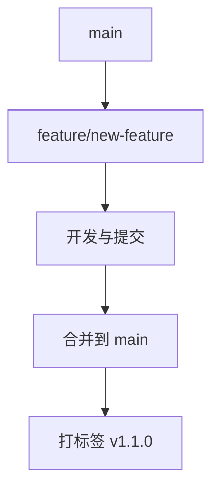

# Android 版本管理

在 Android 应用开发中，版本管理是一个至关重要的环节。它不仅帮助开发者跟踪代码的变化，还能确保应用在不同版本之间的兼容性和稳定性。本文将详细介绍 Android 版本管理的基本概念、工具和最佳实践，帮助你更好地管理和发布 Android 应用。

## 什么是 Android 版本管理？

Android 版本管理是指对 Android 应用的代码、资源和配置进行系统化的管理和控制。它包括版本控制、版本号管理、发布流程和更新策略等方面。通过有效的版本管理，开发者可以确保应用的每个版本都是可追踪、可维护和可发布的。

### 版本控制工具

在 Android 开发中，常用的版本控制工具有 Git 和 SVN。Git 是目前最流行的分布式版本控制系统，广泛应用于开源项目和商业项目中。

```bash
# 初始化一个新的 Git 仓库
git init

# 添加文件到暂存区
git add .

# 提交更改
git commit -m "Initial commit"
```

### 版本号管理

Android 应用的版本号通常由两部分组成：`versionCode` 和 `versionName`。`versionCode` 是一个整数，用于内部版本控制；`versionName` 是一个字符串，用于向用户展示的版本号。

```xml
<manifest xmlns:android="http://schemas.android.com/apk/res/android"
    package="com.example.myapp">

    <application
        android:versionCode="1"
        android:versionName="1.0.0">
        ...
    </application>
</manifest>
```

:::tip
`versionCode` 每次发布新版本时都应递增，而 `versionName` 可以根据语义化版本控制（Semantic Versioning）进行更新。
:::

## 版本管理流程

### 1. 创建分支

在开发新功能或修复 bug 时，通常会从主分支（如 `main` 或 `master`）创建一个新的分支。

```bash
# 创建并切换到一个新分支
git checkout -b feature/new-feature
```

### 2. 提交更改

在完成开发或修复后，将更改提交到分支。

```bash
# 添加更改到暂存区
git add .

# 提交更改
git commit -m "Add new feature"
```

### 3. 合并分支

将开发完成的分支合并回主分支。

```bash
# 切换回主分支
git checkout main

# 合并分支
git merge feature/new-feature
```

### 4. 打标签

在发布新版本时，可以为该版本打一个标签，以便后续追踪。

```bash
# 创建一个标签
git tag -a v1.0.0 -m "Release version 1.0.0"

# 推送标签到远程仓库
git push origin v1.0.0
```

## 实际案例

假设你正在开发一个名为 "MyApp" 的 Android 应用。你刚刚完成了一个新功能，并准备发布版本 1.1.0。

1. **创建分支**：你从 `main` 分支创建了一个新分支 `feature/new-feature`。
2. **开发与提交**：你在新分支上完成了开发，并提交了更改。
3. **合并分支**：你将 `feature/new-feature` 分支合并回 `main` 分支。
4. **打标签**：你为版本 1.1.0 打了一个标签 `v1.1.0`，并将其推送到远程仓库。



## 总结

Android 版本管理是确保应用开发顺利进行的关键环节。通过使用版本控制工具（如 Git）、合理管理版本号、遵循版本管理流程，开发者可以有效地跟踪代码变化、发布新版本并维护应用的稳定性。

### 附加资源

- [Git 官方文档](https://git-scm.com/doc)
- [Semantic Versioning](https://semver.org/)
- [Android 开发者指南](https://developer.android.com/guide)

### 练习

1. 在你的 Android 项目中初始化一个 Git 仓库，并提交初始代码。
2. 创建一个新分支，开发一个小功能，并将其合并回主分支。
3. 为你的应用设置 `versionCode` 和 `versionName`，并发布一个新版本。

通过实践这些步骤，你将更好地掌握 Android 版本管理的核心概念和技能。