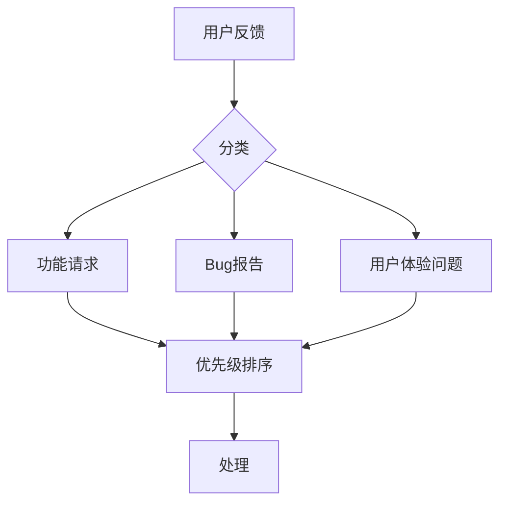
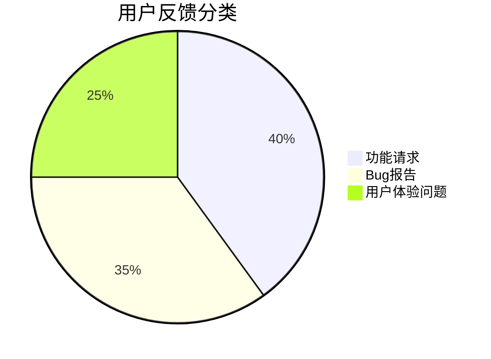

## 介绍

在Android应用的发布与维护过程中，用户反馈是至关重要的。它可以帮助开发者了解用户的需求、发现潜在的问题，并持续优化应用的功能和性能。通过有效的用户反馈机制，开发者可以更好地与用户互动，提升用户满意度。

本文将逐步讲解如何收集、处理和分析Android应用的用户反馈，并提供实际案例和代码示例，帮助你掌握这一重要技能。

## 收集用户反馈

### 1. 使用Google Play的评论系统

Google Play商店提供了一个内置的评论系统，用户可以在其中为你的应用打分并留下评论。这些评论是获取用户反馈的重要来源。

:::tip
定期查看Google Play的评论，了解用户的真实体验和需求。
:::

### 2. 集成第三方反馈工具

除了Google Play的评论系统，你还可以集成第三方反馈工具，如Firebase Crashlytics、Instabug或UserVoice。这些工具可以帮助你更高效地收集用户反馈。

以下是一个使用Firebase Crashlytics收集用户反馈的示例：

```java
FirebaseCrashlytics.getInstance().log("User feedback: " + userFeedback);
FirebaseCrashlytics.getInstance().recordException(new Exception("User reported issue: " + issueDescription));
```

### 3. 应用内反馈表单

你可以在应用中直接集成反馈表单，让用户在不离开应用的情况下提交反馈。以下是一个简单的反馈表单实现示例：

```xml
<EditText
    android:id="@+id/feedbackInput"
    android:layout_width="match_parent"
    android:layout_height="wrap_content"
    android:hint="请输入您的反馈" />

<Button
    android:id="@+id/submitFeedbackButton"
    android:layout_width="wrap_content"
    android:layout_height="wrap_content"
    android:text="提交反馈" />
```

```java
Button submitButton = findViewById(R.id.submitFeedbackButton);
submitButton.setOnClickListener(v -> {
    EditText feedbackInput = findViewById(R.id.feedbackInput);
    String feedback = feedbackInput.getText().toString();
    // 处理反馈逻辑
    sendFeedbackToServer(feedback);
});
```

## 处理用户反馈

### 1. 分类和优先级

收集到的用户反馈需要进行分类和优先级排序。常见的分类包括功能请求、Bug报告、用户体验问题等。优先级可以根据问题的严重性和影响范围来确定。



### 2. 自动化和手动处理

对于常见的反馈类型，可以设置自动化处理流程。例如，自动回复用户确认收到反馈，或自动将Bug报告分配给开发团队。对于复杂的反馈，可能需要手动处理。

以下是一个简单的自动化回复示例：

```java
public void sendAutoReply(String userEmail, String feedback) {
    String replyMessage = "感谢您的反馈！我们已经收到您的意见，并将尽快处理。";
    // 发送邮件逻辑
    sendEmail(userEmail, "反馈确认", replyMessage);
}
```

## 分析用户反馈

### 1. 数据可视化

通过数据可视化工具（如Google Analytics或Firebase Analytics），你可以将用户反馈数据转化为图表，帮助你更直观地分析用户需求。



### 2. 趋势分析

通过分析用户反馈的趋势，你可以发现应用在不同版本中的问题变化，从而更好地规划未来的开发工作。

## 实际案例

### 案例：某社交应用的用户反馈处理

某社交应用在发布新版本后，收到了大量用户反馈，主要集中在“消息发送失败”的问题上。开发团队通过以下步骤处理了这些反馈：

1. **收集反馈**：通过应用内反馈表单和Google Play评论系统收集用户反馈。
2. **分类和优先级**：将反馈分类为Bug报告，并标记为高优先级。
3. **处理反馈**：开发团队修复了消息发送失败的问题，并通过自动化回复系统通知用户问题已解决。
4. **分析反馈**：通过数据可视化工具，团队发现该问题影响了30%的用户，并在下一个版本中进行了全面测试，确保问题不再发生。

## 总结

用户反馈是Android应用开发和维护过程中不可或缺的一部分。通过有效的收集、处理和分析，你可以不断提升应用的质量和用户体验。希望本文的内容能帮助你更好地理解和应用用户反馈机制。

## 附加资源

- [Firebase Crashlytics文档](https://firebase.google.com/docs/crashlytics)
- [Google Play开发者控制台](https://play.google.com/console/)
- [Firebase Analytics文档](https://firebase.google.com/docs/analytics)

## 练习

1. 在你的Android应用中集成一个简单的反馈表单，并实现提交功能。
2. 使用Firebase Crashlytics记录一条模拟的用户反馈。
3. 分析你应用的用户反馈数据，并尝试绘制一个简单的饼图来展示反馈分类。