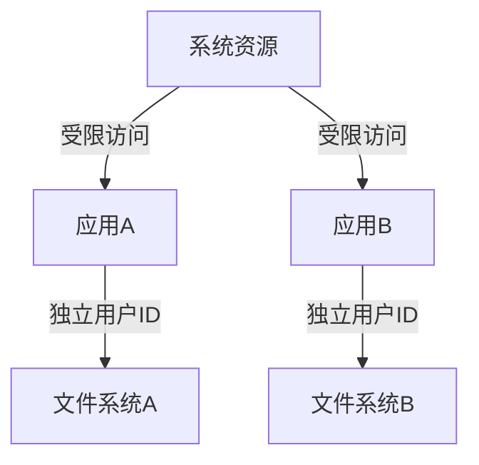

## 介绍

Android作为全球最流行的移动操作系统之一，其安全性至关重要。Android安全机制旨在保护用户数据、防止恶意软件以及确保应用的隔离性。本文将详细介绍Android的安全机制，包括权限管理、数据加密、应用沙箱等核心概念，并通过实际案例帮助初学者理解如何在实际开发中应用这些机制。

## 权限管理

Android的权限管理机制是保护用户隐私和数据安全的重要手段。每个应用在安装或运行时都需要请求特定的权限，用户可以选择是否授予这些权限。

### 权限请求示例

以下是一个请求访问设备位置的代码示例：

```java
if (ContextCompat.checkSelfPermission(this, Manifest.permission.ACCESS_FINE_LOCATION)
        != PackageManager.PERMISSION_GRANTED) {
    ActivityCompat.requestPermissions(this,
            new String[]{Manifest.permission.ACCESS_FINE_LOCATION}, 1);
}
```

### 权限处理

在用户做出选择后，系统会回调`onRequestPermissionsResult`方法，开发者需要在此处理用户的响应：

```java
@Override
public void onRequestPermissionsResult(int requestCode, String[] permissions, int[] grantResults) {
    if (requestCode == 1) {
        if (grantResults.length > 0 && grantResults[0] == PackageManager.PERMISSION_GRANTED) {
            // 权限被授予
        } else {
            // 权限被拒绝
        }
    }
}
```

:::tip
始终在请求权限时向用户解释为什么需要该权限，以增加用户信任感。
:::

## 数据加密

数据加密是保护敏感信息不被未授权访问的关键技术。Android提供了多种加密API，如`KeyStore`和`Cipher`。

### 使用KeyStore加密数据

以下是一个使用`KeyStore`生成密钥并加密数据的示例：

```java
KeyStore keyStore = KeyStore.getInstance("AndroidKeyStore");
keyStore.load(null);

KeyGenerator keyGenerator = KeyGenerator.getInstance(KeyProperties.KEY_ALGORITHM_AES, "AndroidKeyStore");
keyGenerator.init(new KeyGenParameterSpec.Builder(
        "myKey",
        KeyProperties.PURPOSE_ENCRYPT | KeyProperties.PURPOSE_DECRYPT)
        .setBlockModes(KeyProperties.BLOCK_MODE_CBC)
        .setEncryptionPaddings(KeyProperties.ENCRYPTION_PADDING_PKCS7)
        .build());
keyGenerator.generateKey();

Cipher cipher = Cipher.getInstance("AES/CBC/PKCS7Padding");
cipher.init(Cipher.ENCRYPT_MODE, keyStore.getKey("myKey", null));

byte[] encryptedData = cipher.doFinal("敏感数据".getBytes());
```

:::caution
确保密钥的安全存储，避免密钥泄露导致数据被解密。
:::

## 应用沙箱

Android应用沙箱机制通过为每个应用分配独立的用户ID和文件系统空间，确保应用之间的隔离性。

### 沙箱机制示意图



:::note
应用沙箱机制防止了应用之间的直接数据访问，增强了系统的安全性。
:::

## 实际案例

### 案例：安全存储用户凭证

在一个需要用户登录的应用中，开发者可以使用`SharedPreferences`结合加密技术来安全存储用户凭证。

```java
SharedPreferences sharedPreferences = getSharedPreferences("user_credentials", MODE_PRIVATE);
SharedPreferences.Editor editor = sharedPreferences.edit();

// 加密用户凭证
String encryptedCredentials = encryptData("user:password");
editor.putString("credentials", encryptedCredentials);
editor.apply();
```

:::warning
避免在`SharedPreferences`中存储明文密码，始终使用加密技术保护敏感信息。
:::

## 总结

Android安全机制是构建安全应用的基础。通过合理的权限管理、数据加密和应用沙箱机制，开发者可以有效保护用户数据和隐私。在实际开发中，应始终遵循最佳实践，确保应用的安全性。

## 附加资源

- [Android开发者文档 - 安全性](https://developer.android.com/training/articles/security-tips)
- [Android KeyStore系统](https://developer.android.com/training/articles/keystore)
- [Android权限指南](https://developer.android.com/guide/topics/permissions/overview)

## 练习

1. 修改一个现有应用，使其在请求权限时向用户解释权限的必要性。
2. 使用`KeyStore`和`Cipher`API实现一个简单的数据加密和解密功能。
3. 分析一个开源Android应用，了解其如何处理权限和数据加密。