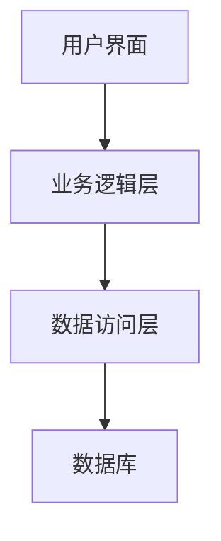

## 介绍

在 Android 开发中，编写高质量的文档是确保代码可维护性和团队协作效率的关键。无论是 API 文档、代码注释，还是项目说明，良好的文档都能帮助开发者快速理解代码逻辑、功能实现以及项目结构。本文将详细介绍如何为 Android 项目编写规范的文档，并提供实际案例和代码示例。

## 为什么需要编写文档？

:::note
文档是代码的“说明书”，它帮助开发者理解代码的意图、功能和使用方法。
:::

- **提高代码可读性**：清晰的文档让其他开发者（或未来的你）更容易理解代码。
- **促进团队协作**：文档是团队沟通的桥梁，减少沟通成本。
- **简化维护**：当项目规模扩大时，文档能帮助快速定位问题和修改代码。

## 文档类型

在 Android 项目中，常见的文档类型包括：

1. **代码注释**：直接在代码中编写的注释，解释代码的功能和逻辑。
2. **API 文档**：描述类、方法和参数的用途。
3. **README 文件**：项目概述、安装说明和使用指南。
4. **设计文档**：描述系统架构、模块设计和实现细节。

---

## 代码注释

代码注释是文档的基础，通常分为单行注释和多行注释。

### 单行注释

单行注释用于简短说明代码的功能。

```java
// 计算两个数的和
int sum = a + b;
```

### 多行注释

多行注释用于描述复杂的逻辑或功能。

```java
/*
 * 该方法用于验证用户输入。
 * 如果输入为空，则返回 false；
 * 否则返回 true。
 */
public boolean validateInput(String input) {
    return input != null && !input.isEmpty();
}
```

### Javadoc 注释

Javadoc 是 Java 和 Android 中用于生成 API 文档的标准注释格式。

```java
/**
 * 计算两个整数的和。
 *
 * @param a 第一个整数
 * @param b 第二个整数
 * @return 两个整数的和
 */
public int add(int a, int b) {
    return a + b;
}
```

:::tip
使用 Javadoc 注释时，确保描述清晰，并包含 `@param`、`@return` 和 `@throws` 等标签。
:::

---

## API 文档

API 文档是描述类、方法和参数用途的文档。Android 开发中通常使用 Javadoc 生成 API 文档。

### 示例：API 文档生成

以下是一个完整的类文档示例：

```java
/**
 * 该类用于管理用户信息。
 */
public class UserManager {

    /**
     * 添加新用户。
     *
     * @param username 用户名
     * @param password 密码
     * @return 添加成功返回 true，否则返回 false
     */
    public boolean addUser(String username, String password) {
        // 实现逻辑
        return true;
    }
}
```

使用以下命令生成 API 文档：

```bash
javadoc -d docs -sourcepath src -subpackages com.example
```

生成的文档将包含类、方法和参数的详细说明。

---

## README 文件

README 文件是项目的“门面”，通常包含以下内容：

1. **项目概述**：简要描述项目的功能和目标。
2. **安装说明**：如何安装和配置项目。
3. **使用指南**：如何使用项目的功能。
4. **贡献指南**：如何为项目贡献代码。

### 示例：README 文件

```markdown
# MyAndroidApp

## 项目概述
这是一个用于管理用户信息的 Android 应用程序。

## 安装说明
1. 克隆仓库：
   ```bash
   git clone https://github.com/example/myandroidapp.git
   ```
2. 打开项目：
   - 使用 Android Studio 打开项目。
3. 构建并运行：
   - 点击 `Run` 按钮。

## 使用指南
- 添加用户：点击“添加用户”按钮并填写表单。
- 删除用户：长按用户项并选择“删除”。

## 贡献指南
欢迎提交 Pull Request！请确保代码符合编码规范。
```

---

## 设计文档

设计文档描述系统的架构和模块设计，通常包括以下内容：

1. **系统架构图**：展示系统的模块和关系。
2. **模块设计**：详细描述每个模块的功能和实现。
3. **数据流图**：展示数据在系统中的流动。

### 示例：系统架构图



---

## 实际案例

以下是一个实际项目中的文档示例：

### 案例：用户登录功能

#### 代码注释

```java
/**
 * 处理用户登录请求。
 *
 * @param username 用户名
 * @param password 密码
 * @return 登录成功返回 true，否则返回 false
 */
public boolean login(String username, String password) {
    // 验证用户名和密码
    if (validateCredentials(username, password)) {
        return true;
    }
    return false;
}
```

#### README 文件

```markdown
## 用户登录功能
用户可以通过输入用户名和密码登录系统。登录成功后，将跳转到主页面。
```

---

## 总结

编写高质量的文档是 Android 开发中不可或缺的一部分。通过清晰的代码注释、规范的 API 文档和详细的 README 文件，您可以显著提升代码的可维护性和团队协作效率。

## 附加资源

- [Javadoc 官方文档](https://docs.oracle.com/javase/8/docs/technotes/tools/windows/javadoc.html)
- [Markdown 语法指南](https://www.markdownguide.org/)
- [Android 开发文档](https://developer.android.com/docs)

## 练习

1. 为您的 Android 项目编写 Javadoc 注释。
2. 创建一个包含项目概述、安装说明和使用指南的 README 文件。
3. 绘制系统架构图并描述每个模块的功能。