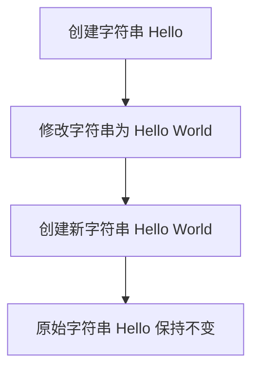

# Java字符串不可变性

在Java中，字符串是不可变的（immutable）。这意味着一旦创建了一个字符串对象，它的内容就不能被更改。这种设计是Java语言的核心特性之一，理解它对于编写高效、安全的代码至关重要。

## 什么是字符串不可变性？

字符串不可变性意味着，一旦一个字符串对象被创建，它的值就不能被修改。任何看似修改字符串的操作，实际上都会创建一个新的字符串对象，而原始字符串保持不变。

例如：

```java
String str = "Hello";
str = str + " World";
```

在上述代码中，`str` 最初指向字符串 `"Hello"`。当执行 `str = str + " World"` 时，Java 不会修改原始的 `"Hello"` 字符串，而是创建一个新的字符串 `"Hello World"`，并将 `str` 指向这个新对象。

## 为什么字符串是不可变的？

Java 设计字符串为不可变的主要原因是出于安全性和性能的考虑：

1. **安全性**：不可变字符串可以防止恶意代码修改字符串内容，从而避免潜在的安全漏洞。
2. **性能**：由于字符串是不可变的，它们可以被缓存和共享，从而减少内存占用并提高性能。
3. **线程安全**：不可变对象天生是线程安全的，因为它们的状态不会改变，因此不需要同步。

## 代码示例

让我们通过一个简单的例子来理解字符串的不可变性：

```java
String s1 = "Java";
String s2 = s1;

System.out.println("s1: " + s1); // 输出: s1: Java
System.out.println("s2: " + s2); // 输出: s2: Java

s1 = s1 + " Programming";

System.out.println("s1: " + s1); // 输出: s1: Java Programming
System.out.println("s2: " + s2); // 输出: s2: Java
```

在这个例子中，`s1` 和 `s2` 最初都指向同一个字符串 `"Java"`。当 `s1` 被修改时，`s2` 仍然指向原始的 `"Java"` 字符串，而 `s1` 指向一个新的字符串 `"Java Programming"`。

## 实际应用场景

### 1. 字符串常量池

Java 使用字符串常量池（String Pool）来存储字符串字面量。由于字符串是不可变的，相同的字符串字面量可以被多个引用共享，从而节省内存。

```java
String s1 = "Hello";
String s2 = "Hello";

System.out.println(s1 == s2); // 输出: true
```

在这个例子中，`s1` 和 `s2` 都指向字符串常量池中的同一个 `"Hello"` 对象。

### 2. 安全性

在涉及敏感信息（如密码）的场景中，不可变字符串可以防止数据被意外或恶意修改。

```java
String password = "secret";
// 假设这里有一些操作
password = "newSecret"; // 创建了一个新的字符串对象
```

在这个例子中，原始的 `"secret"` 字符串不会被修改，而是创建了一个新的字符串对象。

## 总结

Java 字符串的不可变性是一个重要的概念，它带来了安全性、性能和线程安全等多方面的优势。理解这一概念有助于编写更高效、更安全的代码。

:::tip
**提示**：如果你需要频繁修改字符串内容，可以考虑使用 `StringBuilder` 或 `StringBuffer`，它们是可变的字符串类。
:::

## 附加资源与练习

- **练习**：编写一个程序，比较使用 `String` 和 `StringBuilder` 在大量字符串拼接时的性能差异。
- **进一步阅读**：查阅 Java 官方文档，了解更多关于字符串不可变性的细节。



通过以上内容，你应该对 Java 字符串的不可变性有了更深入的理解。继续练习和探索，你将能够更好地应用这一概念。