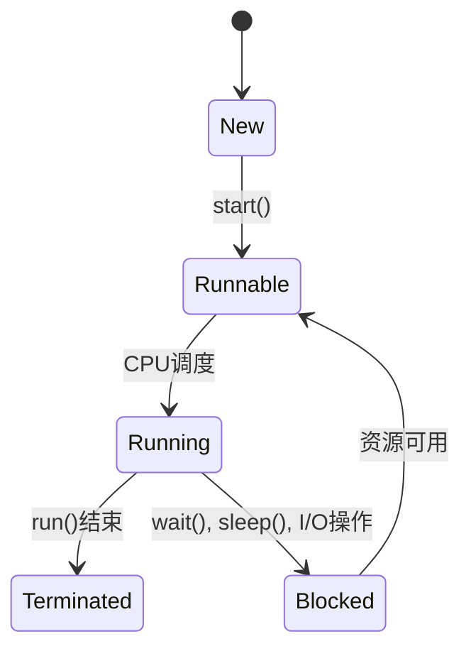

## 介绍

在现代计算机系统中，多线程编程是提高程序性能的重要手段之一。Java作为一门广泛使用的编程语言，提供了丰富的多线程支持。通过多线程，程序可以同时执行多个任务，从而提高资源利用率和响应速度。

### 什么是多线程？

多线程是指在一个程序中同时运行多个线程。每个线程都是一个独立的执行路径，可以并行或并发地执行任务。Java通过`Thread`类和`Runnable`接口提供了多线程的支持。

## 创建线程

在Java中，创建线程有两种主要方式：

1. **继承`Thread`类**
2. **实现`Runnable`接口**

### 继承`Thread`类

```java
class MyThread extends Thread {
    public void run() {
        System.out.println("Thread is running");
    }
}

public class Main {
    public static void main(String[] args) {
        MyThread thread = new MyThread();
        thread.start();
    }
}
```

**输出：**
```
Thread is running
```

### 实现`Runnable`接口

```java
class MyRunnable implements Runnable {
    public void run() {
        System.out.println("Thread is running");
    }
}

public class Main {
    public static void main(String[] args) {
        Thread thread = new Thread(new MyRunnable());
        thread.start();
    }
}
```

**输出：**
```
Thread is running
```

:::tip
实现`Runnable`接口的方式更为灵活，因为它允许你的类继承其他类，而继承`Thread`类的方式则不行。
:::

## 线程的生命周期

线程在其生命周期中会经历多个状态：



- **New**: 线程被创建但尚未启动。
- **Runnable**: 线程已经启动，正在等待CPU调度。
- **Running**: 线程正在执行`run()`方法。
- **Blocked**: 线程被阻塞，等待资源。
- **Terminated**: 线程执行完毕或被强制终止。

## 线程同步

在多线程环境中，多个线程可能会同时访问共享资源，导致数据不一致的问题。Java提供了`synchronized`关键字和`Lock`接口来解决这个问题。

### 使用`synchronized`关键字

```java
class Counter {
    private int count = 0;

    public synchronized void increment() {
        count++;
    }

    public int getCount() {
        return count;
    }
}

public class Main {
    public static void main(String[] args) throws InterruptedException {
        Counter counter = new Counter();

        Thread t1 = new Thread(() -> {
            for (int i = 0; i < 1000; i++) {
                counter.increment();
            }
        });

        Thread t2 = new Thread(() -> {
            for (int i = 0; i < 1000; i++) {
                counter.increment();
            }
        });

        t1.start();
        t2.start();

        t1.join();
        t2.join();

        System.out.println("Count: " + counter.getCount());
    }
}
```

**输出：**
```
Count: 2000
```

:::caution
如果没有使用`synchronized`关键字，`count`的值可能会小于2000，因为两个线程可能会同时访问和修改`count`。
:::

## 实际应用场景

### 1. 多线程下载器

多线程下载器可以利用多个线程同时下载文件的不同部分，从而提高下载速度。

```java
import java.io.*;
import java.net.URL;
import java.util.concurrent.ExecutorService;
import java.util.concurrent.Executors;

public class MultiThreadDownloader {
    public static void main(String[] args) {
        String fileUrl = "http://example.com/largefile.zip";
        int numThreads = 4;

        ExecutorService executor = Executors.newFixedThreadPool(numThreads);

        for (int i = 0; i < numThreads; i++) {
            int finalI = i;
            executor.execute(() -> {
                try {
                    URL url = new URL(fileUrl);
                    InputStream in = url.openStream();
                    FileOutputStream out = new FileOutputStream("part" + finalI + ".zip");

                    byte[] buffer = new byte[1024];
                    int bytesRead;
                    while ((bytesRead = in.read(buffer)) != -1) {
                        out.write(buffer, 0, bytesRead);
                    }

                    in.close();
                    out.close();
                } catch (IOException e) {
                    e.printStackTrace();
                }
            });
        }

        executor.shutdown();
    }
}
```

### 2. 并发数据处理

在处理大量数据时，可以使用多线程来并行处理数据，从而提高处理速度。

```java
import java.util.concurrent.ExecutorService;
import java.util.concurrent.Executors;

public class DataProcessor {
    public static void main(String[] args) {
        int[] data = new int[1000];
        for (int i = 0; i < data.length; i++) {
            data[i] = i;
        }

        ExecutorService executor = Executors.newFixedThreadPool(4);

        for (int i = 0; i < data.length; i++) {
            int finalI = i;
            executor.execute(() -> {
                data[finalI] = data[finalI] * 2;
            });
        }

        executor.shutdown();

        // 等待所有任务完成
        while (!executor.isTerminated()) {}

        System.out.println("Data processing complete.");
    }
}
```

## 总结

Java多线程编程是提高程序性能的重要手段。通过继承`Thread`类或实现`Runnable`接口，你可以创建和管理多个线程。线程同步是确保数据一致性的关键，Java提供了`synchronized`关键字和`Lock`接口来实现线程同步。在实际应用中，多线程可以用于下载文件、处理数据等场景。

## 附加资源

- [Java官方文档 - 多线程](https://docs.oracle.com/javase/tutorial/essential/concurrency/)
- [Java并发编程实战](https://book.douban.com/subject/10484692/)

## 练习

1. 修改上面的`Counter`类，使用`Lock`接口代替`synchronized`关键字来实现线程同步。
2. 编写一个多线程程序，模拟多个用户同时购买商品，确保库存不会出现负数。

:::note
在完成练习时，务必注意线程安全问题，确保程序的正确性。
:::