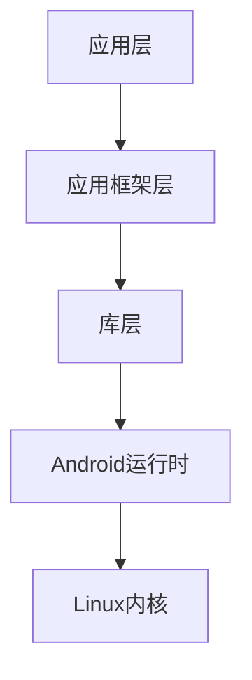

## 什么是Android？

Android是一个基于Linux内核的开源操作系统，主要用于移动设备，如智能手机和平板电脑。它由Google主导开发，并得到了全球开发者和设备制造商的支持。Android系统提供了丰富的API和工具，使开发者能够构建功能强大的应用程序。

## Android的架构

Android系统的架构分为多个层次，每一层都有其特定的功能。以下是Android的主要架构层次：

1. **应用层（Applications）**：这是用户直接接触的部分，包括系统应用（如电话、短信）和第三方应用（如微信、支付宝）。
2. **应用框架层（Application Framework）**：提供了开发Android应用所需的各种API，如活动管理、内容提供者、通知管理等。
3. **库层（Libraries）**：包含了一系列的C/C++库，如SQLite、OpenGL等，用于支持应用框架层的功能。
4. **Android运行时（Android Runtime）**：包括核心库和Dalvik虚拟机（或ART），用于执行应用程序。
5. **Linux内核（Linux Kernel）**：提供底层硬件驱动和系统服务，如内存管理、进程管理等。



## Android应用的基本组件

Android应用由多个基本组件构成，每个组件都有其特定的功能：

1. **活动（Activity）**：代表应用中的一个屏幕，用户可以通过活动与应用进行交互。
2. **服务（Service）**：在后台执行长时间运行的操作，如下载文件或播放音乐。
3. **广播接收器（Broadcast Receiver）**：用于响应系统范围内的广播消息，如电池电量低或网络状态变化。
4. **内容提供者（Content Provider）**：管理应用数据的共享，允许其他应用访问和修改数据。

### 示例：创建一个简单的Activity

以下是一个简单的Activity示例，展示如何在Android中创建一个基本的用户界面：

```java
package com.example.myfirstapp;

import android.os.Bundle;
import android.widget.TextView;
import androidx.appcompat.app.AppCompatActivity;

public class MainActivity extends AppCompatActivity {
    @Override
    protected void onCreate(Bundle savedInstanceState) {
        super.onCreate(savedInstanceState);
        setContentView(R.layout.activity_main);

        TextView textView = findViewById(R.id.textView);
        textView.setText("Hello, Android!");
    }
}
```

在这个示例中，`MainActivity`继承自`AppCompatActivity`，并在`onCreate`方法中设置了布局文件`activity_main.xml`。`TextView`用于显示文本“Hello, Android!”。

## Android的实际应用场景

Android广泛应用于各种场景，包括但不限于：

1. **移动应用开发**：如社交媒体应用、游戏、工具类应用等。
2. **物联网（IoT）**：Android系统可以运行在智能家居设备、可穿戴设备等物联网设备上。
3. **企业应用**：许多企业使用Android开发内部应用，如库存管理、客户关系管理等。

:::tip
Android的开源特性使其成为开发者的首选平台之一。通过Android Studio等工具，您可以轻松地开发和测试Android应用。
:::

## 总结

本文简要介绍了Android操作系统的基本概念、架构和主要组件。通过理解这些基础知识，您可以为后续的Android开发打下坚实的基础。希望本文能帮助您快速入门Android开发。

## 附加资源与练习

1. **官方文档**：访问[Android开发者官网](https://developer.android.com/)获取最新的开发文档和教程。
2. **练习**：尝试创建一个简单的Android应用，包含一个Activity和一个按钮，点击按钮时显示一条消息。

:::caution
在开发过程中，务必注意Android版本兼容性问题，确保您的应用在不同设备上都能正常运行。
:::