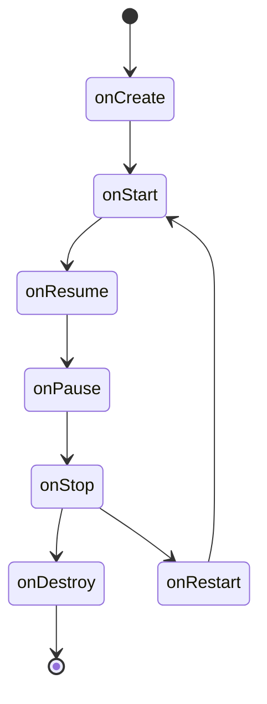

## 介绍

在Android开发中，**生命周期**是指应用组件（如Activity或Fragment）从创建到销毁的整个过程。理解生命周期对于管理应用的状态、资源和用户体验至关重要。每个组件都有其特定的生命周期回调方法，开发者可以通过重写这些方法来控制组件的行为。

本文将详细介绍Android中Activity和Fragment的生命周期，并通过代码示例和实际案例帮助你掌握这一重要概念。

---

## Activity生命周期

Activity是Android应用的核心组件之一，它代表一个用户界面（UI）。Activity的生命周期由一系列回调方法组成，这些方法在Activity的不同状态下被调用。以下是Activity的主要生命周期方法：

1. **onCreate()**：Activity首次创建时调用。通常在这里初始化UI和数据。
2. **onStart()**：Activity即将可见时调用。
3. **onResume()**：Activity进入前台并可以与用户交互时调用。
4. **onPause()**：Activity部分被遮挡（如弹出对话框）时调用。
5. **onStop()**：Activity完全不可见时调用。
6. **onDestroy()**：Activity被销毁时调用。
7. **onRestart()**：Activity从停止状态重新启动时调用。

以下是一个简单的Activity生命周期示例：

```java
public class MainActivity extends AppCompatActivity {

    @Override
    protected void onCreate(Bundle savedInstanceState) {
        super.onCreate(savedInstanceState);
        setContentView(R.layout.activity_main);
        Log.d("Lifecycle", "onCreate called");
    }

    @Override
    protected void onStart() {
        super.onStart();
        Log.d("Lifecycle", "onStart called");
    }

    @Override
    protected void onResume() {
        super.onResume();
        Log.d("Lifecycle", "onResume called");
    }

    @Override
    protected void onPause() {
        super.onPause();
        Log.d("Lifecycle", "onPause called");
    }

    @Override
    protected void onStop() {
        super.onStop();
        Log.d("Lifecycle", "onStop called");
    }

    @Override
    protected void onDestroy() {
        super.onDestroy();
        Log.d("Lifecycle", "onDestroy called");
    }

    @Override
    protected void onRestart() {
        super.onRestart();
        Log.d("Lifecycle", "onRestart called");
    }
}
```

运行上述代码时，你可以在Logcat中看到Activity生命周期的回调顺序。

---

## Fragment生命周期

Fragment是Activity的一部分，它可以嵌入到Activity中并拥有自己的生命周期。Fragment的生命周期与Activity类似，但有一些额外的回调方法：

1. **onAttach()**：Fragment与Activity关联时调用。
2. **onCreate()**：Fragment创建时调用。
3. **onCreateView()**：创建Fragment的UI时调用。
4. **onViewCreated()**：Fragment的UI创建完成后调用。
5. **onStart()**：Fragment可见时调用。
6. **onResume()**：Fragment可交互时调用。
7. **onPause()**：Fragment部分被遮挡时调用。
8. **onStop()**：Fragment不可见时调用。
9. **onDestroyView()**：Fragment的UI被销毁时调用。
10. **onDestroy()**：Fragment被销毁时调用。
11. **onDetach()**：Fragment与Activity解除关联时调用。

以下是一个Fragment生命周期的示例：

```java
public class ExampleFragment extends Fragment {

    @Override
    public void onAttach(Context context) {
        super.onAttach(context);
        Log.d("FragmentLifecycle", "onAttach called");
    }

    @Override
    public void onCreate(@Nullable Bundle savedInstanceState) {
        super.onCreate(savedInstanceState);
        Log.d("FragmentLifecycle", "onCreate called");
    }

    @Override
    public View onCreateView(LayoutInflater inflater, ViewGroup container, Bundle savedInstanceState) {
        Log.d("FragmentLifecycle", "onCreateView called");
        return inflater.inflate(R.layout.fragment_example, container, false);
    }

    @Override
    public void onViewCreated(@NonNull View view, @Nullable Bundle savedInstanceState) {
        super.onViewCreated(view, savedInstanceState);
        Log.d("FragmentLifecycle", "onViewCreated called");
    }

    @Override
    public void onStart() {
        super.onStart();
        Log.d("FragmentLifecycle", "onStart called");
    }

    @Override
    public void onResume() {
        super.onResume();
        Log.d("FragmentLifecycle", "onResume called");
    }

    @Override
    public void onPause() {
        super.onPause();
        Log.d("FragmentLifecycle", "onPause called");
    }

    @Override
    public void onStop() {
        super.onStop();
        Log.d("FragmentLifecycle", "onStop called");
    }

    @Override
    public void onDestroyView() {
        super.onDestroyView();
        Log.d("FragmentLifecycle", "onDestroyView called");
    }

    @Override
    public void onDestroy() {
        super.onDestroy();
        Log.d("FragmentLifecycle", "onDestroy called");
    }

    @Override
    public void onDetach() {
        super.onDetach();
        Log.d("FragmentLifecycle", "onDetach called");
    }
}
```

---

## 生命周期图示

以下是一个Activity和Fragment生命周期的Mermaid图示：



---

## 实际应用场景

### 场景1：保存和恢复状态

当Activity或Fragment被系统销毁并重新创建时（如屏幕旋转），你可以通过重写 `onSaveInstanceState()` 和 `onRestoreInstanceState()` 方法来保存和恢复UI状态。

```java
@Override
protected void onSaveInstanceState(Bundle outState) {
    super.onSaveInstanceState(outState);
    outState.putString("key", "value");
}

@Override
protected void onRestoreInstanceState(Bundle savedInstanceState) {
    super.onRestoreInstanceState(savedInstanceState);
    String value = savedInstanceState.getString("key");
}
```

### 场景2：释放资源

在 `onDestroy()` 或 `onDestroyView()` 中释放资源（如关闭数据库连接或取消网络请求），以避免内存泄漏。

---

## 总结

Android生命周期是开发中必须掌握的核心概念。通过理解Activity和Fragment的生命周期回调方法，你可以更好地管理应用的状态和资源，从而提供更流畅的用户体验。

---

## 附加资源

- [Android官方文档：Activity生命周期](https://developer.android.com/guide/components/activities/activity-lifecycle)
- [Android官方文档：Fragment生命周期](https://developer.android.com/guide/fragments/lifecycle)

## 练习

1. 创建一个新的Activity，并重写所有生命周期方法，观察Logcat中的输出。
2. 在Fragment中实现状态保存和恢复功能。
3. 尝试在 `onPause()` 中暂停视频播放，并在 `onResume()` 中恢复播放。