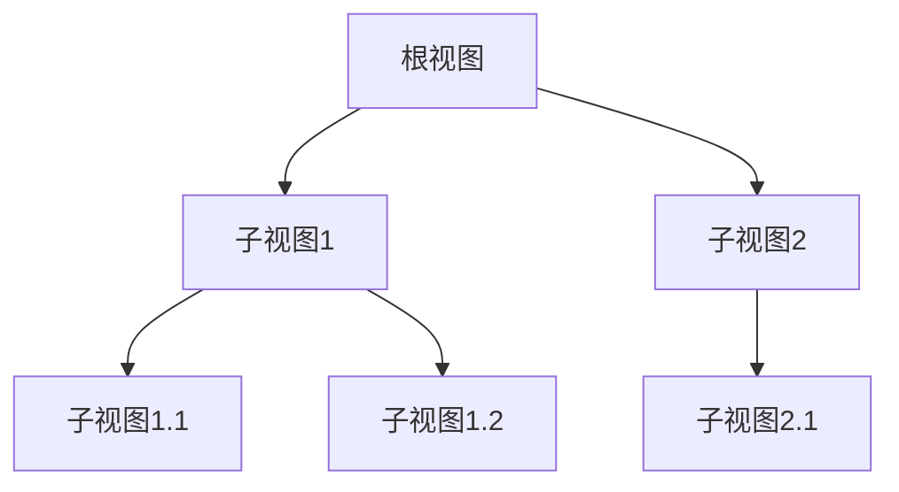

# Android视图基础

在Android应用开发中，**视图（View）**是构建用户界面的基本单元。无论是按钮、文本框还是复杂的布局，所有UI元素都是视图的子类。理解视图的基础知识是掌握Android UI设计的第一步。

## 什么是视图？

视图是Android中所有UI组件的基类。它负责绘制屏幕上的内容，并处理用户的交互事件。视图可以是简单的（如按钮或文本框），也可以是复杂的（如列表或网格）。每个视图都占据屏幕上的一个矩形区域，并负责在该区域内绘制内容和处理触摸事件。

### 视图的层次结构

在Android中，视图是以树形结构组织的。每个视图可以包含多个子视图，形成一个层次结构。最顶层的视图称为**根视图**，通常是`Activity`或`Fragment`的布局容器。



## 创建视图

在Android中，视图可以通过两种方式创建：

1. **XML布局文件**：这是最常见的方式。你可以在XML文件中定义视图的层次结构和属性，然后在代码中加载该布局。
2. **代码动态创建**：你也可以在Java或Kotlin代码中动态创建视图，并将其添加到布局中。

### XML布局示例

以下是一个简单的XML布局文件示例，定义了一个包含按钮和文本框的线性布局：

```xml
<LinearLayout xmlns:android="http://schemas.android.com/apk/res/android"
    android:layout_width="match_parent"
    android:layout_height="match_parent"
    android:orientation="vertical">

    <TextView
        android:id="@+id/textView"
        android:layout_width="wrap_content"
        android:layout_height="wrap_content"
        android:text="Hello, World!" />

    <Button
        android:id="@+id/button"
        android:layout_width="wrap_content"
        android:layout_height="wrap_content"
        android:text="Click Me" />
</LinearLayout>
```

### 代码动态创建示例

以下是在Kotlin代码中动态创建相同布局的示例：

```kotlin
val linearLayout = LinearLayout(this).apply {
    orientation = LinearLayout.VERTICAL
    layoutParams = LinearLayout.LayoutParams(
        LinearLayout.LayoutParams.MATCH_PARENT,
        LinearLayout.LayoutParams.MATCH_PARENT
    )
}

val textView = TextView(this).apply {
    text = "Hello, World!"
    layoutParams = LinearLayout.LayoutParams(
        LinearLayout.LayoutParams.WRAP_CONTENT,
        LinearLayout.LayoutParams.WRAP_CONTENT
    )
}

val button = Button(this).apply {
    text = "Click Me"
    layoutParams = LinearLayout.LayoutParams(
        LinearLayout.LayoutParams.WRAP_CONTENT,
        LinearLayout.LayoutParams.WRAP_CONTENT
    )
}

linearLayout.addView(textView)
linearLayout.addView(button)

setContentView(linearLayout)
```

## 视图的布局

视图的布局决定了它们在屏幕上的位置和大小。Android提供了多种布局管理器，如`LinearLayout`、`RelativeLayout`、`ConstraintLayout`等，用于控制视图的排列方式。

### LinearLayout

`LinearLayout`是一种简单的布局管理器，它将子视图按水平或垂直方向排列。你可以通过`android:orientation`属性指定排列方向。

```xml
<LinearLayout
    android:layout_width="match_parent"
    android:layout_height="match_parent"
    android:orientation="vertical">

    <Button
        android:layout_width="wrap_content"
        android:layout_height="wrap_content"
        android:text="Button 1" />

    <Button
        android:layout_width="wrap_content"
        android:layout_height="wrap_content"
        android:text="Button 2" />
</LinearLayout>
```

### ConstraintLayout

`ConstraintLayout`是一种更灵活的布局管理器，允许你通过约束条件来控制视图的位置和大小。它非常适合复杂的布局设计。

```xml
<androidx.constraintlayout.widget.ConstraintLayout
    android:layout_width="match_parent"
    android:layout_height="match_parent">

    <Button
        android:id="@+id/button1"
        android:layout_width="wrap_content"
        android:layout_height="wrap_content"
        android:text="Button 1"
        app:layout_constraintTop_toTopOf="parent"
        app:layout_constraintStart_toStartOf="parent" />

    <Button
        android:id="@+id/button2"
        android:layout_width="wrap_content"
        android:layout_height="wrap_content"
        android:text="Button 2"
        app:layout_constraintTop_toBottomOf="@id/button1"
        app:layout_constraintStart_toStartOf="parent" />
</androidx.constraintlayout.widget.ConstraintLayout>
```

## 视图的交互

视图不仅可以显示内容，还可以响应用户的交互事件。常见的交互事件包括点击、长按、滑动等。

### 点击事件处理

以下是一个处理按钮点击事件的示例：

```kotlin
val button = findViewById<Button>(R.id.button)
button.setOnClickListener {
    Toast.makeText(this, "Button Clicked!", Toast.LENGTH_SHORT).show()
}
```

## 实际应用场景

假设你正在开发一个简单的计算器应用。你需要创建一个包含数字按钮和操作符按钮的布局，并处理用户的点击事件以执行计算操作。

```xml
<LinearLayout
    android:layout_width="match_parent"
    android:layout_height="match_parent"
    android:orientation="vertical">

    <TextView
        android:id="@+id/resultTextView"
        android:layout_width="match_parent"
        android:layout_height="wrap_content"
        android:text="0"
        android:textSize="24sp"
        android:gravity="end" />

    <GridLayout
        android:layout_width="match_parent"
        android:layout_height="wrap_content"
        android:columnCount="4">

        <!-- 数字按钮和操作符按钮 -->
        <Button
            android:id="@+id/button7"
            android:text="7"
            android:layout_column="0" />
        <Button
            android:id="@+id/button8"
            android:text="8"
            android:layout_column="1" />
        <!-- 更多按钮... -->
    </GridLayout>
</LinearLayout>
```

在代码中，你可以为每个按钮设置点击事件监听器，并根据用户输入更新结果。

## 总结

通过本文，你了解了Android视图的基础知识，包括视图的创建、布局和交互方式。掌握这些概念是构建复杂用户界面的基础。接下来，你可以尝试创建自己的布局，并处理更多的用户交互事件。

:::tip 附加资源
- [Android官方文档：视图](https://developer.android.com/reference/android/view/View)
- [Android布局管理器指南](https://developer.android.com/guide/topics/ui/declaring-layout)
:::

:::note 练习
1. 创建一个包含多个按钮的线性布局，并为每个按钮设置不同的点击事件。
2. 使用`ConstraintLayout`设计一个复杂的布局，包含多个视图和约束条件。
:::