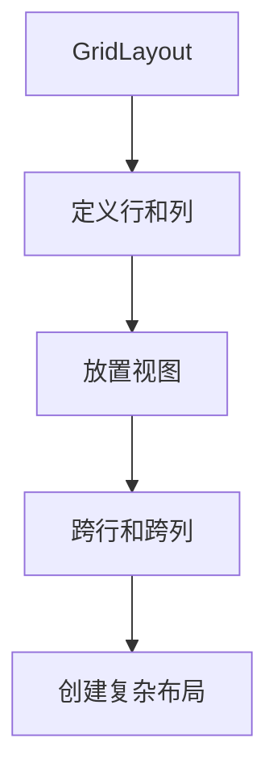

## 什么是 Android 网格布局？

Android 网格布局（`GridLayout`）是一种用于在 Android 应用中排列视图的布局管理器。它允许开发者将界面划分为行和列的网格，并将视图放置在这些网格中。与 `LinearLayout` 和 `RelativeLayout` 不同，`GridLayout` 提供了更灵活的布局方式，特别适合需要对齐和分布视图的场景。

`GridLayout` 的主要特点包括：
- **灵活的网格系统**：可以定义任意数量的行和列。
- **自动对齐**：视图可以自动对齐到网格的边界。
- **跨行和跨列**：视图可以跨越多个行或列。

## 基本用法

### 1. 在 XML 中定义 GridLayout

以下是一个简单的 `GridLayout` 示例，展示了如何在 XML 中定义网格布局：

```xml
<GridLayout
    android:layout_width="match_parent"
    android:layout_height="wrap_content"
    android:rowCount="2"
    android:columnCount="2">

    <Button
        android:text="Button 1"
        android:layout_row="0"
        android:layout_column="0" />

    <Button
        android:text="Button 2"
        android:layout_row="0"
        android:layout_column="1" />

    <Button
        android:text="Button 3"
        android:layout_row="1"
        android:layout_column="0" />

    <Button
        android:text="Button 4"
        android:layout_row="1"
        android:layout_column="1" />
</GridLayout>
```

在这个示例中，我们创建了一个 2 行 2 列的网格布局，并在每个网格中放置了一个按钮。

### 2. 跨行和跨列

`GridLayout` 允许视图跨越多个行或列。以下是一个跨列的例子：

```xml
<Button
    android:text="Button 5"
    android:layout_row="0"
    android:layout_column="0"
    android:layout_columnSpan="2" />
```

在这个例子中，`Button 5` 跨越了第 0 行的两列。

## 实际案例：创建一个简单的计算器界面

让我们通过一个实际案例来展示 `GridLayout` 的强大功能。我们将创建一个简单的计算器界面，包含数字按钮和操作符按钮。

```xml
<GridLayout
    android:layout_width="match_parent"
    android:layout_height="wrap_content"
    android:rowCount="5"
    android:columnCount="4">

    <TextView
        android:text="0"
        android:layout_row="0"
        android:layout_column="0"
        android:layout_columnSpan="4"
        android:gravity="end"
        android:textSize="24sp" />

    <Button
        android:text="7"
        android:layout_row="1"
        android:layout_column="0" />

    <Button
        android:text="8"
        android:layout_row="1"
        android:layout_column="1" />

    <Button
        android:text="9"
        android:layout_row="1"
        android:layout_column="2" />

    <Button
        android:text="/"
        android:layout_row="1"
        android:layout_column="3" />

    <!-- 其他按钮省略 -->
</GridLayout>
```

在这个案例中，我们创建了一个 5 行 4 列的网格布局，用于显示计算器的界面。`TextView` 用于显示计算结果，并跨越了 4 列。

## 总结

`GridLayout` 是 Android 中一种强大的布局管理器，特别适合需要对齐和分布视图的场景。通过定义行和列，开发者可以轻松创建灵活且响应式的用户界面。

:::tip
**提示**：在实际开发中，`GridLayout` 可以与 `ConstraintLayout` 结合使用，以实现更复杂的布局效果。
:::

## 附加资源与练习

- **官方文档**：[GridLayout | Android Developers](https://developer.android.com/reference/android/widget/GridLayout)
- **练习**：尝试创建一个 3x3 的网格布局，并在每个网格中放置不同的视图（如 `ImageView` 和 `TextView`）。
- **进阶**：研究如何使用 `GridLayout` 实现动态布局，例如根据屏幕大小自动调整网格的行数和列数。



通过本文的学习，你应该已经掌握了 `GridLayout` 的基本用法，并能够将其应用到实际项目中。继续练习和探索，你将能够创建更加复杂和美观的用户界面！