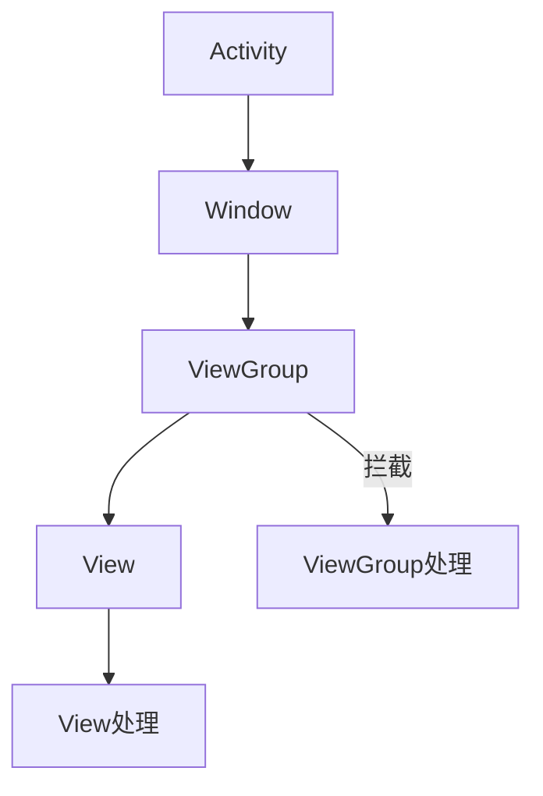

# Android触摸事件

在Android开发中，触摸事件是用户与应用程序交互的核心方式之一。无论是点击按钮、滑动屏幕，还是拖动元素，这些操作都依赖于触摸事件的处理。本文将详细介绍Android中的触摸事件机制，并通过代码示例和实际案例帮助你掌握这一重要概念。

## 什么是触摸事件？

触摸事件是指用户在屏幕上进行的触摸操作，例如点击、长按、滑动等。Android系统将这些操作封装为`MotionEvent`对象，并通过视图层级结构传递给相应的视图进行处理。

### 触摸事件的类型

Android中的触摸事件主要分为以下几种类型：

- **ACTION_DOWN**：手指按下屏幕时触发。
- **ACTION_MOVE**：手指在屏幕上移动时触发。
- **ACTION_UP**：手指离开屏幕时触发。
- **ACTION_CANCEL**：触摸事件被取消时触发（例如父视图拦截了事件）。

## 触摸事件的处理流程

当用户触摸屏幕时，Android系统会生成一个`MotionEvent`对象，并将其传递给视图层级结构中的最上层视图。视图可以通过重写`onTouchEvent()`方法来处理这些事件。

### 事件分发机制

Android的触摸事件处理遵循以下流程：

1. **事件分发（Dispatch）**：事件从Activity开始，依次传递给Window、ViewGroup，最后到达具体的View。
2. **事件拦截（Intercept）**：ViewGroup可以在事件到达子View之前拦截事件。
3. **事件处理（Handle）**：View通过`onTouchEvent()`方法处理事件。



## 代码示例：处理触摸事件

以下是一个简单的代码示例，展示了如何在自定义View中处理触摸事件。

```java
public class CustomView extends View {

    public CustomView(Context context) {
        super(context);
    }

    @Override
    public boolean onTouchEvent(MotionEvent event) {
        switch (event.getAction()) {
            case MotionEvent.ACTION_DOWN:
                // 处理按下事件
                Log.d("CustomView", "ACTION_DOWN");
                break;
            case MotionEvent.ACTION_MOVE:
                // 处理移动事件
                Log.d("CustomView", "ACTION_MOVE");
                break;
            case MotionEvent.ACTION_UP:
                // 处理抬起事件
                Log.d("CustomView", "ACTION_UP");
                break;
            case MotionEvent.ACTION_CANCEL:
                // 处理取消事件
                Log.d("CustomView", "ACTION_CANCEL");
                break;
        }
        return true; // 返回true表示事件已被处理
    }
}
```

### 输入与输出

- **输入**：用户在屏幕上进行触摸操作。
- **输出**：根据不同的触摸事件类型，打印相应的日志信息。

## 实际案例：实现拖动功能

让我们通过一个实际案例来展示如何使用触摸事件实现拖动功能。假设我们有一个自定义View，用户可以通过触摸来拖动它。

```java
public class DraggableView extends View {

    private float lastX, lastY;

    public DraggableView(Context context) {
        super(context);
    }

    @Override
    public boolean onTouchEvent(MotionEvent event) {
        float x = event.getX();
        float y = event.getY();

        switch (event.getAction()) {
            case MotionEvent.ACTION_DOWN:
                lastX = x;
                lastY = y;
                break;
            case MotionEvent.ACTION_MOVE:
                float dx = x - lastX;
                float dy = y - lastY;
                setX(getX() + dx);
                setY(getY() + dy);
                lastX = x;
                lastY = y;
                break;
        }
        return true;
    }
}
```

### 案例解析

- **ACTION_DOWN**：记录触摸的初始位置。
- **ACTION_MOVE**：计算触摸点的位移，并更新View的位置。

## 总结

通过本文的学习，你应该已经掌握了Android中的触摸事件处理机制。我们介绍了触摸事件的类型、处理流程，并通过代码示例和实际案例展示了如何在实际开发中应用这些知识。

:::tip 提示
在实际开发中，触摸事件的处理可能会涉及到更复杂的逻辑，例如多点触控、手势识别等。建议你进一步学习相关的API和框架，以提升应用的交互体验。
:::

## 附加资源与练习

- **官方文档**：[MotionEvent](https://developer.android.com/reference/android/view/MotionEvent)
- **练习**：尝试实现一个支持多点触控的自定义View，并处理多个手指的触摸事件。

希望本文对你理解Android触摸事件有所帮助！继续深入学习，你将能够构建更加丰富和交互性强的Android应用。