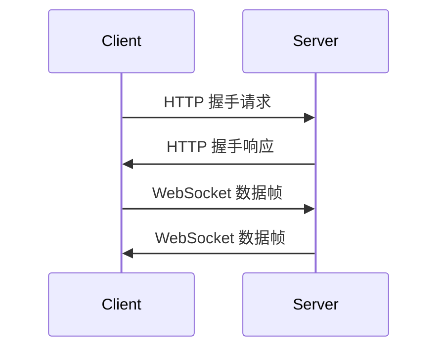

## 介绍

WebSocket 是一种在单个 TCP 连接上进行全双工通信的协议。与传统的 HTTP 请求-响应模式不同，WebSocket 允许服务器和客户端之间进行实时、双向的数据传输。这使得 WebSocket 成为实现聊天应用、实时通知、在线游戏等功能的理想选择。

在 Android 开发中，WebSocket 可以帮助你构建高效、实时的网络应用。本文将带你从零开始学习如何在 Android 应用中使用 WebSocket。

## WebSocket 基础

WebSocket 协议基于 HTTP，但在握手成功后，连接会升级为 WebSocket 连接。以下是 WebSocket 的工作流程：



### WebSocket 握手

WebSocket 连接始于一个 HTTP 握手请求。客户端发送一个包含 `Upgrade: websocket` 头的 HTTP 请求，服务器响应确认升级为 WebSocket 协议。

### WebSocket 数据帧

一旦握手成功，客户端和服务器之间就可以通过 WebSocket 数据帧进行双向通信。数据帧可以是文本、二进制数据或控制帧（如关闭连接）。

## 在 Android 中使用 WebSocket

要在 Android 应用中使用 WebSocket，你可以使用 `okhttp` 库，它提供了对 WebSocket 的支持。

### 添加依赖

首先，在你的 `build.gradle` 文件中添加 `okhttp` 依赖：

```groovy
dependencies {
    implementation 'com.squareup.okhttp3:okhttp:4.9.3'
}
```

### 创建 WebSocket 客户端

接下来，创建一个 WebSocket 客户端并连接到服务器：

```kotlin
import okhttp3.OkHttpClient
import okhttp3.Request
import okhttp3.WebSocket
import okhttp3.WebSocketListener
import okio.ByteString

val client = OkHttpClient()
val request = Request.Builder().url("ws://your.websocket.url").build()
val webSocket = client.newWebSocket(request, object : WebSocketListener() {
    override fun onOpen(webSocket: WebSocket, response: okhttp3.Response) {
        // 连接成功
        webSocket.send("Hello, Server!")
    }

    override fun onMessage(webSocket: WebSocket, text: String) {
        // 收到文本消息
        println("Received: $text")
    }

    override fun onMessage(webSocket: WebSocket, bytes: ByteString) {
        // 收到二进制消息
        println("Received: ${bytes.hex()}")
    }

    override fun onClosing(webSocket: WebSocket, code: Int, reason: String) {
        // 连接关闭中
        webSocket.close(1000, null)
    }

    override fun onClosed(webSocket: WebSocket, code: Int, reason: String) {
        // 连接已关闭
        println("Connection closed")
    }

    override fun onFailure(webSocket: WebSocket, t: Throwable, response: okhttp3.Response?) {
        // 连接失败
        t.printStackTrace()
    }
})
```

### 发送和接收消息

在 `onOpen` 方法中，你可以发送消息到服务器。服务器返回的消息会在 `onMessage` 方法中接收到。

:::tip
确保在 `onFailure` 方法中处理连接失败的情况，以便在出现问题时能够及时恢复或通知用户。
:::

## 实际应用场景

### 实时聊天应用

WebSocket 非常适合用于构建实时聊天应用。客户端和服务器可以实时发送和接收消息，而不需要频繁的 HTTP 请求。

### 实时通知

在需要实时通知用户的应用中，WebSocket 可以用于推送通知。例如，当有新消息或系统更新时，服务器可以立即通知客户端。

### 在线游戏

在线游戏通常需要低延迟的双向通信。WebSocket 可以帮助实现实时的游戏状态同步和玩家互动。

## 总结

WebSocket 是一种强大的协议，适用于需要实时、双向通信的应用场景。在 Android 开发中，使用 `okhttp` 库可以轻松实现 WebSocket 功能。通过本文的学习，你应该已经掌握了如何在 Android 应用中使用 WebSocket 进行实时通信。

## 附加资源

- [OkHttp 官方文档](https://square.github.io/okhttp/)
- [WebSocket 协议规范](https://tools.ietf.org/html/rfc6455)
- [Android 网络编程指南](https://developer.android.com/training/volley)

## 练习

1. 尝试使用 WebSocket 构建一个简单的聊天应用。
2. 修改代码，使其能够处理二进制数据的发送和接收。
3. 研究如何在 WebSocket 连接断开时自动重连。

:::caution
在实际应用中，请确保处理 WebSocket 连接的生命周期，避免内存泄漏和资源浪费。
:::