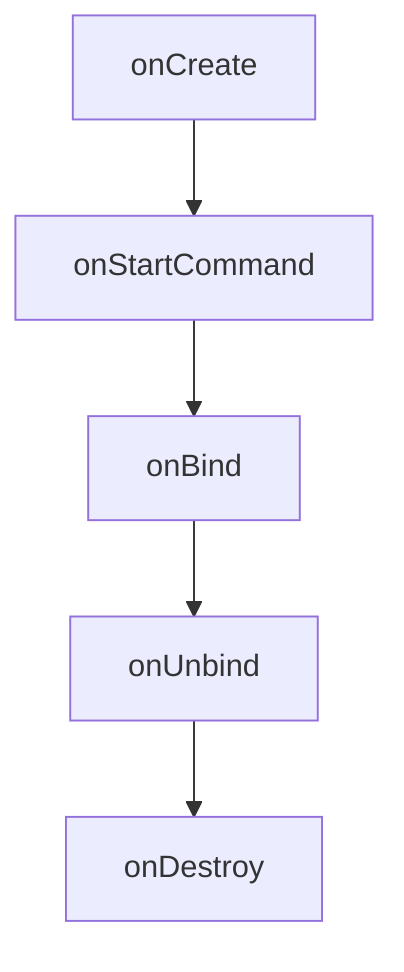

# Android 服务

在 Android 开发中，**服务（Service）** 是一种可以在后台执行长时间运行操作的组件，无需用户界面。服务通常用于处理不需要用户交互的任务，例如播放音乐、下载文件或同步数据。与 Activity 不同，服务没有用户界面，因此它可以在后台持续运行，即使应用不在前台。

## 服务的类型

Android 服务主要分为以下两种类型：

1. **启动服务（Started Service）**：通过调用 `startService()` 启动的服务。这种服务会一直运行，直到任务完成或手动停止。
2. **绑定服务（Bound Service）**：通过调用 `bindService()` 启动的服务。这种服务允许其他组件（如 Activity）与其进行交互。

## 创建服务

要创建一个服务，您需要继承 `Service` 类并重写其生命周期方法。以下是一个简单的服务示例：

```java
public class MyService extends Service {

    @Override
    public void onCreate() {
        super.onCreate();
        // 服务创建时调用
    }

    @Override
    public int onStartCommand(Intent intent, int flags, int startId) {
        // 服务启动时调用
        // 在这里执行后台任务
        return START_NOT_STICKY;
    }

    @Override
    public void onDestroy() {
        super.onDestroy();
        // 服务销毁时调用
    }

    @Override
    public IBinder onBind(Intent intent) {
        // 绑定服务时调用
        return null;
    }
}
```

### 启动服务

要启动服务，您可以在 Activity 中使用以下代码：

```java
Intent serviceIntent = new Intent(this, MyService.class);
startService(serviceIntent);
```

### 停止服务

要停止服务，您可以在 Activity 中使用以下代码：

```java
Intent serviceIntent = new Intent(this, MyService.class);
stopService(serviceIntent);
```

## 服务的生命周期

服务的生命周期包括以下几个阶段：

1. **onCreate()**：服务创建时调用。
2. **onStartCommand()**：服务启动时调用。
3. **onBind()**：服务绑定时调用。
4. **onUnbind()**：服务解绑时调用。
5. **onDestroy()**：服务销毁时调用。



## 实际案例

假设您正在开发一个音乐播放器应用，您可以使用服务在后台播放音乐。以下是一个简单的音乐播放服务示例：

```java
public class MusicService extends Service {

    private MediaPlayer mediaPlayer;

    @Override
    public void onCreate() {
        super.onCreate();
        mediaPlayer = MediaPlayer.create(this, R.raw.sample_music);
    }

    @Override
    public int onStartCommand(Intent intent, int flags, int startId) {
        mediaPlayer.start();
        return START_NOT_STICKY;
    }

    @Override
    public void onDestroy() {
        super.onDestroy();
        if (mediaPlayer != null) {
            mediaPlayer.stop();
            mediaPlayer.release();
        }
    }

    @Override
    public IBinder onBind(Intent intent) {
        return null;
    }
}
```

在 Activity 中启动和停止音乐服务：

```java
// 启动音乐服务
Intent musicIntent = new Intent(this, MusicService.class);
startService(musicIntent);

// 停止音乐服务
Intent stopMusicIntent = new Intent(this, MusicService.class);
stopService(stopMusicIntent);
```

## 总结

Android 服务是处理后台任务的强大工具，适用于不需要用户交互的长时间运行操作。通过理解服务的生命周期和类型，您可以有效地在应用中使用服务来提升用户体验。

:::tip
在实际开发中，建议使用 `JobScheduler` 或 `WorkManager` 来处理需要长时间运行的任务，以确保更好的电池寿命和系统性能。
:::

## 附加资源

- [Android 官方文档 - 服务](https://developer.android.com/guide/components/services)
- [Android 服务与线程的区别](https://developer.android.com/guide/components/processes-and-threads)

## 练习

1. 创建一个简单的服务，在后台打印日志信息。
2. 修改音乐播放服务，使其支持暂停和恢复功能。
3. 探索 `JobScheduler` 和 `WorkManager`，并尝试将服务替换为这些组件。
