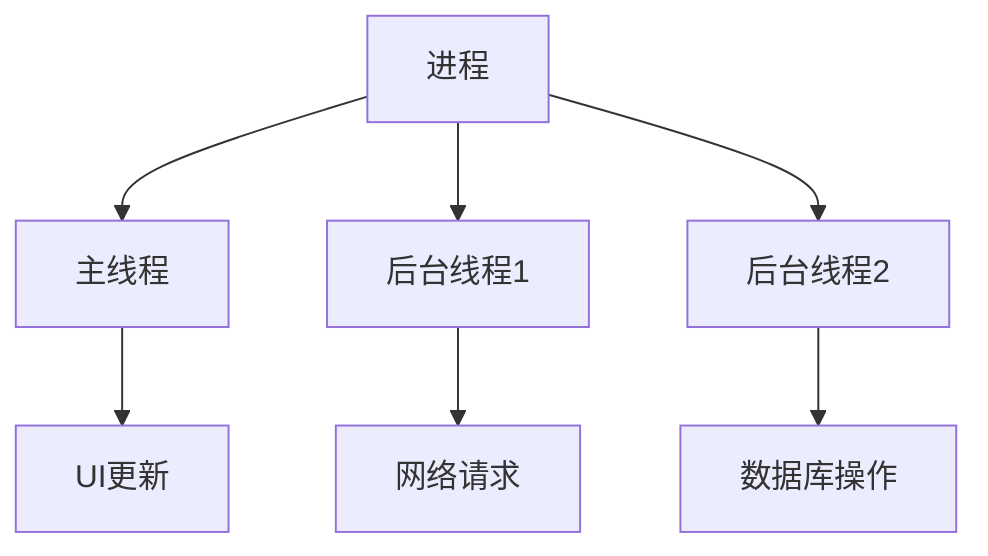

## 介绍

在Android开发中，**进程**和**线程**是处理后台任务和并发操作的核心概念。理解它们的工作原理对于开发高效、响应迅速的应用至关重要。本文将详细介绍Android中的进程与线程，并通过代码示例和实际案例帮助你掌握这些概念。

## 什么是进程？

在Android中，**进程**是一个独立的执行环境，每个应用默认运行在自己的进程中。进程拥有独立的内存空间和系统资源，确保应用之间的隔离性和安全性。

### 进程的生命周期

Android系统会根据应用的状态和系统资源动态管理进程的生命周期。以下是进程的几种状态：

- **前台进程**：用户正在与之交互的进程，例如当前显示的Activity。
- **可见进程**：用户不在直接交互，但仍然可见的进程，例如显示对话框的Activity。
- **服务进程**：正在运行服务的进程，例如音乐播放器后台播放音乐。
- **后台进程**：不在前台或不可见的进程，例如用户按Home键后进入后台的应用。
- **空进程**：没有任何活动组件的进程，系统可能会随时终止以释放资源。

:::tip
Android系统会优先终止低优先级的进程（如空进程）以释放资源，确保高优先级进程（如前台进程）的正常运行。
:::

## 什么是线程？

**线程**是进程内的执行单元，一个进程可以包含多个线程。线程允许应用在同一时间内执行多个任务，例如在后台下载数据的同时更新UI。

### 主线程（UI线程）

在Android中，**主线程**（也称为UI线程）负责处理用户界面更新和事件响应。所有与UI相关的操作都必须在主线程中执行。

```java
// 在主线程中更新UI
TextView textView = findViewById(R.id.textView);
textView.setText("Hello, World!");
```

### 后台线程

为了避免阻塞主线程，耗时的操作（如网络请求或数据库查询）应在**后台线程**中执行。Android提供了多种方式来实现后台任务：

1. **Thread**：最基本的线程实现。
2. **HandlerThread**：带有消息循环的线程。
3. **AsyncTask**（已弃用）：简化后台任务与UI更新的工具。
4. **ExecutorService**：线程池管理工具。
5. **Coroutine**（Kotlin）：轻量级的并发工具。

```java
// 使用Thread执行后台任务
new Thread(() -> {
    // 模拟耗时操作
    try {
        Thread.sleep(2000);
    } catch (InterruptedException e) {
        e.printStackTrace();
    }

    // 更新UI（需要在主线程中执行）
    runOnUiThread(() -> {
        TextView textView = findViewById(R.id.textView);
        textView.setText("Task completed!");
    });
}).start();
```

:::caution
不要在后台线程中直接更新UI，否则会导致应用崩溃。使用`runOnUiThread()`或`Handler`将更新操作切换到主线程。
:::

## 进程与线程的关系

一个进程可以包含多个线程，线程共享进程的内存空间和资源。以下是进程与线程的关系示意图：



## 实际案例：后台下载文件

以下是一个实际案例，展示如何在后台线程中下载文件并更新UI：

```java
// 在后台线程中下载文件
new Thread(() -> {
    try {
        URL url = new URL("https://example.com/file.zip");
        HttpURLConnection connection = (HttpURLConnection) url.openConnection();
        connection.connect();

        // 获取文件大小
        int fileSize = connection.getContentLength();

        // 读取文件并保存到本地
        InputStream input = connection.getInputStream();
        FileOutputStream output = new FileOutputStream("file.zip");
        byte[] buffer = new byte[1024];
        int length;
        while ((length = input.read(buffer)) != -1) {
            output.write(buffer, 0, length);
        }
        output.close();
        input.close();

        // 下载完成后更新UI
        runOnUiThread(() -> {
            TextView textView = findViewById(R.id.textView);
            textView.setText("Download completed!");
        });
    } catch (IOException e) {
        e.printStackTrace();
    }
}).start();
```

## 总结

- **进程**是应用的独立执行环境，拥有独立的内存空间和资源。
- **线程**是进程内的执行单元，允许并发执行多个任务。
- **主线程**负责UI更新，**后台线程**用于执行耗时操作。
- 使用`runOnUiThread()`或`Handler`将后台任务的结果更新到UI。

## 附加资源与练习

1. **练习**：尝试实现一个后台任务，从API获取数据并显示在RecyclerView中。
2. **资源**：
   - [Android开发者文档：进程与线程](https://developer.android.com/guide/components/processes-and-threads)
   - [Kotlin协程指南](https://kotlinlang.org/docs/coroutines-guide.html)
   - [Java线程池教程](https://www.baeldung.com/thread-pool-java-and-guava)

通过本文的学习，你应该已经掌握了Android中的进程与线程的基本概念及其应用。继续实践和探索，你将能够开发出更高效、更流畅的Android应用！